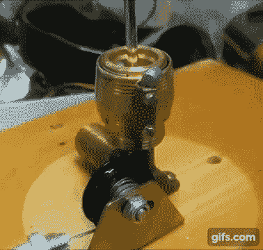

# 空气-水火箭发射台对 STEM 学生来说是一个很好的清洁乐趣

> 原文：<https://hackaday.com/2017/07/01/launch-pad-for-air-water-rockets-is-good-clean-fun-for-stem-students/>

我们对空气-水火箭有着美好的回忆，那是夏天在游泳池里用廉价商店买来的。尽管妈妈严格指导他们只能直着射击，但第一个目标总是游泳池另一边的兄弟或朋友。没有人失去眼睛，这是很好的干净的乐趣，幸运的是在暑假期间没有教育价值。

 但是现在一个老师走了，毁了这一切，他为他的 STEM 学生做了一个[空气-水火箭发射台](https://hackaday.io/project/25609-air-water-rocket-launcher)。开个玩笑——[罗伯特·赫德]一定是周五发布日到来时澳大利亚最酷的老师。[哈特先生]想要一种快速简单的方法来安全地发射空水火箭，并想出了一个非常聪明的系统。核心任务是将空气泵入部分填充的水瓶，然后干净地释放空气。[Robert]使用快速分离配件，通过自行车刹车电缆将母接头安装到电机上。控制箱有一个压缩机、释放电机和一个无线报警遥控器，全部由 12 伏电池供电。随着公耦合粘在瓶盖作为一个喷嘴和快速，干净的释放，飞行是非常壮观的。

发射空水火箭的方式有很多种，从简单的[到复杂的](http://hackaday.com/2012/10/10/build-your-own-water-rocket-launcher/)的[。[罗伯特]的建造倾向于复杂，但看起来足够坚固，可以重复使用，并使发射过程成为例行公事，所以孩子们可以专注于空气动力学。或者只是享受在户外看着东西飞。](http://hackaday.com/2010/07/30/building-a-better-water-rocket-launchpad/)

 [https://www.youtube.com/embed/5Jcnxz9uMjc?version=3&rel=1&showsearch=0&showinfo=1&iv_load_policy=1&fs=1&hl=en-US&autohide=2&wmode=transparent](https://www.youtube.com/embed/5Jcnxz9uMjc?version=3&rel=1&showsearch=0&showinfo=1&iv_load_policy=1&fs=1&hl=en-US&autohide=2&wmode=transparent)

 [https://www.youtube.com/embed/-slp7N1ouRc?version=3&rel=1&showsearch=0&showinfo=1&iv_load_policy=1&fs=1&hl=en-US&autohide=2&wmode=transparent](https://www.youtube.com/embed/-slp7N1ouRc?version=3&rel=1&showsearch=0&showinfo=1&iv_load_policy=1&fs=1&hl=en-US&autohide=2&wmode=transparent)

