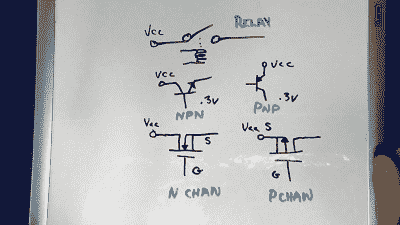
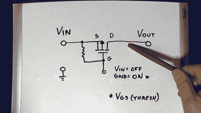
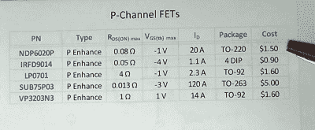
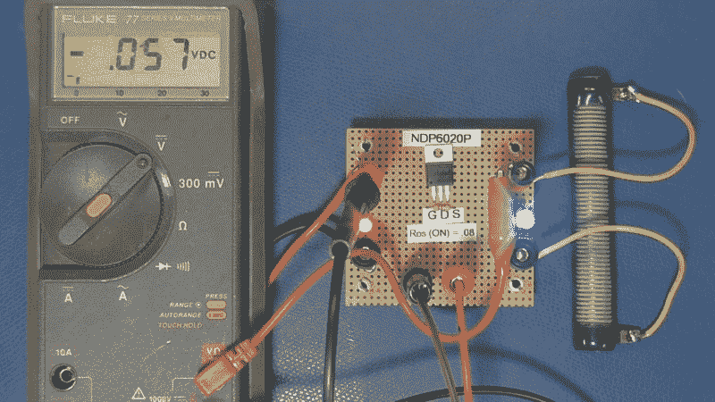
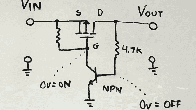

# 了解并构建高端开关

> 原文：<https://hackaday.com/2015/09/16/learn-and-build-a-high-side-switch/>

作为电子工程师，我有一个多年来收集的电路精神收藏，就像一个机械师在工作时收集专门的工具一样。所有的工程师都这样做，他们工具箱中的工具通常代表他们的项目历史和广度。

设计师工具箱中的一个有用电路是“高端开关”。顾名思义，这是一个将“高端”或正电压切换到负载的电路。

 [https://www.youtube.com/embed/flYr9ubKIoQ?version=3&rel=1&showsearch=0&showinfo=1&iv_load_policy=1&fs=1&hl=en-US&autohide=2&wmode=transparent](https://www.youtube.com/embed/flYr9ubKIoQ?version=3&rel=1&showsearch=0&showinfo=1&iv_load_policy=1&fs=1&hl=en-US&autohide=2&wmode=transparent)

从集电极开路输出等输出来看，我们通常倾向于将东西切换到地，原因是地通常是一个已知的实体，通常具有低阻抗并处于已知电压。但在电路中使用高端开关也有好处。

## 打开电压

切换高端比低端处理更多的未知；输入电压、所需的输出电压和源电压的阻抗几乎都是可变的。大多数情况下，我们还需要提供低阻抗输出，这意味着高端开关本身的电阻不会与负载一起形成分压器，从而在开关两端产生显著的压降。

Different ways to implement a High Side Switch.

例如，我们可以用继电器做一个高端开关，有时仍然会这样做。典型地，电流使用、电流能力、线圈电压、成本和尺寸的特性彼此不一致。

如果我们使用标准的晶体管，我们将不得不忍受某种形式的电压降。一方面，这意味着我们无法从 5v 电源获得 5v 输出，因为在此过程中我们通常会损失 0.3v。在高电流下，功耗也会很快失控。

## (再次)输入 FET

使用场效应晶体管(FET ),我们可以利用它的一些优良特性来制作开关。为了缩小我们要使用的 FET 的范围，我们可以这样开始:我们想要一个通常关断的器件，必须通过施加控制电压来开启，这意味着我们想要一个增强型 FET。接下来，我们决定是否要使用大于开关电压(如果可用)或小于开关电压的电压来控制器件。例如，如果我们想要接通 5 伏，我们是想要使用 8 伏或更高还是 4 伏或更低？在本例中，我们希望在没有额外电压的情况下接通高端开关，事实上，将信号接地颇具吸引力。这样一来，我们只能选择 P 沟道增强型 FET。

A high side switch using 2 components.

任何部分的特征都可能是广泛和多样的，所以我们从寻找几个重要的参数开始。在开关应用中，与线性音频放大器应用不同，低漏源导通电阻非常重要。该参数称为漏极至源极电阻 ON 或 R [DS(ON)] ，一个良好的可用器件通常以毫欧为单位进行测量。利用欧姆定律，一个快捷的方法告诉我们，在一安培的电流下，毫欧的电压降将是毫伏。

## 打开它

接下来，我们要确保可以用现有电压开启器件。这相当于电压栅极至源极阈值 V [GS(thresh)] 规格。-1 v 的 V [GS(thresh)] 意味着如果我们想要切换 3.3 v，我们需要将栅极拉至 3.3V 以下至少 1 v。使用晶体管或集电极开路器件通常可以将信号拉至 0.3-0.5v 的地电位范围内，在这种情况下，使用 V [GS(thresh)] 约为 1V 的器件切换 2.5V 有足够的空间。

A small selection of FET’s and their properties.

看一下表中所示的几款器件的规格，我们会看到许多权衡取舍。如果我们选择更小的 TO-92 封装，我们会得到更大的无法使用的封装，R [DS(ON)] 值为 1 欧姆或更大。如果我们的 R [DS(ON)] 太小，价格就会翻两番。其他部分的 V [GS(thresh)] 太大，但事实是，找到可用于此处所示项目的部分并不困难。

## 这是关于电子，我的意思是空穴

对于那些有兴趣在幕后窥视的人来说，像 TO-220 这样的较大外壳具有较低导通电阻的原因是因为外壳容纳了较大的芯片。较大的芯片具有较大的表面积，从而提供较小的电阻。我们使用 P 沟道器件的事实意味着我们也需要更大的表面积，因为 P 沟道器件通常比 N 沟道器件效率低，因为它们使用“空穴”而不是电子作为载流子。最简单的说法是空穴迁移率小于电子迁移率。

开关电路由两个基本元件组成，不包括我们在生产设计中会考虑的附加元件，如 FET 的反向保护二极管。如上所述，所示 FET 确实内置了反向雪崩二极管，用于过压和反向保护，但工程师的工作是确定是否需要额外的保护。

所示电阻是一个偏置电阻，在没有其他输入的情况下，它将栅极保持在已知值，在这种情况下，它将 FET 保持在关断或非导通状态。简而言之，当至少需要-1v 来开启 FET 时，电阻器使 FET 保持在 0v 的 V [GS] 状态。

## 对其进行测试

为了演示低 R [DS(ON)] 的影响，我用一个 5 欧姆负载的电路来展示。记住欧姆定律和 E=IR，5 伏电压下的 5 欧姆负载产生 1 安培的负载电流。使用相同的等式，R [DS(ON)] 很容易用 1 安培的电流来演示:1 安培下 0.057 伏的电压降意味着这种情况下 FET 的电阻为 0.057 欧姆！为了让我们更好地理解这一点，该设备消耗的功率是 P=I ² R，即 0.057 瓦或 57 毫瓦。我们甚至不需要进行散热计算，就能知道不需要散热器，而且这种方式下器件工作可靠。客观地说，负载电阻的功耗为 5 瓦，是开关本身的 87 倍。

Measuring .057 Volts drop across the FET at 1 Amp.

由于我们在接通负载的过程中仅损失 0.057 伏电压，这意味着我们可以使用 5V 电源作为电源，同时仍能接通 5V 负载，例如目前可用的许多 5V 控制器或微型计算机板之一。这几乎和机械开关一样好。

## 拍手，拍手

通过在其基极添加一个简单的晶体管和一个电阻来限制电流，我们可以反转开启 FET 所需的信号。这意味着我们可以通过将负载侧电压连接到反相晶体管来创造一种推动状态；一旦为高电平，晶体管将保持 FET 导通，直到有东西关断晶体管。

A self latching circuit gives us a “Push On” function.

我展示推动式电路的想法源于对电池供电组件或应用的思考，在这些组件或应用中，可能会使用定时器在一段时间后关闭。基于控制器的负载甚至可以关闭自己的电源，虽然这有点复杂，因为负载需要时间彻底关闭，例如基于 Linux 的系统，例如 Raspbery PI。

## 结论

希望这是一个简单电路的例子，在某种程度上你可能会觉得有用，至少我们已经研究了高端开关的属性，并根据其规格选择了一些元件。

Powering a 5V Raspberry PI from the standard 5V supply and only losing .06 volts in the process.