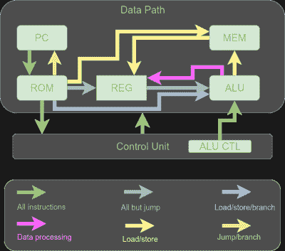

# 通过修复学习:另一个 Verilog CPU

> 原文：<https://hackaday.com/2017/05/05/learn-by-fixing-another-verilog-cpu/>

因为我经常和学生一起工作，我总是在寻找一个简单的 CPU，最好是在 Verilog 中，在金发区。也就是不太容易也不太难。我对[fpga4student]推出的这款 16 位 RISC 处理器寄予厚望，但如果不做一些额外的工作，它可能无法达到预期的目的。

CPU 本身非常简单，适合一个相当长的网页。然而，关于它的细节有点稀疏。这并不总是一件坏事。你可以给学生提供太多的帮助。话说回来，你也可以提供太少。然而，更糟糕的是，需要让它工作的一个模块不见了！你可能会说这是留给读者的一个练习，但也许应该以这种方式指出来。

起初，我准备删除书签，继续前进。然后我决定修正这个设计并对它做一些分析的过程实际上可能比仅仅研究一个完全有效的设计更有指导意义。所以我决定与你分享我的解决方案，并深入了解这个架构。除此之外，我将向您展示如何让这个东西在一个在线模拟器中运行，这样您就可以在没有软件安装的情况下进行实验。当然，如果你对 Verilog 工具链(比如 Xilinx 或 Altera 的工具链，甚至是 Icarus 或 CVer 之类的免费工具链)感到满意，那么你也应该可以轻松使用它。这一次我将重点介绍 CPU 是如何工作的，下一次我将向您展示如何用一些免费工具来模拟它。

## 设计

让我们从 CPU 的框图开始。它与其他 RISC 架构没有太大区别，尤其是那些不使用流水线的架构。程序计数器(PC)驱动指令存储器。有一个专用加法器为每条指令在 PC 上加 4，因为每条指令是 4 个字节。mux 允许您为下一条指令或跳转目标(实际上是绝对跳转、计算分支或返回地址)加载 PC。还有另一个专用于计算分支的加法器。

[](https://hackaday.com/wp-content/uploads/2017/05/riscarch2.png)

该处理发生在执行不同操作的算术逻辑单元(ALU)中。目的地可以是主存储器或寄存器之一。寄存器文件使用一个老技巧来避免一个常见的问题。假设每个周期可以读取一个寄存器。如果一条指令中只允许一个寄存器，那也没问题。但是如果你允许一个指令做一些类似于添加两个寄存器的事情，你将很难加载这两个寄存器，除非你延长指令时间。这就是为什么寄存器文件有两个输出端口。

事实是，寄存器文件至少是设计不能很好地综合到实际硬件的一个地方。首先，在初始块中有一个 For 循环来将寄存器清零。大多数合成工具会把它扔掉。你最好有一个重置信号。另一个可能的问题取决于你的目标 FPGA 和你使用的工具。

设计人员为寄存器提供了两个读取端口，但底层存储是相同的。这将使得很难使用专门的 RAM 单元，如果它们可用的话。另一种常见技术是简单地使用两个独立的寄存器模块，每个读端口一个。写操作会将数据发送到两个数据块，因此从外部看不出区别。不过，这通常会导致更快、更紧凑的设计。

要做到这一点，重写寄存器文件会很有趣(也不是很难)。然而，如果你不打算构建硬件，你可能不会注意到任何差异。

像大多数相似的 CPU 一样，整个控制工作由多路复用器选择什么数据发送到哪里。特别是，处理器的数据路径中有四个多路复用器:

*   PC src–将“下一个”PC 值发送到程序计数器
*   RegDst–从指令的两个字段中选择要写入的寄存器(图中显示了三个输入，但这似乎是一个错误)
*   BSrc–选择 ALU 的第二个参数(立即值或寄存器值)
*   WBSrc“回写”多路复用器选择将哪些数据设置回寄存器进行写入

## 设计表格

设计的其余部分显示了十三条指令、五种指令格式以及每种格式所需的控制信号。每一类指令的细微差别取决于 ALU 的用途。换句话说，加法指令和减法指令完全相同，除了 ALU 做什么。正如你所想象的，ALU 接受两个输入和一个操作码并产生一个输出。

最初的帖子实际上并没有说明哪些指令属于哪个类别，但是很容易就能弄清楚。加载和存储指令采用存储器访问格式。相等和不相等指令上的分支在分支类别中。跳转指令有自己的格式。所有其他指令都是“数据处理”一个表格显示了“汉明距离”操作码，但这在其他任何地方都没有出现，包括在代码中，所以我怀疑这是一个剪切和粘贴错误。

这两个表很好地总结了使 CPU 工作所需的操作。有九种不同的控制信号:

*   RegDst–这对应于图中同名的 mux，并选择目的地是否是寄存器(在代码中显示为 reg_dst)
*   alus RC–选择 ALU 参数的来源(与图中的 BSrc mux 相同，在代码中显示为 alu_src)
*   mem toreg–发生存储器到寄存器的传输时有效(代码中的 mem_to_reg)
*   reg write–设置何时写入寄存器(代码中的 reg_write)
*   MemRead–当存储器读取是指令的源数据时设置(代码中的 mem_read)
*   mem write–当存储器是写目的地时置位(代码中的 mem_write)
*   分支–当分支正在进行时激活(代码中 beq 和 bne 信号的组合)
*   ALU op–与指令的一部分结合，选择要在 ALU 中执行的操作(代码中的 alu_op)
*   跳转–当跳转正在进行时激活

该表直接对应于控制单元中的 Verilog，只是名称发生了变化，这很不幸，因为这使得该表有点难以理解。例如，下面是操作码为 0010 的数据处理指令的代码:

```
4'b0010: // data_processing
begin
  reg_dst = 1'b1;
  alu_src = 1'b0;
  mem_to_reg = 1'b0;
  reg_write = 1'b1;
  mem_read = 1'b0;
  mem_write = 1'b0;
  beq = 1'b0;
  bne = 1'b0;
  alu_op = 2'b00;
  jump = 1'b0; 
end
```

将它与原始帖子中的表格进行比较，您会直接看到它的映射。在英语中，指令是从两个寄存器中读取，用 ALU 操作码 0 写回寄存器，它不是跳转或分支。

令人费解的是，这个块被复制用于所有的数据处理指令，即使它不应该是必要的。幸运的是，对于模拟来说，这真的无关紧要，大多数合成工具会找出它并为您合并相同的代码。

## 下次

在下一期中，我将向您展示如何将设计加载到我最喜欢的快速设计工具之一 EDA Playground 中。有一个丢失的文件和一些必要的信息来使它与在线工具一起工作。然而，一旦你弄清楚了一些特性，CPU 确实像承诺的那样工作。如果你想先睹为快，你可以看看下面的视频。

 [https://www.youtube.com/embed/v6paddEMvWM?version=3&rel=1&showsearch=0&showinfo=1&iv_load_policy=1&fs=1&hl=en-US&autohide=2&wmode=transparent](https://www.youtube.com/embed/v6paddEMvWM?version=3&rel=1&showsearch=0&showinfo=1&iv_load_policy=1&fs=1&hl=en-US&autohide=2&wmode=transparent)

