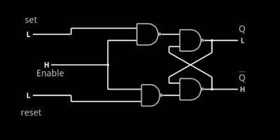
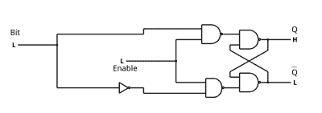
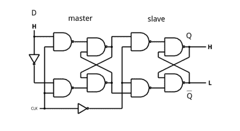
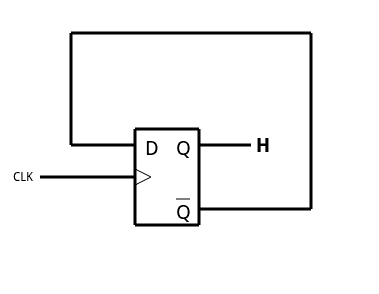
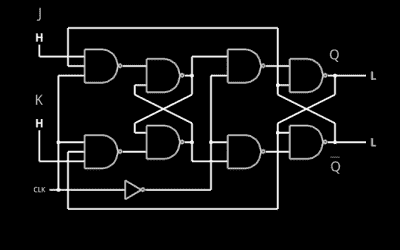

# 通过(更多)模拟学习人字拖

> 原文：<https://hackaday.com/2015/09/24/learn-flip-flops-with-more-simulation/>

在上一期中，我们讨论了[为什么触发器在数字设计中如此重要](http://hackaday.com/2015/09/23/learn-flip-flops-with-simulation/)。我们还看了一些锁存电路。这一次，我想看一些实际的触发器——即基于某个时钟信号保持其状态的电路元件。

就像上次一样，我想从三个不同的角度来看顺序构建模块:在抽象层，在门层，然后使用 Verilog 和两个在线工具，您也可以用它们来模拟电路。还记得 SR 闩锁吗？它需要两个输入，一个用来设置 Q 输出，另一个用来复位它。这个不起眼的构建模块是许多其他逻辑电路的核心。

[](https://hackaday.com/wp-content/uploads/2015/09/circ5.png) 对 SR 锁存器的常见增强是包括使能信号。这防止了在使能信号未被断言时输出改变。实现很简单。您只需要在每个输入端放置一个额外的门，这样，除非另一个输入(使能)有效，否则门的输出不能有效。示意图出现在右侧。

在[这个模拟](http://www.falstad.com/circuit/circuitjs.html?cct=$+1+0.000005+1.500424758475255+50+5+50%0A151+464+208+576+208+0+2+0%0A151+464+336+576+336+0+2+5%0Aw+576+208+576+240+0%0Aw+576+240+464+304+0%0Aw+576+336+576+304+0%0Aw+576+304+464+240+0%0Aw+464+240+464+224+0%0Aw+464+304+464+320+0%0AL+208+352+96+352+0+0+true+5+0%0AL+208+192+96+192+0+0+true+5+0%0AM+576+208+656+208+0+2.5%0AM+576+336+656+336+0+2.5%0Ax+87+162+118+165+0+24+set%0Ax+646+186+663+189+0+24+Q%0Ax+76+405+130+408+0+24+reset%0Ax+646+314+663+317+2+24+Q%0Aw+368+176+208+176+0%0Aw+208+176+208+192+0%0Aw+384+368+208+368+0%0Aw+208+352+208+368+0%0AL+208+272+144+272+0+1+false+5+0%0Aw+368+208+304+208+0%0Aw+304+208+304+272+0%0Aw+304+272+208+272+0%0Aw+304+272+304+336+0%0Aw+304+336+384+336+0%0Ax+117+302+189+305+0+24+Enable%0Aw+464+192+448+192+0%0Aw+448+352+464+352+0%0A151+368+192+448+192+0+2+5%0A151+384+352+448+352+0+2+5%0A)(或[Verilog 等效](http://www.edaplayground.com/x/NSN))的情况下，由于输入与非门的反转，SR 输入变为高电平有效。如果使能输入为低电平，则不会有任何变化。如果为高电平，则 S 或 R 输入上的有效输入将导致锁存器置位或复位。当 enable 为高电平时，不要同时将两者都设为高电平(或者，这是一个仿真，所以你不能烧坏任何东西)。(注:如果您看不到整个电路或在电路模拟器中什么也看不到，请尝试从主菜单中选择编辑|中心电路。)

[](https://hackaday.com/wp-content/uploads/2015/09/circ6.png)SR 锁存器可能是有用的，但是在许多应用中，必须明确地设置和复位它是不方便的。我上次说过，这些电路就像一个记忆位，你怎么能让锁存器只记住一个位的状态呢？很简单。只需用一位驱动 S 输入，用同一位的反相驱动 R 输入。右图是福斯塔德的[或使用 Verilog](http://www.falstad.com/circuit/circuitjs.html?cct=$+1+0.000005+1.500424758475255+50+5+50%0A151+784+240+896+240+0+2+5%0A151+784+368+896+368+0+2+0%0Aw+896+240+896+272+0%0Aw+896+272+784+336+0%0Aw+896+368+896+336+0%0Aw+896+336+784+272+0%0Aw+784+272+784+256+0%0Aw+784+336+784+352+0%0AM+896+240+976+240+0+2.5%0AM+896+368+976+368+0+2.5%0Ax+966+218+983+221+0+24+Q%0Ax+966+346+983+349+2+24+Q%0Aw+688+208+528+208+0%0Aw+528+208+528+224+0%0Aw+704+400+528+400+0%0Aw+528+384+528+400+0%0AL+528+304+464+304+0+0+false+5+0%0Aw+688+240+624+240+0%0Aw+624+240+624+304+0%0Aw+624+304+528+304+0%0Aw+624+304+624+368+0%0Aw+624+368+704+368+0%0Ax+437+334+509+337+0+24+Enable%0Aw+784+224+768+224+0%0Aw+768+384+784+384+0%0A151+688+224+768+224+0+2+5%0A151+704+384+768+384+0+2+5%0AI+416+384+528+384+0+0.5%0AL+272+256+144+256+0+0+false+5+0%0Aw+304+384+416+384+0%0Aw+304+384+272+384+0%0Aw+272+384+272+256+0%0Aw+272+256+272+224+0%0Aw+272+224+528+224+0%0Ax+133+227+162+230+0+24+Bit%0A) 的[。](http://www.edaplayground.com/x/UbF)

这实际上是采样保持电路的数字版本。当 enable 置位时，输出跟随输入。当 enable 未置位时，输出保持其值。

还有其他方法可以达到同样的效果。因为锁存器和触发器如此通用，所以有各种各样的设计。例如，查找 [Earle latch](https://en.wikipedia.org/wiki/Flip-flop_(electronics)#Earle_latch) ，与传统锁存器设计相比，它提供了固定的传播延迟。

## D 触发器

用反相器修改的 SR 锁存器通常被称为 D 锁存器，因为单个输入是锁存器要存储的数据。不过，要使它成为 D 触发器，你需要安排在时钟边沿捕捉数据，而不是在锁存器使能的任何时候。

[](https://hackaday.com/wp-content/uploads/2015/09/dff.png) 实现这一点的一种方法称为主从触发器(不一定是 D 触发器)。想法是用一条使能线级联两个锁存器。然而，第一个触发器(主机)使使能线变直。从机得到一个反向拷贝。这意味着当您启用触发器时，主机的输出将跟踪输入。然而，由于从机被禁用(由于反相使能线)，输出不会发生变化。当使能线下降时，主机将保持它看到的最后状态，但现在从机的使能线将打开，输出将改变。由于主机的输入不能改变，结果是在使能线被解除断言时，整个触发器存储输入的状态。[这里有一个模拟](http://www.falstad.com/circuit/circuitjs.html?cct=$+1+0.000005+10.200277308269968+50+5+50%0A151+592+192+688+192+0+2+5%0A151+592+304+688+304+0+2+0%0Aw+592+272+592+288+0%0Aw+592+208+592+224+0%0Aw+688+272+688+304+0%0Aw+688+272+592+224+0%0Aw+688+192+688+224+0%0Aw+688+224+592+272+0%0A151+480+176+592+176+0+2+5%0A151+480+320+592+320+0+2+5%0Aw+480+192+480+304+0%0Aw+480+304+480+384+0%0A151+352+192+448+192+0+2+5%0A151+352+304+448+304+0+2+0%0Aw+480+160+448+160+0%0Aw+448+160+448+192+0%0Aw+448+304+448+336+0%0Aw+448+336+480+336+0%0Aw+352+208+352+224+0%0Aw+352+288+352+272+0%0Aw+448+272+448+304+0%0Aw+448+272+352+224+0%0Aw+448+224+448+192+0%0Aw+448+224+352+272+0%0A151+240+176+352+176+0+2+0%0A151+240+320+352+320+0+2+5%0AI+240+384+480+384+0+0.5%0AM+688+192+752+192+0+2.5%0AM+688+304+752+304+0+2.5%0Ax+678+165+695+168+0+24+Q%0Ax+680+353+697+356+2+24+Q%0Ax+313+111+388+114+0+24+master%0Ax+559+113+613+116+0+24+slave%0Aw+240+192+240+336+0%0Aw+240+336+240+384+0%0AI+208+160+208+304+0+0.5%0Aw+208+160+240+160+0%0Aw+208+304+240+304+0%0AL+208+160+208+128+0+1+false+5+0%0Ax+199+94+215+97+0+24+D%0AR+240+384+208+384+1+2+120+2.5+2.5+0+0.5%0Ao+38+64+0+38+5+0.00009765625+0+-1+D%0Ao+27+64+0+38+5+0.00009765625+0+-1+Q%0Ao+40+64+0+38+5+0.00009765625+0+-1+clk%0A)(见右图)。

然而，更常见的是使触发器对实际时钟边沿敏感。一种简单的方法是使用我前面提到的脉冲边沿检测器来提供传统锁存器的使能输出。模拟器还向[展示了使用几个锁存器的不同方法](http://www.falstad.com/circuit/circuitjs.html?cct=$+1+0.000005+10.200277308269968+50+5+50%0A151+416+304+528+304+0+2+0%0A151+416+176+528+176+0+2+5%0Aw+528+176+528+208+0%0Aw+528+208+416+272+0%0Aw+528+304+528+272+0%0Aw+528+272+416+208+0%0Aw+416+208+416+192+0%0Aw+416+272+416+288+0%0A151+256+176+368+176+0+2+0%0A151+256+80+368+80+0+2+5%0A151+256+304+368+304+0+3+5%0A151+256+400+368+400+0+2+0%0Aw+256+96+256+112+0%0Aw+256+112+368+144+0%0Aw+256+160+256+144+0%0Aw+256+144+368+112+0%0Aw+368+112+368+80+0%0Aw+256+320+256+336+0%0Aw+256+336+368+368+0%0Aw+368+368+368+400+0%0Aw+256+384+256+368+0%0Aw+256+368+368+336+0%0Aw+368+160+416+160+0%0Aw+368+320+416+320+0%0Aw+368+208+256+272+0%0Aw+256+64+224+64+0%0Aw+224+448+368+448+0%0Aw+256+304+192+304+0%0Aw+192+192+256+192+0%0Aw+256+416+192+416+0%0AL+192+416+128+416+0+1+false+5+0%0AR+192+304+128+304+1+2+100+2.5+2.5+0+0.5%0AM+528+176+592+176+0+2.5%0AM+528+304+592+304+0+2.5%0Aw+192+192+192+304+0%0Aw+256+288+256+272+0%0Aw+368+176+368+208+0%0Aw+368+400+368+448+0%0Aw+224+448+224+64+0%0Aw+368+144+368+160+0%0Aw+368+160+368+176+0%0Aw+368+304+368+320+0%0Aw+368+320+368+336+0%0Ao+30+64+0+38+5+0.00009765625+0+-1+D%0Ao+32+64+0+38+5+0.00009765625+0+-1+Q%0Ao+31+64+0+38+5+0.00009765625+0+-1+clk%0A)，其中一个使用三输入门构建。

在 Verilog 中，边沿敏感触发器很容易创建。合成工具负责处理细节。这是一个边沿敏感型 D 触发器:

```
module dff(input clk, input d, output reg q, output qnot);
assign qnot=~q;
always @(posedge clk) q<=d;
endmodule
```

就是这样。您可以添加一个复位信号:

```
module dff_reset(input reset, input clk, input d, output reg q, output qnot);
assign qnot=~q;
always @(posedge clk) 
 if (reset) q<=1’b0; else q<=d;
endmodule
```

在这种情况下，复位是同步的，因为它只在触发器处理时钟沿时发生。EDA 操场的一个例子展示了一个带异步复位的 D 触发器,你可以尝试一下。

## T 触发器

[](https://hackaday.com/wp-content/uploads/2015/09/circ7.png)T(或 toggle)触发器在每个时钟脉冲上改变状态(至少在每个使能的时钟脉冲上)。如果你有一个 D 触发器，这很容易实现。只需[将反相的 Q 输出连接到 D 输入](http://www.falstad.com/circuit/circuitjs.html?cct=$+1+0.000005+10.200277308269968+50+5+50%0A155+256+240+400+240+0+5%0AR+256+272+160+272+1+2+100+2.5+2.5+0+0.5%0Aw+352+304+448+304+0%0Aw+448+304+448+128+0%0Aw+448+128+208+128+0%0Aw+208+128+208+240+0%0Aw+208+240+256+240+0%0AM+352+240+400+240+0+2.5%0A)(见左)就可以了。请注意，这具有将时钟频率除以 2 的效果，这也是您经常使用触发器的原因之一:分频。

在 Verilog 中，T 触发器非常简单(虽然我认为你可以连接一个 D 触发器，但这不是必须的):

```
module tff(input reset, input clk, output reg q);
always @(posedge clk) if (reset) q<=1’b0; else q<=~q;
endmodule
```

还有许多其他方法来构建 T 触发器，包括将 JK 触发器的 J 和 K 输入连接在一起(见下文)。

## JK 触发器

JK 人字拖听起来很神秘，其实不然。可以把它想象成一个 SR 触发器，其中 J 输入相当于 S，K 输入相当于 r，它不是 SR 触发器的原因是，如果同时置位两个输入，它会有明确定义的行为:输出翻转(就像 T 触发器一样)。

[](https://hackaday.com/wp-content/uploads/2015/09/jkff.png) 你可以找到[一个 JK 人字拖](http://www.falstad.com/circuit/circuitjs.html?cct=$+1+0.000005+10.634267539816559+50+5+50%0A151+512+176+608+176+0+2+5%0A151+512+288+608+288+0+2+0%0Aw+512+256+512+272+0%0Aw+512+192+512+208+0%0Aw+608+256+608+288+0%0Aw+608+256+512+208+0%0Aw+608+176+608+208+0%0Aw+608+208+512+256+0%0A151+400+160+512+160+0+2+0%0A151+400+304+512+304+0+2+5%0Aw+400+176+400+288+0%0Aw+400+288+400+368+0%0A151+272+176+368+176+0+2+5%0A151+272+288+368+288+0+2+0%0Aw+400+144+368+144+0%0Aw+368+144+368+176+0%0Aw+368+288+368+320+0%0Aw+368+320+400+320+0%0Aw+272+192+272+208+0%0Aw+272+272+272+256+0%0Aw+368+256+368+288+0%0Aw+368+256+272+208+0%0Aw+368+208+368+176+0%0Aw+368+208+272+256+0%0A151+160+160+272+160+0+3+5%0AI+144+368+400+368+0+0.5%0AM+608+176+672+176+0+2.5%0AM+608+288+672+288+0+2.5%0Ax+598+149+615+152+0+24+Q%0Ax+600+337+617+340+2+24+Q%0Aw+112+144+160+144+0%0Ax+110+79+116+82+0+24+J%0AR+144+368+112+368+1+2+120+2.5+2.5+0+0.5%0A151+160+304+272+304+0+3+5%0Aw+512+192+512+96+0%0Aw+512+96+160+96+0%0Aw+160+96+160+160+0%0AL+112+288+112+256+0+1+false+5+0%0Ax+104+225+117+228+0+24+K%0Aw+144+368+144+288+0%0Aw+144+288+160+288+0%0Aw+160+176+144+176+0%0Aw+144+176+144+288+0%0Aw+112+320+112+288+0%0Aw+112+320+160+320+0%0Aw+512+272+512+400+0%0Aw+512+400+160+400+0%0Aw+160+400+160+304+0%0AL+112+144+112+112+0+1+false+5+0%0Ao+48+64+0+38+5+0.00009765625+0+-1+J%0Ao+37+64+0+38+5+0.00009765625+0+-1+K%0Ao+26+64+0+38+5+0.00009765625+0+-1+Q%0Ao+32+64+0+38+5+0.00009765625+0+-1+clk%0A)的模拟，然后用它做实验(见左图)。请注意，模拟器在从链接加载 JK 触发器时存在亚稳态问题(见下文)。如果 Q 输出振荡，进入电路菜单，在时序逻辑下，选择触发器，然后 JK 触发器。

在 Verilog 中，你通常不会直接对此建模，尽管你当然可以。这里有一个 Verilog JK 触发器:

```
module jkff(input clk, input j, input k, output reg q, output qnot);
assign qnot=~q;
always @(posedge clk)
 case ({j, k})
 2’b00: q<=q;
 2’b01: q<=1’b0;
 2’b10: q<=1’b1;
 2’b11: q<=~q;
 endcase
endmodule
```

## 关于 FPGAs 的更多信息

在为 FPGA 编码时，很多时候你不会直接编写触发器本身。首先，大多数 FPGA 供应商提供优化的触发器宏，您可以使用这些宏来利用片上资源。此外，你通常会在一个较高的水平编码，合成器将推断出你想要的触发器。例如，你可以写一个简单的状态机:

```
 always@(posedge clk or posedge reset) 
 begin 
   if (reset) 
   begin 
     state = s1; outbit = 1'b1; 
   end 
   else 
   begin 
     case (state) 
 s1: begin 
     if (x1==1'b1) state = s2; 
     else state = s3; 
     outbit = 1'b1; 
     end 
 s2: begin 
 . . .
   endcase 
   end 
 end
```

尽管这看起来并不完全像示例之一，但 FPGA 合成器会识别这一点，并使用触发器构建相应的电路。它还能识别其他基于触发器的电路，如计数器和移位寄存器。

这并不是说你不应该知道触发器的类型，不知道如何编码。能够这样做将有助于您理解工具在为您推断什么。然而，如果你浏览大量的实际代码，你不会看到这些触发器实例的许多精确副本。

但是，您将会看到，时钟敏感的块中总是有赋值。您还会看到更高级别的构造，如计数器和状态机，它们在内部使用这些构建块。

## 触发器时序

在本系列的第一部分中，我谈到了我们整洁的原理图如何与现实世界不匹配，虽然这有时是一个问题，但有时也是一件好事。人字拖也不例外。由于现实世界的电路元件，触发器有几个问题:建立时间，保持时间，以及更普遍的亚稳态。

[](https://hackaday.com/wp-content/uploads/2015/09/setuphold.png) 你可以在左边看到设置和保持时间的图形表示。在有效时钟沿之前的建立时间内，触发器的输入必须稳定。输入还必须至少在时钟边沿后的保持时间内保持稳定。那么，从图形上看，外部红线之间的信号不会改变。绿色信号是合法的，但是另外两个违反了规则。实际上，这限制了时钟的速度。假设你的点击每 10ns 有一个活跃沿。如果你的组合逻辑馈入触发器有 9ns 的延迟，那应该没问题，对吧？如果最小设置时间超过 1nS，则不会。设置和保持违规有时很难排除，尽管现代示波器有时具有特殊的触发模式来查找违规。

如果违反了建立或保持时间，触发器可能会进入亚稳态。这意味着触发器可能表现不佳。在某些情况下，它会振荡，或者比正常情况下需要更长的时间来改变状态。在一些情况下，您必须担心亚稳定性。一种是改变时钟域时(即从使用不同时钟的另一个触发器馈入一个触发器)。另一个问题是当数据来自纯异步域时，例如用户输入交换机或 RS232 端口。在这种情况下，无法确保输入在建立或保持时间内(甚至是在时钟边沿)不会改变。

当有异步输入时，通常会通过多个 D 触发器级联。您使用的每一个额外的触发器都减少了亚稳态的机会(在输出端)。但是，它也会将每个触发器的输入延迟一个时钟周期。

亚稳定性是一个很大的话题，可能值得单独写一整篇文章。如果你等不及，有一篇关于这个主题的好的 IEEE 论文或者看看下面的视频。

存在抗亚稳态触发器设计，其进入亚稳态的机会减少。不过，这些方法并不完美，因为你不可能让建立时间和保持时间都为零。最终，好的设计无可替代。

## 包裹

人字拖是数字设计师武库中的一个强大工具。实现它们的范围可以从 555 芯片(不是开玩笑，[你可以用 555](http://hackaday.com/2010/02/02/beginner-concepts-555-push-button-toggle/) 制作一个慢触发器)到使用分立元件，到使用 IC 编写 Verilog 或 VHDL。学习人字拖很像学习国际象棋。几分钟就能学会动作。你可以花一生的时间去掌握它们。希望这两个帖子教会了你招式。剩下的就看你的了。

 [https://www.youtube.com/embed/alRaqQzTPds?version=3&rel=1&showsearch=0&showinfo=1&iv_load_policy=1&fs=1&hl=en-US&autohide=2&wmode=transparent](https://www.youtube.com/embed/alRaqQzTPds?version=3&rel=1&showsearch=0&showinfo=1&iv_load_policy=1&fs=1&hl=en-US&autohide=2&wmode=transparent)

