# 学习树脂铸造技术:冷铸造

> 原文：<https://hackaday.com/2016/07/14/learn-resin-casting-techniques-cold-casting/>

有时，我们需要项目中金属零件的外观、感觉和重量，而不是金属本身。也许你会喜欢那种复古风格。也许你正在修复一个旧收音机，你有一个黄铜件，但没有另一个。有可能得到一个非常像金属的零件，而不需要铸造所需的所有费用和热量，也不需要在金属制造车间里长时间工作。

在投资冷铸材料之前，最好有实际的预期。冷铸部件不能很好地进行高度抛光，但是对于拉绒和缎面，它几乎与铸部件没有区别。冷铸部分将有金属重量，但它像陶瓷一样叮当作响。它会感觉很凉爽，传热也很好，但是我没有你的数据。由黄铜、铜和铁粉制成的零件会相应地生锈。如果你想让它们保持明亮的光泽，它们需要用虫胶或类似的涂层处理；幸运的是，热固性树脂通常非常惰性，因此任何用于金属上的涂层都可以。

最好认为这种材料的行为或多或少类似于玻璃填充尼龙，如用于电动工具外壳的那种。会很僵硬。在[开裂](https://en.wikipedia.org/wiki/Crazing)之前，它会弯曲一段相对较短的距离，然后在应力点开裂。它将明显强于 3D 打印部件，弱于纯树脂部件，并取决于金属；比它想要模仿的金属更脆弱。

## 材料

如果零件主要是装饰性的，冷铸是特别宽容的。用于将颗粒粘合在一起的树脂可以是任何东西。当我使用我最喜欢的创新聚合物 IE-3075 时，几乎任何东西都可以。它有一个相当长的固化时间，但五金店的两部分釉涂层也适用于这种应用。

金属可以是任何细粉。对于这个例子，我使用 500 目(30 微米)铝粉。我订购了 Smooth-On 为快速运输销售的粉末，但他们的粉末没有什么特别之处。如果你有时间，易贝等网站提供的速度较慢但便宜得多的那种也可以。

#### 关于使用金属粉末的一些注意事项:

[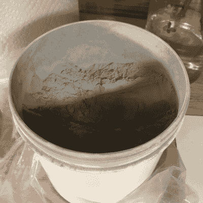](https://hackaday.com/wp-content/uploads/2016/06/img_3407.jpg)

Aluminum Powder.

1.  **爆炸危险:**在处理金属粉末时，不要吸烟或让[梯子](http://hackaday.com/2015/03/05/11000-volt-jacobs-ladder-sounds-like-a-lightsaber/)开着。它们可以形成一种细微的、几乎不可见的金属云，当遇到适当的热火焰时就会爆炸(查看[Jenny]关于[金属粉末作为燃料的文章](http://hackaday.com/2016/04/20/are-powdered-metal-fuels-just-a-flash-in-the-pan/))。这种爆炸不一定只是可怕的闪光。事实上，这可能是一个迅速膨胀的热量和力量球，它可能会毁掉你成为黑客空间性感黑客筹款日历中插页的机会。
2.  器官衰竭娱乐时间:铝与老年痴呆症有关。过多的铁会使你在很短的时间内出现临床抑郁和嗜睡。银色会让你的[永远变成蓝色](https://en.wikipedia.org/wiki/Argyria)。这些金属粉末非常细，你的身体可以毫不费力地通过胃、肺和皮肤将有毒物质吸收到血液中。我强烈建议遵循良好的实验室规范，即使你不得不在酒吧里对你的朋友撒谎。

考虑到这一点，让我们谈谈使用金属粉末时最起码的安全预防措施:

1.  佩戴呼吸器:一个质量好的防尘口罩就可以了，但是对于这种事情，最好买一个真正的呼吸器。我建议 3M 系列至少要有 P100 过滤器。阅读如何辨别口罩是否密封的选择指南。如果你有浓密的胡须，一定要把面具拉得比平时更紧。
2.  **戴手套**:我强烈建议每个黑客在他们的实验室里随时准备一盒符合他们体型的丁腈手套。高质量的那种，就像外科医生可能使用的，非常适合，甚至有纹理的指尖。它们不容易撕裂，我真的看不出不戴手套会有多大的灵活性损失。
3.  戴上眼睛保护装置:除了失明的危险，眼睛还非常善于吸收有害化学物质进入体内。护眼是必须的。
4.  **清洁:**工作结束后，一定要用湿纸巾把所有东西都擦干净。将食物容器远离该区域，直到它被清洗干净。

## 3D 打印和打磨

Sanding the 3D printed PLA part until smooth.

我用于这次铸造的主零件是 3D 打印的。我用了相当多的外层，很少填充。一个重要的事情要注意任何树脂铸造是硅胶模具将拿起每一个细节。这是祸也是福。如果你现在把时间花在完成零件上，并且接近你想要的外观和感觉，你就不需要在最后的零件上做任何修饰。

[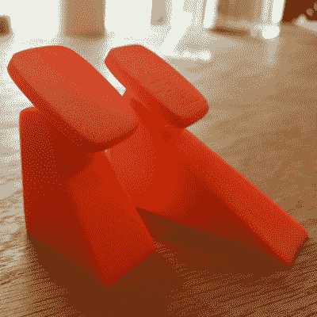](https://hackaday.com/wp-content/uploads/2016/06/2016-06-04-10-18-42-hdr-2.jpg)

The parts are matched to be perfectly fit to each other.

为了在 PLA 部件上得到一个非常好的光滑表面，我开始用 220 号砂纸磨掉这些层。然后，我直接移动到 800 粒度，以获得光滑的表面。PLA 很容易打磨。关键是不要让它变暖。一瓶喷雾式的水可以帮助解决这个问题，还可以延长砂纸的寿命。任何类型的强力砂光机都可能使 PLA 过热，从而损坏零件。

#### 关于公差的说明:

当这些部件组合成一个铰链时，它们会被钻一个孔。大多数制造模具的硅树脂几乎不会收缩。此外，高质量热固性树脂也不会明显改变尺寸。因此，无论你在主零件上加多少公差，你都会得到多少公差。这真的很有帮助，也是金属零件的另一个优势。对于这些部件，我们匹配了一对 3D 打印部件，然后打磨它们以完美滑动。用这种模具制作的每一个复制零件都将表现得像手工制作的一样。还不错！

## 模子

为了制作模具，我把准备好的 3D 打印部件放在一个合适的位置。对于这些零件，模具必须是单面的。即使零件有一个底切，硅树脂也很容易弯曲，所以它们只有一条分模线。3D 打印机用来将零件固定在床上的平坦表面将由一片平坦的 UHMW 聚乙烯制成，聚氨酯和硅树脂不会粘附在其上。

我测量了最高的部分，并增加了 8 毫米，以确定我的模具的深度。我还测量了配置占用空间的长度和宽度。我将这些值放入 inkscape 中，为一个盒子做了一个快速布局。我把这些打印出来，粘在一些泡沫塑料上作为切割指南。

 [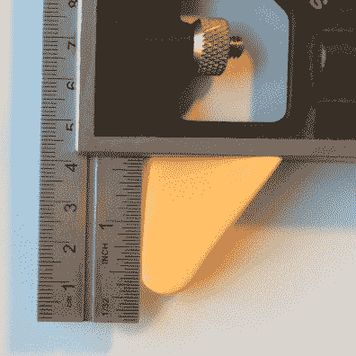](https://hackaday.com/2016/07/14/learn-resin-casting-techniques-cold-casting/2016-06-04-10-23-08/)  [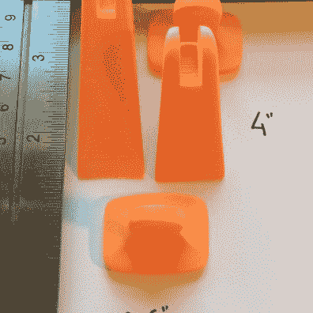](https://hackaday.com/2016/07/14/learn-resin-casting-techniques-cold-casting/2016-06-04-10-25-54/) 

这个盒子很容易组装。因为在硅树脂模具的浇注中不涉及水或溶剂；PVA 学校胶水足以将零件固定在泡沫芯上。如果我更聪明的话，我会用不同的方式来布置我的模板，这样我就可以在泡沫芯的中间切开，当我向上弯曲时，就可以得到一个自由的密封边缘。我最后用热胶水把长方形粘在一起。重要的是要确保所有的边缘都密封。硅树脂在 30 分钟内开始凝固，但它至少能从模具中渗出一个小时。出现这种情况很让人郁闷。

     [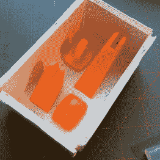](https://hackaday.com/2016/07/14/learn-resin-casting-techniques-cold-casting/2016-06-04-11-15-30/) 

## 混合并浇注模具

按照制造商的说明混合并测量硅树脂。确保尽可能彻底地混合硅树脂。早期我试着轻轻混合以避免气泡，但这导致硅胶永远保持粘性。如果你有一个真空室，在浇注前将硅树脂脱气。如果使用压力室，在脱模前，在 60psi 的压力下固化硅胶。在我的情况下，这是 12 个小时。

 [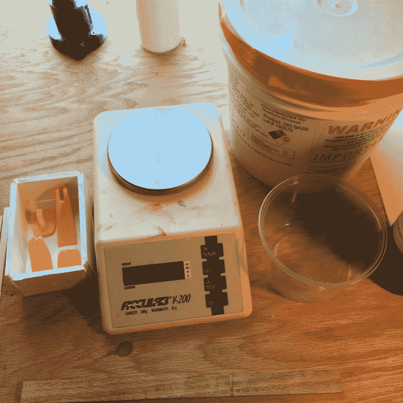](https://hackaday.com/2016/07/14/learn-resin-casting-techniques-cold-casting/2016-06-04-11-20-19-hdr-2/)  [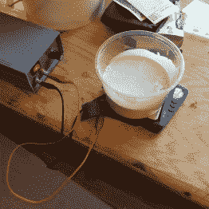](https://hackaday.com/2016/07/14/learn-resin-casting-techniques-cold-casting/2016-06-04-11-29-26/)    [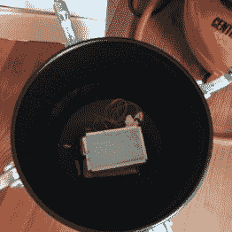](https://hackaday.com/2016/07/14/learn-resin-casting-techniques-cold-casting/2016-06-04-11-36-03/) 

## 混合并浇注冷铸型

[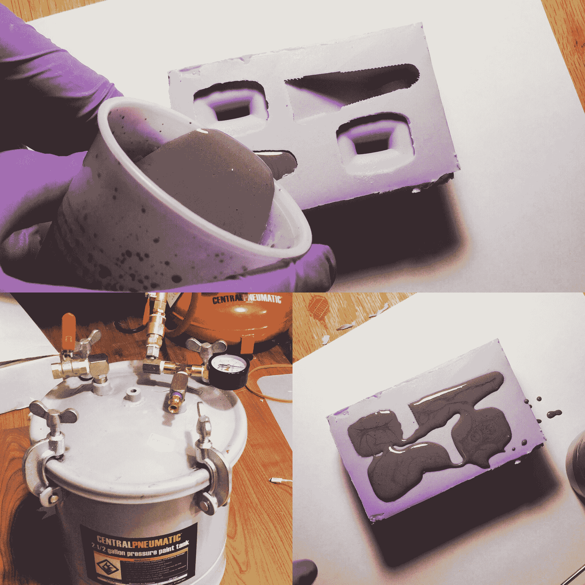](https://hackaday.com/wp-content/uploads/2016/06/img_3415.jpg)

Pouring the resin and powder mixture into the mold.

Smooth-On 和大多数网站推荐树脂与粉末的体积比为 1:1。通过个人实验，我发现只要树脂混合准确，实际上同样的零件可以在粉末和树脂的比例上有 20%的误差。一旦你过了这个阶段，零件要么光泽不佳，要么太脆。

A powder and resin mixture that was too thick couldn’t flow properly into the mold.

这很好，因为根据所选的几何形状，你可以使用不同厚度的泥浆。对于将被树脂完全填充的一小部分，较薄的混合物将工作得最好。

对于非常大的零件，你可以通过用比树脂更多的金属制成非常厚的浆料来节省大量的金属粉末。这个可以涂在模具内侧，放置固化，然后后面可以填充没有粉末的树脂。这部分不会有同样的重量和声音作为一个 100%填充的一部分。

混合树脂和粉末混合物相当容易。首先精确测量出树脂的 A 和 B 部分。非常彻底地混合这个。一旦树脂被混合，就可以加入金属粉末。获得正确的混音顺序很重要。如果你过早地混合金属，A 和 B 成分可能不能很好地相互反应。

Mixing the powdered metal and resin together before pouring.

混合后，树脂可以任选地真空脱气，然后像往常一样倒入模具中。由于这是一个单个部件的模具，倾倒的背面覆盖有一层 UHMW 以形成一个平坦的表面。在脱模之前，将浇注的模具置于压力室中，在 60 psi 下固化 4 小时。这个时间会根据所用的树脂而变化。

## 抛光和最终工作

[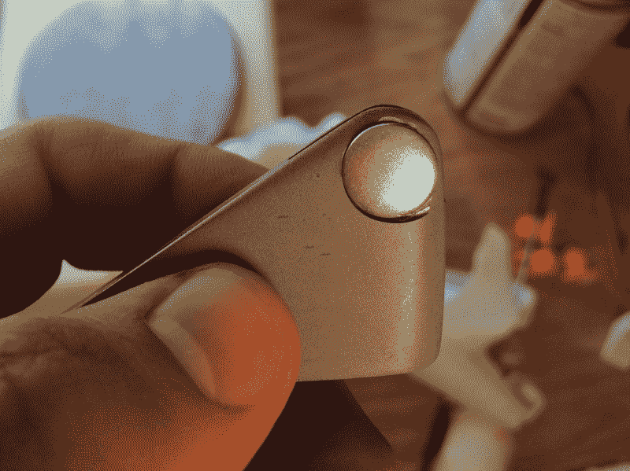](https://hackaday.com/wp-content/uploads/2016/06/sadsadsadsadsad.jpg)

Holes are drilled in the part as one of the final finishing steps

脱模后，零件准备完成。对于这个零件，我们决定在零件从模具中取出后钻孔会容易得多。另一种选择是在模具中有一个销或两部分模具。这将需要更多的时间来完成。

零件从模具中出来时一点光泽都没有。树脂倾向于位于金属粉末的前面。此外，金属颗粒表面可能会有一层小的氧化层，使它们变得暗淡。最后一步是抛光零件。要获得缎面效果，只需用打圈的方式将零件打磨至 400 或 800 粒度。抛光轮也可以。在这个阶段，电动工具是可以接受的；热固性塑料具有很大的工作温度范围，在降解之前会变得相当热。

获得刷过的外观；scotch-brite 垫或钢丝绒在零件表面上以相同的方向敲击将提供所需的效果。

当然，还有很多其他的可能性。例如，这个视频描述了[人为老化一个零件](https://www.youtube.com/watch?v=7VBVU3FNt-s)以获得装饰性生锈效果。它还可以用来模仿青铜铸件或老化一件复制的硬件，以匹配现有作品的铜绿。

[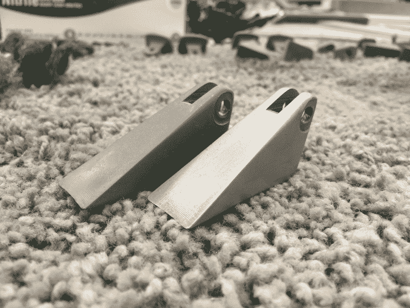](https://hackaday.com/wp-content/uploads/2016/06/img_3510.jpg)

A quick brush over the part with some sand paper and it quickly transforms from obviously plastic to metallic.

这是另一个添加到树脂铸造技能书的有用技术。这项技术有很多用途，从需要精确几何形状的配重到修理古董收音机。许多人用它来制作道具和珠宝，达到惊人的效果。你们有人用过这种技术吗？