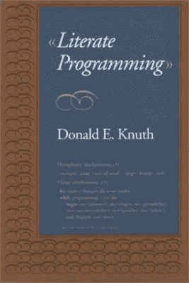
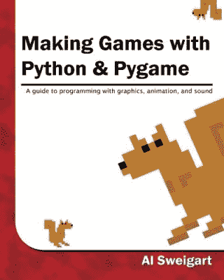
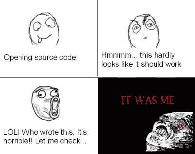

# 学会用有文化的编程来编程

> 原文：<https://hackaday.com/2016/06/06/learn-to-program-with-literate-programming/>

我在编程方面的全盛时期是大约五年前，我真的让我的技能衰退了。我开始发现自己在为自己能力不足找借口。我会用更难的方法来解决问题，这样我就不用编码了。最糟糕的是，我会发现自己搁置项目，因为我不再喜欢编码来做那部分工作。所以我决定投入时间，重新加速。

通常，出于需要，我会重新开始编程。我会疯狂地编码，阅读大量文档，剪切和粘贴大量代码。它可以工作，但是我最终会对我为获得工作代码所做的事情有一个非常混乱的理解。这一次，我想组织我的学习，这样我会有一个更好的，结构化的理解。

然而，有一个问题。编程书籍普遍令人厌烦。我有一大堆，那是在我把一堆送出去之后。这并不是作者的错；这是一门难教的学科。它通常以一两章痛苦的基本概念来折磨读者，并在其中加入足够的神秘色彩来缓解偏头痛。通常，他们也喜欢提到奥秘将在另一章中被揭开。下一步是让你扮演打字员，把一大段新的有趣的代码转录到编辑器中并运行它。大概，打字的行为给读者留下了强烈的好奇心，以至于接下来 17 页关于 13 行代码的枯燥独白在读者的脑海中变成了引人入胜的散文。也许结构化的理解不值得。

我想找到一种学习编程的新方法。在这里，我可以在输入代码时与示例代码进行交互。我想在第一次按下运行按钮之前，而不是之后，就能完全理解。

当我第一次读到[文化编程](https://en.wikipedia.org/wiki/Literate_programming)的时候，我的第一反应是:“不，不要这么做。”在计算机界名气不小的唐纳德·克努特在他的*文化编程*中提出了一种新的做事方式。不要按照编译器喜欢的顺序编写代码，而是按照你喜欢的顺序编写代码，并在开发过程中不断叙述你的想法。他希望人们实现这一壮举的方法是广泛使用宏。举例来说，一个识字的程序会以这样的部分开始:

[](https://hackaday.com/wp-content/uploads/2016/05/literate_programming_book_cover.jpg)

The source of all this trouble.

```
Herein lies my totally rad game in which a
bird flaps to avoids pipes.The code is
structured in this manner:
<<*>>=
<<included files>
<<the objects and characters in my game>>
<<the main loop>>
@
This is the main loop, It contains the logic
and state machine, but it also has a loop to
update all the graphics within each object.
<<the main loop>>+=
 <<the game logic>
 <<the graphics>
@ 

```

在这个例子中，你可以像这样写。

```
In this next bit I am going to define the bird who flaps. To do this I 
will have to create an object. The object will contain the position of 
my bird, the state of its flapping wings, and the physics by which its 
perpetual descent is governed.
<<the objects within my game>>+=
  <<flapping bird>>=
  class Flapping_Bird:
     <<initialize the bird>>
@
The bird is initialized in the middle of the left side of the screen. 
As soon as the user grazes any key for the first time, the bird will begin 
to suffer. To enable this I will need to know what size window the bird 
inhabits, and with this information I will determine the scale of the bird 
and its initial location.
<<initialize the bird>>+=
  __init__(self,screenx,screeny):

etc..

```

好吧，这需要一点破译，我可能没有搞定语法。简单来说，任何在一个<<>>和一个@之间的东西都是真正的代码。如果你看到<<> >+=这意味着将这段代码添加到之前的定义(由<<> >=定义)。维基百科解释得更好。

[](https://hackaday.com/wp-content/uploads/2016/05/41jdefejvil.jpg)

I’m into some heavy technical literature these days. Approach with caution.

除了那个介绍，真正让我难以忘怀的概念是把你脑子里的想法和你的代码一起写下来。

一般来说，我会说这不适合付诸实践。你的同事不会真正欣赏每行之间的暴露段落。学习一门编程语言的全部意义在于熟练掌握这门语言。至少在我看来，目标是让你能够像读书一样阅读代码和逻辑流。(伴随着帮助你定位的有用的评论。)当然，我肯定不是唐纳德·克努特(Donald Knuth)，我甚至不是一个非常优秀的程序员，所以不要把这当成福音。

### 编程应该是令人愉快的

这让我明白了这篇文章的核心。这是我在阅读了识字编程后不久就开始做的事情，它让我学习编程的速度提高了两倍。这也让它变得更加有趣。

我一直在研究一本很棒的关于 pygame 的入门书，用 Python 制作游戏和 Al Weigart 的 Pygame ，这本书在网上是免费的。下面是书中的第一个例子，它以标准的方式呈现。读者需要将代码输入到他们选择的文本编辑器中，然后运行代码。代码按预期执行后，读者需要一行一行地分析，以便弄清楚每一行做了什么。这是可行的，但是我认为它通常更适合教人转录代码，而不是实际编写代码。

```
import pygame, sys
from pygame.locals import *

pygame.init()
DISPLAYSURF = pygame.display.set_mode((400, 300))
pygame.display.set_caption('Hello World!')

while True: # main game loop
  for event in pygame.event.get():
    if event.type == QUIT:
       pygame.quit()
       sys.exit()
  pygame.display.update()
```

根据我从文化编程中得到的启示，我的代码开始看起来像这样:

```
*#alright, we remember this. The compiler or interpreter or whatever* 
*gets mad if we don't import the functions and files we need first*

import pygame, sys *#pygame is the game library I'm using, sys is full*
*of useful system calls. I think I'm importing this one for the sys.exit()*
*function later. I skipped ahead and read that this is similar to breaking*
*from the loop or pressing ctrl-D. Maybe this is a cleaner way to exit*
*a program and a bit more universal? I don't know but I don't want to get*
*bogged down at this point, so I'll remember the question for later.
* 
from pygame.locals import * *#I've already imported pygame, but I'd like*
*to get the stuff inside pygame.locals out. The book mentions that this*
*is mostly useful constants like the QUIT I'll be using later.*
```

我会尽可能多的解释每一行是做什么的。这有点乏味，但它帮助我记下了我记得的片段，并找出了我只认为我认出了哪些部分。

```
pygame.init() *#I should initialize pygame before I start using it. No*
*complaints with that logic here. Apparently it will throw errors if I don't.*
*### Yep, tested it by moving pygame.init() down a few lines. It definitely*
*throws errors.*
```

[](https://hackaday.com/wp-content/uploads/2016/05/eqdac.jpg)

I had this up in the robotics lab in my university for a long time.

我意识到非常有趣的一件事是在我的代码中记录我的实验。因为 python 并不在乎，所以我只是添加了更多的散列来显示我什么时候回去尝试一些东西。无论如何，剩下的在文章的最后，如果你想阅读我空洞的，也许是不正确的评论的全部内容。

虽然我仍然不喜欢有文化的编程，也许，无论如何我还没有达到喜欢它的水平。我肯定受益于它的一些核心思想。

编程是很难记笔记的事情之一。我想象不出有什么比在一张有横线的笔记本纸上写下“打印('你想打印的东西')–打印一些东西到控制台”更没用的了。那有什么好处呢？

编程是关于经验，开发良好的思维模式，并清楚地了解魔术在做什么。如果你在坚持编程方面有困难，试试这个吧。也许会有帮助。期待评论中的想法。你学习编程有什么诀窍吗？

```
DISPLAYSURF = pygame.display.set_mode((400, 300)) *#gosh I hate all caps,*
*but I'm gonna trust that the book writer knows what he's up to. This is*
*is the main "surface" on which everything will be drawn and defines the*
*size of the game's window. Not entirely sure what a surface is yet in*
*the context of pygame.* 
###played with it a bit, changed the window size, etc. It doesn't like
it if the (x,y) of the screen isn't in a tuple

pygame.display.set_caption('Butts') *#change the title bar. I'm an a dolt*
*Noting that this is all in the display bit of pygame.*

while True: *# main game loop*
 for event in pygame.event.get(): *#this bit gets all the events that* 
*happened and cycles through them one by one until its done. I think* 
*each event might be an object, but I'm not sure.*
    if event.type == QUIT: *#The book mentioned that the event types*
*are just numbers and I imported QUIT from pygame.locals earlier with the* 
*from statement. I could have left the from statement out and also gotten*
*this with pygame.locals.QUIT*

*###yep, just for the heck of it I tested that and it worked.*
      pygame.quit() *#quit pygame first. This seems important.*
      sys.exit() *#quit out of the program second.*
 pygame.display.update() *#just going out on a limb here, but my guess is*
*that this function updates that DISPLAYSURF I made earlier.*
```