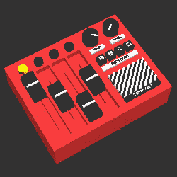

# 了解在这个事后分析的原型中什么可行，什么不可行

> 原文：<https://hackaday.com/2018/03/30/learn-what-did-and-didnt-work-in-this-prototyping-post-mortem/>

 【汤米】是一个制作电子音乐的人，但这不是这篇文章的主题。这篇文章是关于[杰出的原型剖析，他写了](http://blog.tommy.sh/posts/prototype-post-mortem-four-step-octaved-sequencer)关于他试图将*四步八分音序器*变成一个可行的产品。[Tommy]最初制作了一个手工焊接的一次性产品，其性能掩盖了其简单的内部结构，并决定尝试将其转化为产品。简而言之:他说有一天他会推出类似的测序产品，“但不会是这个。这本书将放在我的书架上，提醒我已经走了多远。”

该单元工作，看起来很棒，有一个简单的零件清单，材料清单成本低。那么问题出在哪里？通过原型制作，[Tommy]了解到他的设计在用于创造产品之前需要进行许多修改，他写下了在这个过程中所学到的一切。下面嵌入的是原型的演示，展示了它的工作原理和功能，它有助于为[Tommy]分享的经验提供背景。

[https://player.vimeo.com/video/260509940](https://player.vimeo.com/video/260509940)

当涉及到发现实际问题和意想不到的潜在问题时，动手制作原型可能是一个很好的老师。另一个很好的老师是经验，这是一个很好的机会让[Dan Gelbart]分享他 40 年的机械原型制作经验。在第一个视频的前几分钟，[Dan]谈到了外壳设计的选择，并对该系列的其他部分给出了一个很好的想法。这是[Tommy]关于他的原型课程的文章的后续。