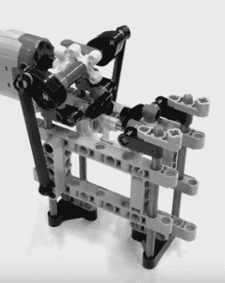

# 乐高划船是你不知道你需要的池畔伴侣

> 原文：<https://hackaday.com/2017/10/15/lego-row-boat-is-the-poolside-companion-you-didnt-know-you-needed/>

也许是欢快的音乐，或者是日落时平静的湖光山色，或者也许只是看到那些小塑料棒在全力抽水。不管是什么原因，[Vimal Patel 发布了他的小型遥控乐高划艇](https://www.youtube.com/watch?v=mdaziKxyl5E)在开放水域上巡航的视频，这肯定会让最疲惫的黑客脸上露出笑容。

[Vimal]告诉我们，他的作品是由超过 140 个未经修改的乐高零件组成的，并通过蓝牙连接到他手机上的应用程序进行控制。虽然我们希望看到他发明的驱动船桨的往复模块的更多细节，但我们不得不承认，他在 flickr 相册中为这个项目提供的图片总体来说是无可挑剔的。如果玩具船游戏对[Vimal]不起作用，我们认为他绝对有能力进入一家汽车制造商的广告部。

[Vimal]甚至为这个项目提供了一个乐高数字设计师文件，这在小彩虹彩色积木的世界里类似于发布源代码，所以你可以在明年夏天之前建立自己的舰队。

值得注意的是，[Vimal]是模块化构建模块领域的大师，在 Hackaday 并不陌生。他的[自系带鞋在今年早些时候给人留下深刻印象](https://hackaday.com/2017/02/01/self-lacing-lego-power-shoe/)，这甚至不是他的[第一艘乐高船只](https://hackaday.com/2012/04/10/water-strider-robot-does-it-with-lego-parts/)。

他现在要做的就是开始建造每个人都喜欢的巨型积木，以达到乐高建筑的真正巅峰。

 [https://www.youtube.com/embed/mdaziKxyl5E?version=3&rel=1&showsearch=0&showinfo=1&iv_load_policy=1&fs=1&hl=en-US&autohide=2&wmode=transparent](https://www.youtube.com/embed/mdaziKxyl5E?version=3&rel=1&showsearch=0&showinfo=1&iv_load_policy=1&fs=1&hl=en-US&autohide=2&wmode=transparent)

