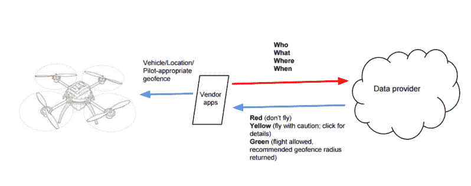

# 让天网变得有自我意识！

> 原文：<https://hackaday.com/2015/09/14/let-skynet-become-self-aware/>

不久前，坐飞机还很难。忘记真正的有人驾驶飞机和飞行员执照；即使是飞行模型飞机也需要数小时的练习，通常是在飞行场地的师傅的指导下。但是伴随训练而来的是安全飞行规则的教育，包括在指定的机场飞行和注意障碍物。

我们不小心搞砸了。我们无人机行业让飞机变得超级容易飞——也许太容易飞了。由于智能自动驾驶和 GPS，你可以打开一个盒子，下载一个应用程序，然后按下“起飞”。直升机会尽职尽责地升到空中，在那里等待进一步的指示——不需要任何技能。即使你碰巧在一场大型比赛中在 NFL 足球场，它也会这样做。或者在机场附近。或者在森林大火中。

问题是，随着培训脱离了驾驶无人机的过程，我们无意中也脱离了学习安全和负责任飞行的教育过程。当然，我们无人机制造商在我们的说明手册(人们不会阅读)和我们的应用程序(他们会掠过)中包含各种警告和咨询，DJI 和我自己的 3DR 等公司也包含基本的“地理围栏”限制，试图将操作者保持在 400 英尺以下和“视觉视线”内。但这还不够。

每天都有更多关于无人机操作员越过这些限制，在喷气式飞机附近飞行，撞上体育场，干扰急救人员的报道。到目前为止，它还没有以悲剧告终，但事情发展的方式最终会。与此同时，这使得无人机越来越有争议，甚至令人恐惧。我把这种流行的(大多是无意的)不良行为称为“集体抢劫”。随着无人机走向大众市场，人们用它们做傻事的几率达到了确定性的奇点。

我们必须在政府为我们做之前做些什么，限制无人机在交火中的许多良好用途。事实是，大多数陷入困境的无人机操作员并没有恶意，甚至可能不知道他们正在做的事情是不负责任的，甚至是非法的。谁能责怪他们呢？很难理解联邦、州和地方法规和指导方针的拼凑，这些法规和指导方针每天甚至每小时都会根据“空域解除冲突”规则和联邦航空局为有执照的飞行员和空中交通管制编写的警报而变化。很多无人机拥有者甚至不知道有这样的规则存在。

### 无人机本身应该知道每个区域的规则

幸运的是，他们不必如此。我们的无人机甚至可以更智能——足够智能，知道它们应该飞往哪里，不应该飞往哪里。因为现代无人机与手机相连，它们也与云相连。每次你打开他们的应用程序，该应用程序可以在线检查，以找到合适的飞行规则，无论你在哪里，就在那里。

它是这样工作的。该应用程序向云服务发送四个数据字段:**谁**(操作员标识符)**什么**(飞机标识符)**哪里** (GPS 和高度位置)和**何时**(在自主任务的情况下，可以是现在或预定时间)。云服务然后返回“红灯”(不允许飞行)、“绿灯”(允许飞行，有基本限制，如 400 英尺高度上限)或“黄灯”(附加限制或警告，可以在上下文中和使用时向运营商解释)。

目前，一些行业组织，如无人机基金会、T2 小型无人机联盟(我帮助领导了这两个组织，但这篇文章仅反映了我个人的观点)以及 3DR 和 DJI 等制造商正在研究这些“安全飞行”标准和 API。与此同时， [Airmap](http://www.airmap.io/) 和 [Skyward](http://skyward.io/) 等许多公司正在构建云服务，以提供任何制造商都可以使用的最新第三方数据层。它将从静态禁飞区数据开始，如机场、美国国家公园和华盛顿 DC 等其他禁飞空域的邻近程度。但它也将快速添加动态数据，如森林火灾、公共事件和与其他飞机的接近程度。

(关于这方面的更多信息，您可以阅读 Dronecode 工作组之一的白皮书[这里](https://docs.google.com/document/d/14j6oO0IH-jobzfKbocxTKpZ5DFexVcmsRoLfbSQg0DI/edit?usp=sharing)和更高层次的描述[这里](https://docs.google.com/document/d/1J8IbNPo5NEEyYjHI-9GGBgxUZ5KmGRx4XrzQaHMYDLs/edit?usp=sharing)。)

### 总是有一个陷阱

当然，这个系统并不完美。它的好坏取决于它所使用的数据，以及制造商实施这些限制的方式，这些数据在全球范围内仍相当不完整。一些无人机制造商可能会选择将距离机场 5 英里的任何区域视为硬性禁令，并禁止该区域的所有飞行，即使是以愤怒的客户为代价，这些客户在沃尔玛购买玩具时并不知道他们距离机场 5 英里(他们也不认为这应该有关系，因为这只是一个“玩具”)。出于用户友好的考虑，其他制造商可能会选择制定更加分级的限制，增加联邦航空局法规中没有的细微差别。比方说，他们可能会禁止距离机场一英里的飞行，但只会将飞行限制在 150 英尺左右的高度(基本上是后院水平的飞行)。

这是合理的第一步。但是最终的安全飞行系统会走得更远。从本质上讲，它将把国际空中交通管制系统扩展到数百万架飞机(空中已经有一百万架消费级无人机)，从儿童到亚马逊，无所不包。唯一的办法就是让无人机自我调节(是的，让天网变得有自我意识)。

### 对等空中交通管制

这种点对点的空中交通管制是有先例的:WiFI。早在 20 世纪 80 年代，FCC 发布了 2.4 Ghz 频段的频谱供未经许可的使用。十年后，第一个 first 802.11 标准发布了，该标准基于一些也适用于无人机的原则。

1.  所使用的空域没有被商业运营者占用
2.  潜在危害低(在 WiFi 的情况下，低传输功率。在无人机的情况下，由于“微型”类别的重量限制，动能较低)
3.  该技术能够通过观察其他正在使用空域的物体并选择避免碰撞的通道/路径来自行“解除”空域冲突。

FCC 创建的“开放频谱”沙盒也围绕 WiFi 创建了一个巨大的新产业。它让每个人都有了无线网络，绕过了之前的频谱垄断者、手机运营商和媒体公司。剩下的就是历史了。

我们可以用无人机做同样的事情。让我们创造一个创新的“沙箱”,为在非常受限的环境中飞行的小型无人机设置监管障碍。沙箱的参数几乎可以是任何东西，只要它们是清楚的，但它应该是基于动能和范围的(在 100 米高度和 1000 米范围内的 2 公斤和 20 米/秒的限制将是一个好的起点)。

与开放频谱的情况一样，在风险相对较低的应用中，如微型无人机，技术可以被允许“自我解除空域冲突”，而不需要排除垄断，如独家许可或监管许可。怎么会？通过让无人机使用他们最初获得飞行许可时使用的同一手机网络报告他们的位置。美国联邦航空局已经为此制定了一个标准，名为 ADS-B，该标准基于每架飞机上报告其位置的应答器。但是那些应答器很贵，对小型无人机来说也没有必要，因为它们已经知道自己的位置，并与云相连。相反，他们可以使用“虚拟 ADS-B”通过他们的手机网络连接报告他们的位置，这些数据可以注入到他们用来检查他们的飞行是否安全的相同云数据服务中。

一旦成功，我们将会有一场革命。WiFi 对电信行业做了什么，自主的云连接无人机可以对航空航天业做什么。我们可以占领天空，而且安全地占领。技术可以解决它所产生的问题。

* * *

### 关于作者

Chris Anderson([@ Chr1sa](http://twitter.com/Chr1sa))是 [3D Robotics](http://3drobotics.com/) 的 CEO，也是 [DIY 无人机](http://diydrones.com/)的创始人。从 2001 年到 2012 年，他是《连线》杂志的主编。在《连线》杂志之前，他在伦敦、香港和纽约为《经济学人》工作了七年。

纽约时报畅销书*长尾*和*自由*以及*制造者:新工业革命*的作者。

他的背景是科学，从在洛斯阿拉莫斯学习物理和做研究开始，在两个领先的科学杂志《自然》和《科学》工作了六年。

在他自称虚度的青春里，克里斯是 DC 朋克乐坛的小角色，有趣的是，他是一个叫做 REM 的乐队的成员。你可以在这里阅读更多关于那个[的内容。](http://www.longtail.com/the_long_tail/2006/07/my_new_wave_hai.html)

奖项包括:广告时代年度编辑(2005)。被命名为“[时代 100](http://www.time.com/time/specials/2007/time100/article/0,28804,1595326_1595332_1615973,00.html) ”，新闻杂志的世界上最有影响力的 100 人名单(2007)。年度[商业书籍](http://www.anderson.ucla.edu/media-relations/2007/2007-loeb-awards) (2007)勒布奖。《连线》杂志因他的任期(2009 年)而被《广告周刊》评为十年最佳杂志。《时代》杂志的[Tech 40](http://business.time.com/2013/05/01/time-tech-40-the-ten-most-influential-tech-ceos/)——科技界最具影响力的人物(2013)。《外交政策》杂志的[全球 100 大思想家](http://www.foreignpolicy.com/2013_global_thinkers/public/anderson) (2013)。