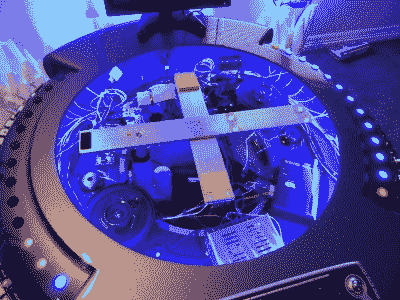

# 悬浮桌发出全息点唱机的声音

> 原文：<https://hackaday.com/2016/11/22/levitating-table-makes-the-sound-of-this-holochess-jukebox/>

一个冒泡的 Wurlitzer juke 将是一个人洞穴的经典图片的珍贵补充——黄铜栏杆的酒吧，kegerator，台球桌，锡标志和墙上的霓虹灯。但是，要给这个千年隼全息桌上点唱机一个合适的家，需要一个特别古怪的住所。而且是特别棒的一个。

 这一切都始于【吉姆·希玛】的朋友制作的一个非常细致逼真的全息桌子复制品。在道具上花了很多时间和精力，在安装媒体播放器时，[吉姆]决定不改变外观，包括运行 OSMC 的树莓皮和 160 瓦的功率放大器。

扬声器有问题——除了在桌子的拉丝铝台面下，没有其他方便安装的地方。音质差强人意，所以[Jim]没有在桌子上戳难看的洞，而是设计了一个伺服系统，在音乐播放时抬起桌子。

液晶显示器和无线键盘稍微降低了整体外观；我们会给[吉姆]一个通行证，直到他能拿出一个全息显示器来完成建设权。但令我们失望的是，他没有用 Figrin D'an 的[《Mad About Me》和模态节点](https://www.youtube.com/watch?v=oMUOfFxuetw)作为下面视频中的演示曲。

这是一个很好的构建，你会想看看[Jim]的[Hyperdyne Labs](http://www.hyperdynelabs.com/home.php)以获得更多值得流口水的道具和效果。对于另一个粉丝点唱机，请查看[这个点唱机，它的内部更大](http://hackaday.com/2014/02/21/this-party-jukebox-is-bigger-on-the-inside/)。

 [https://www.youtube.com/embed/KCO-pgJE9ng?version=3&rel=1&showsearch=0&showinfo=1&iv_load_policy=1&fs=1&hl=en-US&autohide=2&wmode=transparent](https://www.youtube.com/embed/KCO-pgJE9ng?version=3&rel=1&showsearch=0&showinfo=1&iv_load_policy=1&fs=1&hl=en-US&autohide=2&wmode=transparent)

