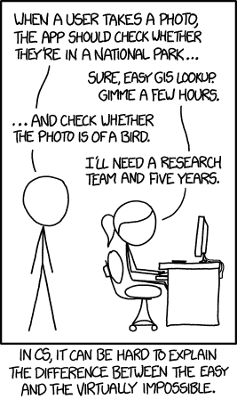
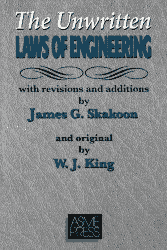
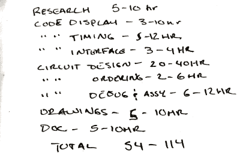

# 合同寿命:估计项目时间

> 原文：<https://hackaday.com/2016/09/09/life-on-contract-estimating-project-time/>

你坐在那里，办公室角落里的时钟显示会议已经过了 45 分钟，内心充满了愤怒。战斗或逃跑是与你的注意力持续时间的竞赛，当他们喋喋不休时，你努力保持一个感兴趣的表情。真正的工作可以在这段时间内完成。如果你去洗手间的话，也许你可以…让会议快进。恐慌的想法持续了一段时间，直到你的意识回到房间里的话语声。

“你做这件事需要多长时间？”经理问道。

“也许几天吧？”你依次回答。经理点点头，你就可以走了。你不知道你已经失败了。

这个项目失去了控制。整整两天，经理在那里期待着结果。怎么会？这怎么又发生了？感觉很好！做这样一个简单的项目只需要两天时间。结果花了一个星期。

下一次会议你说两个星期只是为了确定。每个人都严肃地点点头，对事情需要这么长时间感到不安，但工作必须完成。两天后，你带着一个完成的项目，羞怯地走进经理的办公室。他看起来很高兴，但很困惑。接下来的会议，他坚持说你可以用一半的时间完成。你和你脆弱的自尊领先，却姗姗来迟。奥秘！

这就是我的生活，直到我开始烦扰身边更有经验的人。我从他们身上学到了很多，最后我把它提炼成了几条规则。

1.  除了小时，没有其他单位
2.  要诚实。
3.  获得粒度。
4.  承诺一个范围。给个期限。

### 为什么？

为什么有人想要一个时间估计？他们将如何处理这些信息？当从事合同工作时，当给出时间估计时，感觉就像是把脚伸进了陷阱。他们会让我这么做吗？万一出了问题怎么办？毕竟我们不是算命的。除非经理非常糟糕，或者你表现得非常不负责任，否则估计时间不太可能对你不利。

Source: [XKCD #1425](http://xkcd.com/1425/)

在一天结束时，经理需要一个时间估计，因为他需要知道什么时候移动人员，他需要管理成本。例如，假设他要求一些他认为简单的东西。突然你提供了一个远远超出他预期的时间。他可能会立即将该特征完全从列表中划掉。作为一名没有经验的工程师，我过去认为这是对我能力的轻视。当然，如果我更好，我可以做得更快，但他只是在做一个成本判断。他知道工程时间要花钱。

同样，也许他让楼下大厅的吉姆做交配专题。如果你的时间远远不够，他可能会指派另一名工程师来帮助你或改变吉姆的规格。

最重要的是，估计时间可以保护你。很可能你被要求做一项任务，因为你是专家。你以前做过这个。你知道要花多长时间。你不可能向你的老板解释你的特定任务的所有错综复杂之处。也没有必要让他们负担这些信息。如果给出了一个合适的时间估计，并且你被认为是一个在承诺范围内交付的人，那么你很少会被以敌对的方式询问你的进展。

### 除了小时，没有其他单位

除了小时以外，任何工程估算都不应该计算和给出。

我们按小时计酬。我们按小时计费。我们花几个小时来完成一项任务。一天，一个月，下周，几个，几个，一点，都是无意义的可怕的沟通方式和计算工作时间的方式。

很久以前，当我对这些还不熟悉的时候，我打开微软的 Outlook，查看我的日历。我刚刚学会了以小时为单位进行估算的概念，并且我渴望对它进行测试。我粗略估计了 20 个小时，我急于告诉老板我可以在三天内完成这项工作。一天工作 8 小时就是 24 小时，对吧？我甚至会有一些缓冲时间。

I use a time tracker app like timely to track my exact hours. If I get up to use the bathroom I click stop.

认真看看我的日历，我惊恐地发现，在我最好的日子里，我最多只有五个小时的时间来真正坐下来设计。在平常的日子里，会议、午餐、其他任务以及更多的事情会让我只有三个小时的工作时间来做任何事情。诚然，这家公司喜欢用无意义的工作浪费时间，但这是题外话。

最后，我的经验是，大多数人在他们的绝对极限下工作，在他们每天工作的九个小时中，只能抽出四到六个小时，“铅笔实际上在纸上，故意地移动”。事情就是这样。最后，我给出了一个估计，如果我的时间表保持清晰，下周五是我最有可能交付项目的时间，但我会在周一给他一个更清晰的估计，这取决于下周的情况。他连眼睛都没眨一下。

这很好地引出了下一部分。

### 诚实

The ASME Unwritten Laws Of Engineering would agree with me. If you don’t believe me check for yourself, they wrote them down in this book.

作为一名工匠，有一定的渴望留下深刻印象。有一种想成为最好的欲望。在做时间估计时，最糟糕的事情就是在等式中加入这些。如果你需要三个以上的工程师来完成这个项目，并且需要一年的时间来完成它，那么说你可以在六个月内，在一个山洞里，用一箱废料来完成它是没有任何好处的。如果你一天只有四个小时的实际工作时间，那么…这就是你所拥有的。

除非你在盐矿工作，否则你被雇佣是因为你是能给出专家建议的专家。经理只想要信息，不要别的。另外，这也是我从惨痛的教训中学到的:如果你需要时间来做估算，那就开口吧。我会经常脱口而出一个估计，看起来一切尽在掌握。人们会把它写下来，然后我就不能按时交货了。

诚实面对你的能力和你的需求。

### 获得粒度

当我开始专业工作时，我倾向于像在我的实验室里做黑客一样评估我的项目。“我只会读一点，然后可能会买一块板。我不知道。我猜已经有一些代码了？如果没有，我想我可以只写它。”时间在我的项目中并不重要，所以我会估计我“感觉”这个项目需要多长时间。

Getting granular on a sample made-up project.

你的目标是为项目中的每项任务争取最短的时间和最长的时间。

如果你真的想交付一个准确的评估，任务必须被分解。已经有图书馆了吗？好的，有，但是要花 1500 美元。我要花十到二十个小时来写它，所以如果我做得快，公司就会领先，如果我做得慢，公司就会落后。此外，未来的支持成本如何。我会因为自己做了而不得不花额外的时间调试吗？诸如此类的问题应该以一个粗略的列表结束，这个列表包含了完成这个项目所需要的几乎所有东西。

也很重要。如果你开始变得模糊，并且你不能精确地估计时间，那就交流一下。告诉他们:“嘿，我可以给你一个这部分工作的实时估计，但在我完成之前，我不可能给下一部分工作一个准确的估计”。大多数人都愿意分段工作。这也是非常有用的信息，通常会受到所有相关人员的重视。如果他们坚持认为你可能处于一个糟糕的时期，那么你应该估计绝对最坏的情况时间，并在此基础上增加一些时间。要诚实。

### 承诺

那么，你已经估计了你的项目。你知道完成这项工作最少需要 30 小时，最多需要 80 小时。你是承包商，所以你在家工作。你知道，当一切都非常顺利的时候，你一天大概有 7 个小时的工作时间。那是实际生产东西所花费的实际时间，而不仅仅是你告诉你的伴侣你在“工作”的时间。

和你签约的公司希望在三周内拿到。幸运的是，这是你唯一的项目。你算算。即使它变得可怕，你仍然只需要 11 天半来完成它。假设你有几天不像你希望的那样富有成效。在截止日期之前，你还有额外的 24.5 小时可以争取。如果你能掌控它，你甚至不用碰周末。开始有可能了。很少会事事不顺心。

最好的办法是告诉公司你能满足他们的最后期限，并提及需要的时间。你有足够的活动空间。他们可以在几个小时内估算出你将花费他们的最大金额。你可以毫无压力地工作，因为你知道你不可能错过最后期限。如果你在第三周的中段生病，损失了四天时间，你可以立即给他们发电子邮件，要求额外的几天，或者在必要的时候工作一个周末。

### 结论

当然，在项目评估上有许多学派。已经有很多关于这个主题的著作。有大量的财富建立在软件上，即使是在这个过程中最小的一点点。然而，能够很好地估计某件事需要多长时间是一项非常有用的技能，可以应用到生活的方方面面。

学钢琴需要多长时间？如果每天最少半小时，你知道你需要一周找三个半小时。如果你的伴侣想让你重新摆放家具，修剪草坪，下周六去拜访岳父岳母，每小时一次的估算可以让他们提前做好失望的准备。

你们怎么估计自己的时间？你有什么诀窍，如何让你的客户开心？期待评论。