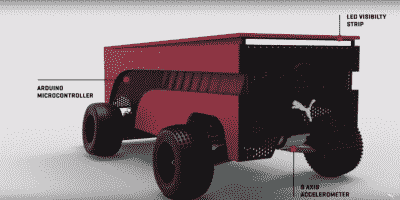

# 循线机器人训练跑步者

> 原文：<https://hackaday.com/2016/04/30/line-following-robot-trains-runners/>

你的机器人能比被称为“世界上跑得最快的人”的尤塞恩·博尔特跑得更快吗？运动鞋、服装和配饰公司彪马[创造了这样一个机器人来帮助训练他们公司赞助的运动员](https://www.youtube.com/watch?v=Q-g1DtiXfu8)。

这个鞋盒大小的机器人超过了[博尔特]的最高时速 44 公里。在这样的速度下，跟踪一条线变得很棘手。开发团队花了 8 个原型才获得这种能力。在 BeatBot 内部，Arduino 以每秒 100 个样本的速度读取 9 个红外传感器进行线路检测。一个数字伺服系统控制阿克曼转向机构跟随轨道或地板上的线。车轮编码器提供速度和距离测量数据。

用户可以设置跑步的距离和时间。跑步速度也可以调整。机器人上的发光二极管提供了发令枪，并帮助跑步者使用周边视觉看到 BeatBot。前后两个 GoPro 摄像头提供了跑步的视觉记录。

彪马认为，实际上与竞争对手，甚至是机器人赛跑，比仅仅与时间赛跑更能提高成绩。他们打赌，一个成年线追随者将帮助奥林匹克级运动员提高他们的表现。

 [https://www.youtube.com/embed/Q-g1DtiXfu8?version=3&rel=1&showsearch=0&showinfo=1&iv_load_policy=1&fs=1&hl=en-US&autohide=2&wmode=transparent](https://www.youtube.com/embed/Q-g1DtiXfu8?version=3&rel=1&showsearch=0&showinfo=1&iv_load_policy=1&fs=1&hl=en-US&autohide=2&wmode=transparent)

