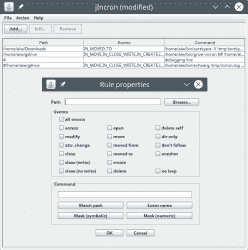

# Linux Fu:注意文件系统

> 原文：<https://hackaday.com/2018/06/07/linux-fu-watch-that-filesystem/>

UNIX 的方式是将不同的、单一用途的程序拼凑在一起，以获得您想要的效果，例如在 Bash 脚本中，您可以通过在命令行中键入其名称来运行该脚本。但有时你希望系统在没有你干预的情况下对系统的变化做出反应。例如，您可能希望监视一个目录，当一个文件从一个已完成的 FTP 事务中出现时自动启动某个程序，而不必坐在那里自己刷新目录。

简单但难看的方法是定期扫描目录。这里有一个非常愚蠢的 shell 脚本:

```
#!/bin/bash
while true
 do
   for I in `ls`
    do cat $I; rm $I
   done
 sleep 10
done
```

举个例子，我将文件转储到控制台并删除它，但是在现实生活中，您会做一些更有趣的事情。这真的不是一个好的脚本，因为它一直在执行，而且它也不是一个非常好的解决方案。(如果你认为我应该使用`for I in *`，试着在一个空目录中这样做，你就会明白为什么我使用`ls`命令。)

## 增加优雅

老实说，你想要更优雅的，对吗？现代内核(2.6.13 和更高版本)有一个名为`inotify`的接口形式的文件系统通知。您可以通过`sys/inotify.h`头文件以编程方式使用这些调用。还有一套你可以安装的命令行程序，通常打包成`inotify-tools`。

其中一个工具是`inotifywait`,它可以产生更好的脚本。例如:

```
#!/bin/bash
while true
 do
   if FN=`inotifywait –e close_write,moved_to --format %f .`
   then
    cat $FN
    rm $FN
   fi
 done
```

我觉得这样更好。它不会经常醒来，只有在某些事情发生了变化的时候。我认为任何一个正常的程序在目录中放东西，要么打开文件写，要么关闭它，要么移动它。任何一种方式都可以，并且`%f`告诉命令报告文件名。当然，你也可以等待其他事件的发生。

如果你想知道为什么 move case 是必要的，想想大多数文本编辑器和网络下载软件是如何工作的。通常，一个新文件在完成之前没有最终的名字。比如 Chrome 会把文件`test.txt`下载成`test.txt.crdownload`之类的。只有当文件完成后，它才会将文件重命名(移动)为`test.txt`。

如果您想在没有脚本的情况下尝试该命令，以便看到效果，只需打开两个终端窗口，如下所示:

[](https://hackaday.com/wp-content/uploads/2018/05/ss.png)

在下层终端中，发出`inotifywait`命令。不要忘记末尾的句点，它告诉它监视当前目录。然后在另一个终端的同一个目录下创建一个文件。文件名将出现在第一个终端中，程序将退出。脚本只是利用这个行为来设置 FN 变量，采取行动，然后重新启动`inotifywait`。顺便说一下，你可以要求程序不要退出，但是这使得编写脚本有点困难。但是，它也消除了在您进行处理时文件更改的问题。

另一个命令行`inotifywatch`也输出文件更改事件，但是它会观察一段时间，然后给出更改摘要。我就不多说了。如果您认为您需要该功能，您可以阅读手册页。

## 一个新的克朗

尽管如此，剧本仍然不够理想。据推测，一个系统可能需要监控许多不同的目录。你真的不想在每种情况下都重复这个脚本，或者它的变体。

有另外一个程序，叫做`incron`(你几乎肯定要安装这个)。`incron`程序类似于 cron，但不是基于时间的事件，而是基于文件通知的事件。一旦你安装了它，如果你想实际使用它，特别是作为一个普通用户，你可能必须改变`/etc/incron.allow`和`/etc/incron.deny`。

假设当一个文件出现在 hexfiles 目录中时，您想要运行一个脚本。您可以使用命令`incrontab -e`来编辑您的`incron`表。格式非常挑剔(例如，它需要空格，而不是制表符)。这是文件中的一行，可以完成这项工作:

```
/home/alw/Downloads/hexfiles IN_CLOSE_WRITE,IN_MOVED_TO /home/alw/bin/program_cpu $@/$#
```

末尾的`$@/$#`提供了受影响文件的完整路径。你也可以获取文本(`$%`)或数字(`$&`)形式的排气时间。您可以监视所有常见的事件，还可以设置选项来做一些事情，比如不取消引用符号链接。您可以在`incron`手册页中找到所有内容。

## 图像使用者界面

[](https://hackaday.com/wp-content/uploads/2018/05/jincron.png) 我不是 GUI 编辑器的忠实粉丝，但我知道我是少数。如果你愿意，还有一个基于 Java 的 incrontab 编辑器可用。没有太多的文档，但是您可以从`/var/spool/incron/your_user_id`导入您的`incrontab`——如果它存在的话。如果你看下面的图片，你可以看到它提供了一个为你构建`incron`表格行的表单。

通常可以在`/etc/incron.d`中找到系统文件。所有的位置都可以通过`/etc/incron.conf`文件来设置，所以如果你不确定去哪里或者你想改变表文件的位置，就从那里开始。

## 向前看

使用`incron`相当优雅。系统程序做所有的等待，我们的脚本只在必要的时候运行。你可以很容易地看到所有你设置了通知的事情。您可以使用这些工具做很多事情，不仅仅是在嵌入式领域。你打算如何使用它们？