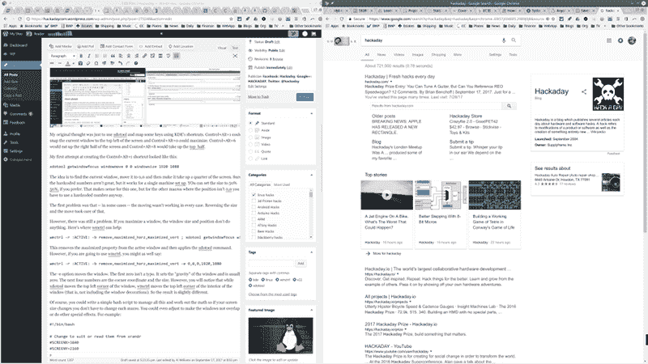

# Linux Fu: X 命令

> 原文：<https://hackaday.com/2017/09/21/linux-fu-x-command/>

基于文本的 Linux 和 Unix 系统很容易操作。Unix I/O 系统的工作方式是，你总是可以伪造另一个程序的键盘输入，并截取它的输出。整个系统就是这样运作的。不过，图形 X11 程序是另一回事。有没有办法像控制文本程序一样控制 X11 程序？这个问题的答案取决于你到底想做什么，但一般的答案是肯定的。

不过，和 Linux 和 Unix 一样，有很多方法可以找到答案。如果你真的想要对程序进行细粒度的控制，一些程序通过一种叫做 D-Bus 的特殊机制来提供控制。这允许程序公开其他程序可以使用的数据和方法。在一个完美的世界里，你的目标程序将使用 D-Bus，但是现在总是这样。所以今天我们将更多地寻找对任意程序的控制。

有几个程序可以以某种方式控制 X 窗口。有一个叫 xdo 的工具，你没怎么听说过。更常见的是 xdotool，我将向您展示一个例子。此外，wmctrl 可以执行一些类似的功能。还有 autokey，它是流行的 Windows 程序 AutoHotKey 的子集。

## 关于 xdotool

当您需要接管 GUI 程序时，xdotool 可能是最有用的命令。这有点像 X 操作的瑞士军刀。然而，命令行语法有点难，这可能是因为该工具可以做许多不同的事情。大多数时候，我对它移动和调整窗口大小的能力感兴趣。但它也可以发送假的键盘和鼠标输入，并且可以将动作绑定到诸如鼠标运动和窗口事件之类的事情上。

虽然您可以让该工具从文件中读取，但您最常看到的是命令行中的参数。这个想法是找到一个窗口，然后将东西应用到它上面。您可以通过名称或使用其他方式(如让用户单击所需的窗口)来查找窗口。

例如，考虑以下情况:

```
echo Pick Window; xdotool selectwindow type "Hackaday"
```

如果您在 shell 提示符下输入，您可以单击一个窗口，看到给定的字符串出现，就好像它是由用户键入的一样。该工具还能够发送鼠标事件和执行多种窗口操作，如改变窗口焦点、改变显示哪个桌面等。

顺便说一下，xdotool 的一些特性需要 X 服务器的 XTest 扩展。我总是发现这个是打开的，但是如果事情不工作，你会想要检查你的 X 服务器日志，看看那个扩展是否被加载。

## wmctrl 呢？

wmctrl 程序有很多类似的功能，但主要是与你的窗口管理器交互。唯一的问题是，它对你的窗口管理器使用一个标准的接口，并且不是所有的窗口管理器都支持所有的功能。这就是为 Linux 分发程序如此令人兴奋的原因之一。没有两个系统是相同的，有些甚至不接近！

当你想切换桌面、最大化窗口和相关任务时，wmctrl 程序大放异彩。然而，它也可以完成 xdotool 可以完成的许多任务。

## 使用大显示器

我最近把我的三显示器设置换成了一个非常大的 4K 显示器。43 英寸的庞然大物，分辨率为 3840×2160。这很好，但是我真的很怀念在一台显示器上放一个程序，在另一台显示器上放第二个(或第三个)程序的日子。

答案是让窗口滑动到屏幕上的特定位置。你可以使用平铺窗口管理器，但我用的是 KDE(它不再有平铺选项)。如果你把窗口拖动到正确的位置，它会把窗口吸附到特定的位置，但是速度不是很快。此外，快照区域并不完全是我想要的位置。

[](https://hackaday.com/wp-content/uploads/2017/09/bigscreen.png)

我最初的想法是使用 xdotool，并使用 KDE 的快捷方式映射一些键。Control+Alt+1 可以将当前窗口对齐到屏幕的左上角，而 Control+Alt+0 可以最大化。ctrl+Alt+6 会占据屏幕的右半部分，而 ctrl+Alt+8 会占据屏幕的上半部分。

我第一次尝试创建 Control+Alt+1 快捷方式时是这样的:

```
xdotool getwindowfocus windowmove 0 0 windowsize 1920 1080
```

这个想法是找到当前窗口，将它移动到 0，0，然后让它占据屏幕的四分之一。当然，硬编码的数字不是很好，但是它适用于单个机器设置。如果您愿意，可以将大小设置为 50% 50%。这对于这个是有意义的，但是对于其他位置不是 0，0 的宏，你必须使用硬编码的数字。

第一个问题是——在某些情况下——移动并不是每次都有效。反转尺寸和移动解决了这个问题。

然而，仍然有一个问题。如果你最大化一个窗口，窗口大小和位置值没有任何作用。下面是 wmctrl 可以提供帮助的地方:

```
wmctrl -r :ACTIVE: -b remove,maximized_horz,maximized_vert ; xdotool getwindowfocus windowsize 1920 1080 windowmove 0 0
```

这将从活动窗口中删除最大化属性，然后应用 xdotool 命令。但是，如果你要用 wmctrl，不妨说:

```
wmctrl -r :ACTIVE: -b remove,maximized_horz,maximized_vert -e 0,0,0,1920,1080
```

-e 选项移动窗口。第一个零不是错别字。它设置窗口的“重力”,通常为零。接下来的四个数字是角坐标和大小。但是，你会注意到，当 xdotool 移动窗口的左上角时，wmctrl 移动窗口内部的左上角(即不包括窗口装饰)。所以结果略有不同。

[](https://hackaday.com/wp-content/uploads/2017/09/half.png)

当然，您可以编写一个简单的 bash 脚本来管理这一切，并算出数学公式，这样，如果您的屏幕大小发生变化，您就不必更改每个宏。你甚至可以调整窗口不重叠或做其他特殊效果。例如:

```
#!/bin/bash

# Change to suit or read them from xrandr
#SCREENX=3840
#SCREENY=2160

# If you don't have xrandr, awk, or yours doesn't put the right
# format out, just hardcode up top
SCREENX=`xrandr -q | awk -F'[ ,]+' '/current/ { print $8 }'`
SCREENY=`xrandr -q | awk -F'[ ,]+' '/current/ { print $10 }'`

# Could adjust the actual locations here if you wanted

HALFX=$(( SCREENX/2 ))
HALFY=$(( SCREENY/2 ))

if [ $# -ne 1 ]
then
ARG="?"
else
ARG="$1"
fi
case "$ARG" in
nw)
TOP=0
LEFT=0
W=$HALFX
H=$HALFY
;;
n)
TOP=0
LEFT=0
W=$SCREENX
H=$HALFY
;;
ne)
TOP=0
LEFT=$HALFX
W=$HALFX
H=$HALFY
;;
w)
TOP=0
LEFT=0
W=$HALFX
H=$SCREENY
;;
center)
TOP=$(( $SCREENY/4 ))
LEFT=$(( $SCREENX/4 ))
W=$HALFX
H=$HALFY
;;

e)
TOP=0
LEFT=$HALFX
W=$HALFX
H=$SCREENY
;;

sw)
TOP=$HALFY
LEFT=0
W=$HALFX
H=$HALFY
;;

s)
TOP=$HALFY
LEFT=0
W=$SCREENX
H=$HALFY

;;

se)
TOP=$HALFY
LEFT=$HALFX
W=$HALFX
H=$HALFY
;;

*)
echo &quot;Usage: winpos (nw, n, ne, w, center, e, sw, s, se)&quot;
exit 1
;;
esac

# do it
# wmctrl -r :ACTIVE:-b remove,maximized_horz,maximized_vert -e 0,$LEFT,$TOP,$W,$H
# or here's another way (note, this will show title bars without adjustment
# the above method will cut them off at the top part of screen
wmctrl -r :ACTIVE: -b remove,maximized_horz,maximized_vert
xdotool getwindowfocus windowsize $W $H windowmove $LEFT $TOP

exit 0

```

有了这个脚本，你的键盘宏就可以调用带有“ne”(东北)或“center”标签的脚本来控制窗口位置。任何更改都很容易在脚本中管理，而不是分散在多个宏中。

## 摘要

在《星际迷航》的一部电影(威廉·夏特纳主演的真实电影)中有一句台词，柯克告诉某人，你必须学习星舰上的事情是如何运作的。Linux 也差不多。如果你能弄清楚如何做，并在无数可能是你想要的工具中跋涉，那么没有什么是你做不到的。有时需要多种工具的组合，处理无限多种配置是很困难的，但是如果你尝试的话，你通常可以让事情发生。