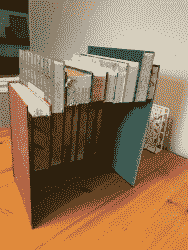

# 你路由器的文学伪装

> 原文：<https://hackaday.com/2018/06/27/literary-camouflage-for-your-router/>

上图中的书有什么可疑之处？是不是没有书挡？它们发出的无线电波呢？[Clay Weiland]不喜欢一个裸露的路由器放在客厅的样子，但他很欣赏把它放在房子中间所获得的覆盖。他以二手书封面的形式添加了一层家居装饰伪装，以隐藏难看的技术。

任何地方都没有关于这个特殊建筑的博客帖子或视频。这些照片是按原样提交给[我们的举报热线](https://hackaday.com/submit-a-tip/)的，并注明涉及到了一个台锯。我们可以有把握地推断，书的封面被剥去了书页，填满了漆成白色的木制空白，粘在一起，看起来像一堆文学作品。这个例子告诉我们，我们的技术不必像秘密一样隐藏起来，或者破坏装饰，它可以尽可能地按照功能放置，而不牺牲风水。

如果藏在书后面激起了你的兴趣，试试一个全面版的，或者这个[平滑算子](https://hackaday.com/2017/01/21/hidden-bookshelf-door-shows-incredible-motion/)。

感谢[George Graves]鼓励人们[使用我们的举报热线](https://hackaday.com/submit-a-tip/)。