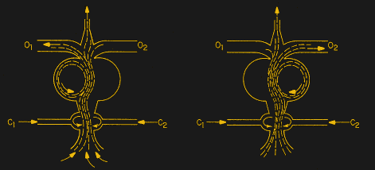

# (空气)压力下的逻辑门

> 原文：<https://hackaday.com/2017/08/19/logic-gates-under-air-pressure/>

我们总是对逻辑门产生的方式着迷。当然，我们认为逻辑门携带电子，但有这么多其他的机械手段来做同样的事情。另一种有时有实际用途的方法是流体或气动逻辑。我们猜测[dAcid]有类似的兴趣，因为他已经写了两篇关于如何建造大门的文章。一贴盖[用普通工具制作](http://www.instructables.com/id/Pneumatic-Logic-Gates-Made-With-Simple-Tools/)。另一个[需要 SLA 打印机](http://www.instructables.com/id/3D-Printed-Pneumatic-Logic-Gates/)。

根据[dAcid]的说法，这两种设计实际上都是一样的，但是 SLA 印刷更加精确。不管怎样，硅树脂都是一种重要的成分。流体逻辑在一些机械系统中有应用，尽管数字逻辑已经使它不如以前重要了。然而，纳米技术系统很可能会机械地实现逻辑，因此这仍然是一种有趣的理解技术。下面，你可以观看使用这两种方法制作的 D 闩锁的视频。

这个想法很简单。流体——记住空气也可以是流体——被送入一个分裂成“Y”或“T”形的管子中(见下图)。垂直于主流的小控制管可以迫使流体沿着 Y 形管的一条边向下流动。在该图的情况下，O1 和 O2 是“T”的分支，C1 和 C2 允许控制流动方向。还有其他变化，包括在一个端口上使用真空和压力来移动主流和实现基本的构建模块。

你可能想知道如何用它制作逻辑门，直到你意识到它只不过是一个多路分解器。一些 FPGAs 使用多路复用器以常规方式实现逻辑，这里的想法也是一样的。顺便说一句，你也可以把一个继电器看作一个多路复用器，并做同样的技术。

事实上，令人惊讶的是，如果你尝试的话，有多少种方法可以制造逻辑门。我们经常觉得有趣的是，如果埃及人利用尼罗河来产生气压，他们很可能拥有制砖技术，金字塔可能是第一个数据中心。你只能想知道，如果他们考虑过这个问题，他们会计算出什么。

你也可以制造纯机械门。如果你有一台激光切割机，[你就一切就绪了](http://hackaday.com/2015/11/23/laser-cut-mechanical-logic-gates/)。

 [https://www.youtube.com/embed/TQ-fUca0Pc4?version=3&rel=1&showsearch=0&showinfo=1&iv_load_policy=1&fs=1&hl=en-US&autohide=2&wmode=transparent](https://www.youtube.com/embed/TQ-fUca0Pc4?version=3&rel=1&showsearch=0&showinfo=1&iv_load_policy=1&fs=1&hl=en-US&autohide=2&wmode=transparent)

[https://player.vimeo.com/video/229391658](https://player.vimeo.com/video/229391658)