# 看看人们在国防会议上给早餐带来了什么

> 原文：<https://hackaday.com/2017/08/01/look-what-people-brought-to-breakfast-at-def-con/>

周日是我们在 Hackaday meetup 的早餐时间，一大群人出现了，看看他们带来的硬件吧！拉斯维加斯可能是一个很难安排聚会的地方——尤其是如果你不想租房子的话。我们过滤进了凯撒街对面的一家星巴克，最后打包了高桌区。事实证明，当你排队买咖啡，要了四打糕点和几桶咖啡时，咖啡师会给你一个很奇怪的眼神。

 [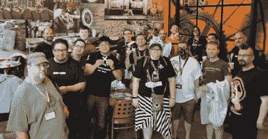](https://hackaday.com/2017/08/01/look-what-people-brought-to-breakfast-at-def-con/02-thirty-minutes-before-the-meetup-2/) About 30 minutes before official start [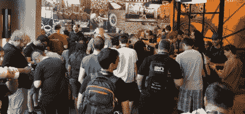](https://hackaday.com/2017/08/01/look-what-people-brought-to-breakfast-at-def-con/10-sort-of-full-looking-2/) Too busy talking hardware to look

空间的大小使得很难拍到整个人群的照片。我确实设法和提前半小时出现的人拍了一张合影。一旦它填满了，我得到的所有人群照片都是背对着我、低着头比较硬件项目的人——这实际上可能更适合 DEF CON，因为人们通常不想被拍照(我们戴着大手帕的朋友就是一个例子)。

 [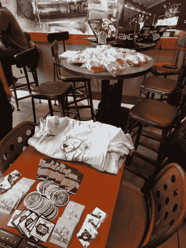](https://hackaday.com/2017/08/01/look-what-people-brought-to-breakfast-at-def-con/01-swag-and-pastries/) Swag, pastries, and RF hacking [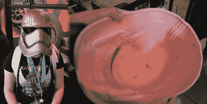](https://hackaday.com/2017/08/01/look-what-people-brought-to-breakfast-at-def-con/03-stormtrooper/) print your Storm Trooper helmet  custom headgear

手头有一大堆不同的硬件。如果你看一张摆着礼品和糕点的桌子的照片，仔细看看桌子后面的高顶。在我们到达之前，有几个人在黑 RTL 特别提款权(这意味着他们至少提前了 45 分钟)。

我是一个在活动中穿着你的硬件项目的粉丝，今年真的很棒。首先，一个来自*原力觉醒*的 Phasma 队长头盔。它是在 ABS 中 3D 打印的，在打磨和喷漆完成工作之前，使用丙酮/ABS 浆料粘合(实际上是焊接)零件。

 [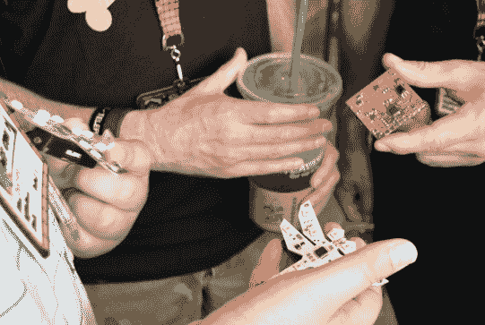](https://hackaday.com/2017/08/01/look-what-people-brought-to-breakfast-at-def-con/05-badge-prototypes/) Dragonfly badge (proper name: Sympetrum) [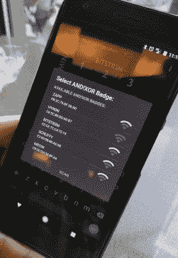](https://hackaday.com/2017/08/01/look-what-people-brought-to-breakfast-at-def-con/04-numerous-andnotxor-badges-on-hand/) AND!XOR badges within BT range

手头上的大多数黑客都是专门为 DEF CON 打造的非官方硬件徽章。我参加了徽章打造的会议，并在会后发布了我在那里看到的所有内容。但在这里，我们看到了[凯瑞]随身携带的蜻蜓徽章以及原型的矩形印刷电路板。那个和！XOR crew 在房子里，我决定对[Hyr0n]的密码哈希进行窃听，我正试图从他们的徽章固件中破解密码哈希。他打开应用程序，毫不奇怪地看到该地区有如此多的[狂欢者戴着狂欢徽章](http://hackaday.com/2017/07/12/hands-on-new-andxor-unofficial-def-con-badge/)。他们的僵尸网络今年大受欢迎！

 [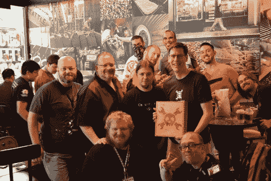](https://hackaday.com/2017/08/01/look-what-people-brought-to-breakfast-at-def-con/08-pose-with-quadbadge-box/)  [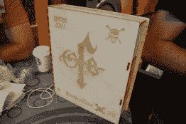](https://hackaday.com/2017/08/01/look-what-people-brought-to-breakfast-at-def-con/06-quadbadge-box/)  [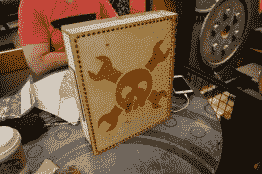](https://hackaday.com/2017/08/01/look-what-people-brought-to-breakfast-at-def-con/07-back-of-quadbadge-box/)  [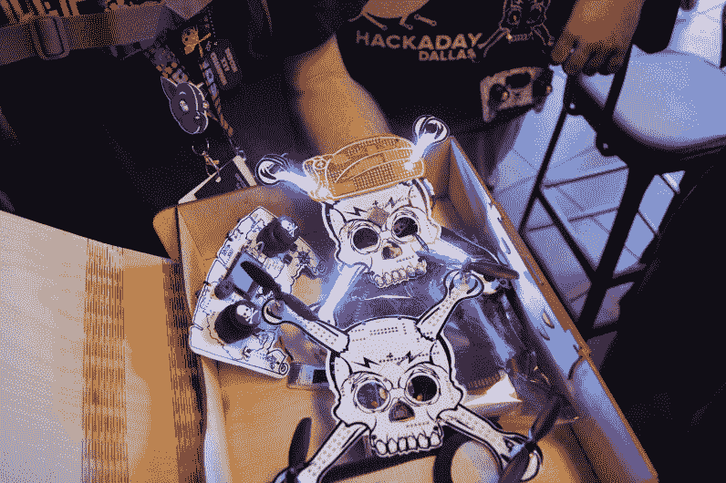](https://hackaday.com/2017/08/01/look-what-people-brought-to-breakfast-at-def-con/09-contents-of-quadbadge-box/) 

在某个时候，有人递给我这个像书一样的盒子，它是用胶合板激光切割蚀刻出来的。这是一个美丽的作品，我不知道我会在里面找到什么。原来这是一个完整的四轴飞行器徽章趣味套件。几周前当我们覆盖这个徽章时，我一定是被电子产品迷住了，以至于我完全错过了他们为它建造的漂亮盒子。

在盒子里，你会发现两个版本的徽章(一个会飞，另一个会闪烁，有一个红色的 PCB 手帕)，一个单独的 PCB 是控制器，还有一个装有额外电池和充电硬件的礼品袋。我们没有在 meetup 上发布这个，但是我们会在[hack aday super conventi on](https://hackaday.io/superconference)上发布给你玩。能和这么多为制作这个徽章而努力的人合影真的很棒。

 [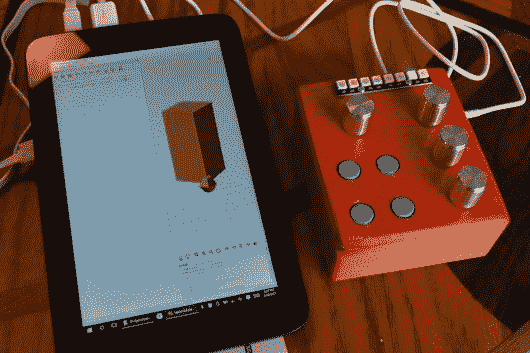](https://hackaday.com/2017/08/01/look-what-people-brought-to-breakfast-at-def-con/11-openscad-controll-box/)  [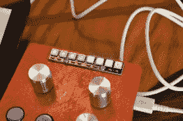](https://hackaday.com/2017/08/01/look-what-people-brought-to-breakfast-at-def-con/12-showing-precision/)  [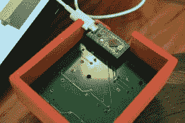](https://hackaday.com/2017/08/01/look-what-people-brought-to-breakfast-at-def-con/13teensy-and-control-pcb/) 

角落里有一个高屋顶，整个早上都被人围着，我只是在中午人群开始散去时才看了一眼。[Brian McEvoy]为 OpenSCAD 构建了一个定制控制器，并在演示方面做得很好。平板电脑正在运行该软件，控制器通过 USB 连接。右边有 3 个旋钮，可以调节高度、宽度和深度。第四个旋钮用于调节精度。这种精确性以一种非常巧妙的方式表现出来。您可以看到 LED 灯带的右侧(小数点)有一个红点，左侧有三个彩色像素。这些是十位、百位和千位，但只要转动曲柄，直到红点在条带的另一端，你就可以将精度设置为十分之一、百分之一等。[Brian]甚至添加了一个按钮，您可以按住它，直到精度达到 10 倍，而无需进行永久性调整。这个项目是由一个小小的董事会推动的。

很高兴看到 Hackaday 社区参加这样的聚会，尽管在 DEF CON 上还有很多其他事情要做。感谢大家来打招呼，分享你们的故事，并展示你们的工作！