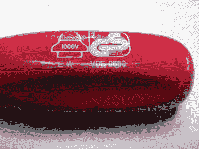

# 直视电源电压并幸存下来

> 原文：<https://hackaday.com/2016/05/11/looking-mains-voltage-in-the-eye-and-surviving-part-1/>

当看到其他人在一件设备中遇到市电时，他们的反应通常是令人惊讶的。作为与 it 打交道多年的工程师，很容易忘记不是每个人都有过这样的经历。一方面，我们对那些不顾后果潜入水中的人感到厌恶，另一方面，我们经常惊讶于有多少人对待任何电压超过几伏的物品，就好像它被放射性炭疽热污染了一样，甚至不敢想打开它。

我们最近在 Hackaday 的作者中进行了一次聊天，讨论我们如何处理这个主题。最简单的方法就是保持自我安全，加入放射性炭疽人群。但我们得出的结论是，这个网站是黑客和制造者的资源。你们中的一些人无论如何都要揭开装有高电压的盒子的盖子，所以我们认为我们应该帮助你们安全地做到这一点，而不是只听远处的尖叫声。

因此，以下是如何接近含有高电压的电子设备系列的第一部分，并现场讲述故事。我们所说的“高电压”是指任何高达电源电压的电压，以及那些直接从电源电压产生的电压，比如你会在开关模式 PSU 中发现的几百伏整流 DC。对于几千伏的 EHT，你必须等待另一篇文章，因为这本身就是一个完整的主题。我们将顺便提及这些更高的电压，但它们的细节最好留给有更多相关经验的普通同事。

## 警告

写这样一篇文章时，首先要明确的一点是，你应该忽略任何“安全”电压或电流的想法。虽然每年有相当多的人死于舔 9 伏电池[的故事可能是一个城市传说](https://www.sparkfun.com/news/1385)，而且你几乎不用担心低压设备，但最好将任何**更高的电压视为潜在的危险并做出相应的反应。**

如果你有一次电源电压电击并侥幸逃脱，你是幸运的，这并不意味着电压是安全的，你只是在用欧姆定律和低阻抗高压电源玩俄罗斯轮盘赌游戏。你的家用电源可以提供你的家庭取暖、烹饪或电水壶所需的大量电流，所以如果它找到一条通过你的低电阻路径，那么它将毫无问题地提供欧姆定律允许它通过的任何电流。如果它发生在你身上，你可能会遇到足够大的阻力，你只会受到非常严重的颠簸，并活着讲述这个故事，但如果不是你的幸运日，阻力会足够小，你只会坐在它的末端抽搐，直到电源关闭，无论你是否活着。这是可怕的事实。弄乱这个东西，你可能会死，故事结束。你有责任保证自己的安全，这不是开玩笑。好吗？现在去工作！

## 工作台

谈论电源电压设备时，首先要从你的工作台开始。我们意识到你可能会在你的厨房餐桌或任何你碰巧在的地方工作，但最好以基线开始这样一篇文章，当你做这些事情时，你真的应该有什么。在电源电压工作台上，我们认为电源系统中有三样东西是必不可少的。一个隔离变压器，用于为需要市电电源的工作项目供电；一个剩余市电电源的剩余电流断路器；一个应急隔离开关，用于所有工作台电源。

### 隔离变压器

[![A mains isolation transformer. wdwd [GFDL], via Wikimedia Commons](img/d3dcbce95c37520858d0b625409de894.png)](https://hackaday.com/wp-content/uploads/2016/04/439px-trenntransformator.jpg) 

一台市电隔离变压器。wdwd [GFDL]通过 [Wikimedia Commons](https://commons.wikimedia.org/wiki/File:Trenntransformator.jpg)

一个[隔离变压器](https://en.wikipedia.org/wiki/Isolation_transformer)将主电源与接地系统隔离。这不会改变设备中电源电压或其他高电压的任何固有风险，但如果您意外地从带电组件提供了接地路径，它确实可以为您提供一定程度的保护。

在这一点上，也许有必要花一分钟解释一下接地是如何作用于主电源的。您的家中将有一个本地接地连接，您的公用事业公司将在变电站将中性线连接到大地，以确保线电压不会感应到比它们应该承载的电压更高的相对于周围环境的电压。火线和零线之间可能有 110V 或 230V 的电压，这取决于你住在哪里，但如果没有接地连接，这两个导体最终可能会比周围环境高出数千伏，例如在雷暴中。接地连接提供了线路电压和周围环境之间的固定关系，例如电线杆、树木、你的房子和你。

因此，接地是配电安全的重要组成部分。你工作台上的开放式设备的唯一障碍是，任何接地连接都成为电源回路的有效部分，因为接地连接可以通过你，这是危险的。隔离变压器切断了工作台的接地电路，从而消除了这种特殊的危险。这样做的结果是，你可以安全地接触两根电线中的任何一根，因为没有接地路径，你不会被电击。(接触两根电线就接通了电路。你还是要小心！)隔离变压器也用于提升接地，以便您可以将电源电路连接到示波器，即使黑色探针夹连接到大地。

### 剩余电流断路器

[![A residual current circuit breaker. Jimbob82 [Public domain], via Wikimedia Commons](img/0798c4d2267151e7a37151753b8d46c9.png)](https://hackaday.com/wp-content/uploads/2016/04/308px-residual_current_device_2pole.jpg) 

一种剩余电流断路器。Jimbob82 [Public domain]，via[Wikimedia Commons](https://commons.wikimedia.org/wiki/File:Residual_current_device_2pole.jpg)

一个[剩余电流断路器](https://en.wikipedia.org/wiki/Residual-current_device)比较火线和零线中的电流。在正常情况下，这些电流将是相同的，因为一个流出的电流必须流回另一个。如果它们不同，则可能是由于危险或故障导致电流缺失，断路器被激活。因此，如果电源通过你的身体短路到地球，而不是正常的返回路径，它会被检测到并被切断。必须了解，剩余电流断路器不会保护您免受隔离变压器另一侧电路的影响，但它可以为您工作台上的其他电路提供一些保护。你可能会发现，你所在国家的接线规范意味着你已经有了一个剩余电流断路器。

### 紧急隔离开关

![Emergency isolation switch. Santeri Viinamäki [CC BY 3.0], via Wikimedia Commons](img/bb50a4ba6645153c59b519284cc78657.png)

紧急隔离开关。santeri viinamki[CC BY 3.0]，via[Wikimedia Commons](https://commons.wikimedia.org/wiki/File:Hätäseis.jpg?uselang=en-gb)

如果你曾经操作过大型机床，你会对紧急隔离开关很熟悉。一个红色的大开关，很容易按下就能关掉所有的电源。如果事情失去控制，你可能会想打它，或者其他人可能会想帮你关掉电死你的电源。无论哪种方式，它都提供了一种非常快速的方法，在发生事故时，手动使您工作台上的任何电源尽可能安全。还记得我们之前提到的坐在电话线的一端抽搐直到电源关闭的那一点吗？这是一个红色的大开关，可以让别人很容易地为你做这件事。

## 工具

The markings on a screwdriver insulation tested to 1000V

整理好你的长凳后，你的工具呢？有可能你已经在这个部门得到了你需要的一切，但是在这里值得一提。如果你在一件带电设备上使用工具或仪器，它必须具有与手握电压相适应的绝缘性能。也许你必须亲身经历过廉价测试探头的绝缘击穿，才能真正理解这一点。

一把质量不错的电工螺丝刀会在其手柄上印有其绝缘电压额定值，尽管没有额定值并不一定是不使用它的理由。许多螺丝刀都有一流的绝缘手柄，但没有额定电压，因为它们是为通用目的而不是专门为电子目的出售的。当你选择螺丝刀或其他工具时，考虑它放在你和金属之间的塑料量，并相应地选择。木质把手可能无法提供足够的保护，无论如何都应避免使用金属把手。

[![The IEC61010 category ratings on an Agilent multimeter. Medvedev [CC BY-SA 3.0], via Wikimedia Commons](img/5cae8d7e963cec855d2175542b4eda4f.png)](https://hackaday.com/wp-content/uploads/2016/05/multimeter-cat-rating.jpg) 

安捷伦万用表上的 IEC61010 类别评级。梅德韦杰夫[CC BY-SA 3.0]，via[Wikimedia Commons](https://commons.wikimedia.org/wiki/File:Digital_Multimeter_Agilent_U1272A.jpg?uselang=en-gb)

您的仪器，如万用表、示波器和它们的探头，都将带有最大电压、浪涌电压和电流的适当安全额定值。在现代设备中，这将由指定的等级来表示，每个等级都有 IEC 61010 定义的相关电压，尽管您可能会发现带有 IEC348 或其他国家标准额定值的旧设备( [Fluke 发布了一个方便的 PDF，详细解释了这些标准，如果您想了解更多信息](http://support.fluke.com/find-sales/download/asset/1263690_6003_eng_j_w.pdf))。这些评级对于确保仪器在您使用时的安全性非常重要。

然而，有一个障碍。近年来，市场上出现了大量更便宜的仪器，这些设备的一些制造商被发现在根本不符合这些标准的产品上欺骗性地标注 IEC 61010 等级。在 Hackaday，我们已经不止一次地报道了[不可靠的廉价万用表](http://hackaday.com/2015/06/02/fail-of-the-week-the-deadliest-multimeter/)和[测试失败](http://hackaday.com/2015/07/04/exploding-multimeter-battle-royale/)的故事，不幸的是，这是一个普遍的问题。所以，当你购买万用表或其他测量电源电压的仪器时，请记住这一点:最便宜的可能不够好。我们都在低压模拟或微控制器工作中使用 5/10 美元的廉价电表，因为试验板上闪烁的 LED 几乎没有危险，但是对于更高的电压，这些 IEC 等级标记必须有可信的出处。从一个体面和有信誉的制造商那里购买你能负担得起的最昂贵的仪器，它会让你更安全，你会得到一个可以用一辈子的高质量仪表。

## 先见

到目前为止，我们已经讨论了您的工作台和相关设备。然而，我们还没有完全完成，因为还有最后一个保证你的板凳安全的因素:你。如果你面前有一件设备，你正准备打开它，那么你的安全程序中最重要的部分不在于你的设备，而在于你如何接近它。

想一分钟，你会在盒子里找到什么？您需要考虑它作为电源需要什么电压，它用这些电压做什么，它内部可能存在任何危险电压，以及一旦盖子打开，它们是否可能被触及。重要的是要认识到，仅仅因为一件物品不是市电供电的，并不意味着你不再需要考虑这一点，例如，如果你曾经打开过一个内置闪光灯的相机，你可能会遇到一个仍然有几百伏电压的电容器。高电压会在哪里？

识别出可能的危险，你打算怎么处理？你只是出于好奇而打开它，你是打算在高压电路上工作来修理它，还是它是多余的，你正在搜寻零件？如果你只是好奇或简单地清理零件，你可能不必一开始就使用电源来增加风险，那么还会有什么其他风险呢？

一旦你建立了这些基本规则，你就可以根据对相关风险的现实预期来调整你的方法。这个过程可能看起来相当冗长，但实际上它应该只需要片刻的思考。利用这一时刻进行思考，远比遭到意想不到的、可能致命的高压电击要好。

## 下次

在本文的下一部分，我们将探索一些您将使用的典型设备，以检查您可能遇到的个别危险和技术。