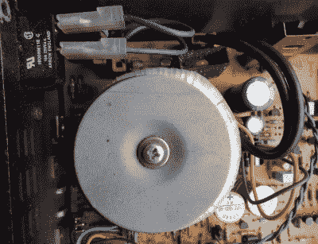
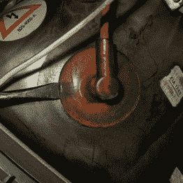
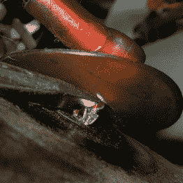

# 电源电压工作:令人震惊的结论！

> 原文：<https://hackaday.com/2016/05/16/looking-mains-voltage-in-the-eye-and-surviving-part-2/>

这是两部分系列中的第二部分，旨在探讨在试验市电电压电子设备时的安全性，包括您可能会发现来自市电电源的电压，但除非经过，否则不会扩展到数千伏 EHT。在第一部分中，我们看了你的工作台的安全方面，保护你自己免受主电源的影响，确保你的工具和仪器适合你手中的电压，最后是你对一件高压设备的思维方式。

心理部分是困难的部分，因为这涉及到对电源电压设计的内部生活的了解。因此，在这篇关于电源电压的第二篇文章中，我们将探讨消费电子产品内部的高电压。

## 电源

当市电电源进入一台设备时，除非它是一个非常简单的设备，如使用市电电压交流电的电水壶，否则它会对交流电做一些事情，将其转换为更有用的电压。现在，我们将考虑您打开设备时可能遇到的最常见的电源类型，以帮助您识别危险电路的位置。

看电源从哪里进入设备。如果它直接进入产生低电压的变压器，那么除了变压器电源侧的任何保险丝或开关元件之外，您没有什么可担心的，因为上电时您必须避免这些元件。如果低压侧处于与电池等效的电压，那么从其获得电力的其余电子设备可以被视为由电池供电。它们是低压的，与电源隔离，当它们通电时，你可以安全地在上面工作。

然而，假设带有变压器电源的设备在其电路的其余部分包含安全低压并不总是安全的。例如，如果您喜欢老式电子管设备，那么您会发现数百伏的高压电源，尽管它们会通过变压器与电源隔离，但仍应被视为与电源一样危险。

A switch-mode power supply in a set-top box from the mid-2000s. The brown board is the power supply, and all the components on it to the right of the yellow transformer are live.

在过去的几十年里，市电通过铁芯变压器转换成低压是一种规范。不过，最近的设备更有可能使用开关模式电源，其中交流电源被整流为高 DC 电压，并以高得多的频率通过更小、更轻的铁氧体磁芯变压器发送。开关模式电源重量轻、效率高，但从本文的角度来看，它们会带来更多的危害，因为它们包含来自电源的显著 DC 电压。

开关模式电源的输出端通过变压器与电源隔离，电压较低，因此可以安全工作。电源侧将包含具有高 DC 电压的储能电容器和用于处于高电压的开关晶体管的散热器。如果观察设计良好的开关电源的 PCB，它的高低压端之间应该有明确的界限，两端之间的安全边界距离仅由变压器和光耦合器或小变压器桥接，用于反馈。不幸的是，虽然不是所有这样的电源都设计得如此之好，你甚至可能会发现一些无法通过最基本的安全测试的电源。

好消息是，开关模式电源通常是现成的产品，占用自己的电路板，因此它们提供的任何低压逻辑板都将与电源隔离，因此在上电时可以安全工作。在上面 2000 年代中期的机顶盒图片中，只有棕色板包含电源电压，绿色逻辑板完全是低压的，可以安全工作。

A 1972 ITT CVC5, a TV from the live-chassis era. None of the circuits you see are isolated from the mains. To the left of the big round capacitors bottom-centre is a row of dropper resistors from which lower voltages are derived.

您可能偶尔会遇到第三种类型的市电电源，其中市电直接整流为高压 DC，任何较低的电压都是通过稳压电路或分压器获得的，无需变压器。例如，一些 LED 灯泡、老式 CRT 电视机和老式电子管收音机就是通过这种方式获得电能的。

如果您正在使用这种类型的设备，您尤其需要注意，因为当它通电时，其电路的每个部分都必须被视为处于电源电位。你会看到以这种方式供电的电视机被称为“活动机箱”，你经常会在它们的后盖上或机箱上找到警告标签。任何使用这种电源设置的设备都将有额外的绝缘，并且可能很少有绝缘良好的外部连接。

## 过分的谨慎

现在，您已经确定了设备的哪些部分是带电的，您可以根据高压安全来定制您的操作方法。

Mains power going straight into a toroidal transformer in set-top box from the late 1980s. The fuse and filter parts above the transformer are live, the rest of the board is relatively safe.

如果您只对某个项目的低压部分感兴趣，其中电源的带电部分明显是分开的，并且电源是隔离的，那么您的工作很容易，只需极其小心地避免接触这些高压部分，在通电时小心操作，并像平常一样操作低压部分。图中的机顶盒应避免靠近环形变压器或棕色开关模式电源 PCB 的保险丝，但你可以用万用表随意戳开它们的低压端。

然而，如果你正在操作的设备在你操作的地方是带电的，比如开关模式电源或带电机箱电视机，你将不得不采取不同的策略。最好将你应该采取的方法描述为“夸大的谨慎”。尽可能长时间地保持设备不带电。将探头设置为在设备未通电的情况下进行测量，只有在再次断电之前通电进行测量或观察。电视维修工程师用一只手放在背后操作带电的机箱并不少见，以避免徒手电击的可能性。

即使拔掉设备插头也不是万无一失的。值得记住的是，在高压设备断电后，其大型电解电容器中可能会残留大量电荷。如果在断电后检查这些电路，务必事先对这些电容进行安全放电，以避免电击。建议您始终使用万用表检查电容器中的剩余电荷，虽然您可以用螺丝刀在端子之间放电，但通过连接到一组测试探针的电阻器来放电可能更安全一些。测量电压，确保电容器已安全放电，并做好准备应对意外情况，因为某些电容器在放电后会因大电解质的不良特性而恢复电压。重复放电，直到电压消失。

## 非常高的电压

[![The interior of a Mac Plus, showing the red EHT lead and insulating cup on the side of the CRT. Blake Patterson, [CC BY 2.0 ], via Wikimedia Commons](img/83d4a76d7480b0e8dcb7b74fe5fa7693.png)](https://hackaday.com/wp-content/uploads/2016/05/cathode_ray_tube_inside_a_macintosh_plus.jpg)

Mac Plus 的内部，显示 CRT 侧面的红色 EHT 引线和绝缘杯。布莱克·帕特森[CC BY 2.0 ]，via [维基共享](https://commons.wikimedia.org/wiki/File:Cathode_ray_tube_inside_a_Macintosh_Plus.jpg)。我们在本系列的前面提到过，我们会顺便看看几千伏的 EHT，尽管这是一个独立的主题，有一系列全新的安全问题，需要另一篇文章来讨论。我只想说，你不应该在没有盖子的情况下给微波炉或雷达设备通电。不过，在 CRT 电视机或显示器中，您可能会遇到这种电压，因此我们应该在这里讨论这种应用。

重要的是要立即说明，阴极射线管上的最终阳极电压可能超过 20 千伏，这取决于显像管，不仅危险，而且致命。CRT 屏幕后面的玻璃漏斗形成了这个 EHT 电源的储存电容器，并且可以在电视或监视器断电后长时间保持 20 千伏的电荷。所以你必须非常尊重地对待这些设备，因为它们可能会杀死你。

也就是说，这不应该阻止你在装有 CRT 的设备上工作。CRT 电路的设计者意识到了这些危险，并确保这些 EHT 电压被安全地锁定在很难触及的地方。看看上面显示 Mac Plus 显示器组件的图片，EHT 电路是前景中 CRT 一侧的红色电缆和红色大吸盘。所有的高电压都安全地包含在红色绝缘体后面，如果您不尝试从 CRT 侧面移除该连接器，当您查看设备的其他部分时，它将保持在绝对安全的状态。

万一您发现自己需要将显示器或电视机箱从 CRT 上拆下来，对 CRT 阳极电容器进行放电是非常简单的，但是这个过程必须小心进行。你的目标是将阳极连接器放电到管的黑色外层，称为 [aquadag](https://en.wikipedia.org/wiki/Aquadag) 。要做到这一点，你需要找到一个大的平刃螺丝刀，有最厚的塑料手柄。那个把手会在短时间内保护你免受 20KV 以上的电压。

  Grounded screwdriver  Sneaking under the cap  Discharge

您需要用一根绝缘线将螺丝刀的金属部分连接到管子的接地连接上，管子通常在金属带的某个位置，金属带绕过表面的边缘。这可能是最好的实现与鳄鱼夹在你的电线。然后，你只需握住螺丝刀的塑料手柄，轻轻地将它的尖端滑到覆盖阳极连接器的橡胶吸盘下面，直到你听到“喀嚓！”它放电的声音。然后，为了确保其真正放电，等待几分钟并重复该过程，在您移除连接器后再次重复该过程。(图片来自[Ax0n]' [CRT 教程](http://www.h-i-r.net/2009/12/flyback-transformers-and-crt-discharge.html)。)

## 包裹

这些文章的目的并不是详细介绍每一种可能的电气危险，而是让您了解一些必要的注意事项和一些技能，以便在您打开一台高压设备时评估您面前的风险。然而，重要的是要记住，决定权在你，决定面前的风险太大而退缩并不可耻。事实上，正是健康的谨慎让工程师们活着领取养老金。我们希望，当你决定继续使用电源供电的套件时，至少你现在也有更好的机会走那么远。祝你好运！