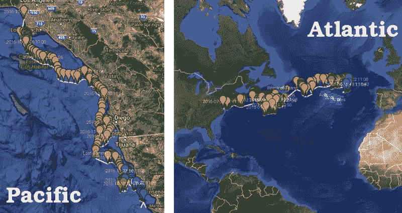

# 低成本漂流浮标在大西洋航行了近一年

> 原文：<https://hackaday.com/2017/04/28/low-cost-drift-buoy-plies-the-atlantic-for-nearly-a-year/>

把一条信息放在瓶子里，扔进大海，如果你非常幸运，几年后你可能会得到回应。将一个浮动的 Arduino-fied 浮标投入海洋，如果你设计得好，它可能会在更长的时间内向你发送数据。

至少这是自从去年他的 buoy 项目推出 DIY 漂流浮标以来[Wayne]所学到的。浮标的 BOM 读起来像 Adafruit 网站上的一页:Arduino 饰品，RTC，GPS 模块，铱星卫星调制解调器，传感器和太阳能电池板。一切都生活在一个透明的塑料干燥箱里，还有一罐干燥剂和一个脂肪电池。

太阳能电池板可以透过箱盖看到，浮标由箱子底部的长 PVC 吊杆保持直立。到目前为止已经建造并发射了两个版本；唉，太平洋浮标刚下水不久就丢了。但是大西洋浮标接收到了墨西哥湾流，并从去年夏天开始慢慢向欧洲漂移，发回了遥测数据。未来的版本旨在整合一个[自动识别系统(AIS)](https://en.wikipedia.org/wiki/Automatic_identification_system) 接收器，大概是为了报告附近船只通过时 AIS 应答器的信号。

我们喜欢对细节的关注以及这种建造的低成本。这是一个 STEM 项目力所能及的项目，类似于我们之前介绍过的许多高空 DIY 气球项目。

 [https://www.youtube.com/embed/OoLDtXKTmis?version=3&rel=1&showsearch=0&showinfo=1&iv_load_policy=1&fs=1&hl=en-US&autohide=2&wmode=transparent](https://www.youtube.com/embed/OoLDtXKTmis?version=3&rel=1&showsearch=0&showinfo=1&iv_load_policy=1&fs=1&hl=en-US&autohide=2&wmode=transparent)

感谢[阿德里安]的提示。