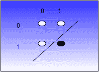

# 机器学习:基础

> 原文：<https://hackaday.com/2016/11/02/machine-learning-foundations/>

当你想让一个人做某事时，你训练他们。当你想让计算机做某件事时，你就给它编程序。然而，至少在某些情况下，有一些方法可以让计算机学习。一种使这成为可能的技术是感知器学习算法。感知器是对神经的计算机模拟，有多种方法可以根据示例数据或确定某个结果好坏的方法来改变感知器的行为。

## 什么是感知器？

我不是生物学家，但显然一个神经元有一堆输入，如果这些输入的水平达到一定水平，神经元就会“激发”，这意味着它会刺激另一个神经元的输入。并非所有的投入都是平等的:在它们的数学模型中，它们有不同的权重。输入 A 可能处于一触即发的状态，而输入 B 和 C 可能一起被唤醒。

对这样的事情进行数学建模并使用计算机程序实现它是非常简单的。让我们考虑一个像双输入与门一样工作的感知器。这两个输入可以是 0 或 1。感知器将有两个权重，每个权重对应一个输入，称为`W0`和`W1`。让我们考虑输入为`X0`和`X1`。感知器(`V`)的值是`V=X0*W0+X1*W1`(编辑:这个等式中有一个打印错误，现在已经修复)。简单吧？还有一个阈值。如果输出值达到或超过阈值，则输出为真(对应于神经元放电)。

这个模型怎么可能是与门呢？假设您将阈值设置为 1。然后将`W0`和`W1`都设为 0.6。您的真值表现在看起来像这样:

| X1 | X0 | V | 结果 |
| Zero | Zero | 0*.6+0*.6=0 | Zero |
| Zero | one | 0*.6+1*.6=.6 | Zero |
| one | Zero | 1*.6+0*.6=.6 | Zero |
| one | one | 1*.6+1*.6=1.2 | one |

如果你喜欢或门，那很简单。只要将权重设置得足够高，比如 1.1，它就会一直发射。该值可以是 0、1.1 或 2.2，结果是一个或门。

## 当它不起作用时

有两个有趣的例子说明这个简单的策略不起作用；我们可以采用更复杂的策略来解决这些问题。首先，考虑一下你是否想要一个与非门。当然，你可以翻转阈值的感觉。然而，如果我们有任何希望制造一个可以学习成为与门、或门或与非门的系统，我们不能有这样的特例，我们不只是改变数据，我们还要改变算法。

因此，除非你像那样作弊，否则你不能选择导致 00、01 和 10 产生一个超过阈值的数字，然后期望 11 产生一个更低的数字。一个简单的方法是给感知器的输出增加一个偏差。例如，假设你把 4 加到感知器的输出上(记住，加 0 和之前的情况是一样的，所以这不是作弊)。现在权重可能是-2 和-2。然后，00、01 或 10 将给出值 4 或 2，这两个值都超过了阈值 1。然而，11 给出了低于阈值的零值。

实现这一点的一个简单方法是简单地向感知器添加一个输入，并使其始终为 1。然后，您可以为该输入分配一个权重(例如，0 表示与门，4 表示与非门)。当然，您不一定要这样做，但是这样可以使代码变得漂亮整洁，因为这只是另一种输入。

[](https://hackaday.com/wp-content/uploads/2016/10/and.png) 另一个问题是，单个感知机只能处理线性可分的事物。那是一个奇特的术语，但是很容易理解。如果你在图上画出与门，它会是这样的。

白色圆圈是零，黑色圆圈是真实输出。看到分隔黑白的直线了吗？能够画出那条线的事实意味着与门是线性可分的。设置权重有效地定义了这条线，线的一边是 0，另一边是 1。

异或(XOR)怎么样？那个图上没有线。试着画一个。你不能。这意味着你不能用一个感知器创建一个异或。但是，您可以使用多层感知器来获得想要的结果。

当你有两个以上的输入时，你就不会有一个简单的 2D 图了。你不是定义一条线，而是定义一个平面或超平面，它清晰地切割一切。原理是一样的，但是画起来要难很多。

## 扩大

对于像逻辑门这样简单的二进制输出，你真的只需要一个感知器。然而，通常使用感知器来确定多个输出。例如，您可以输入十个感知器图像数据，并使用每个感知器来识别从 0 到 9 的数字。增加更多的输入是微不足道的，在数字阅读器的例子中，每个输出对应一个单独的感知器。

甚至逻辑门感知器也可以使用两个独立的输出。一个输出可以是零输出，另一个可以是一输出。这意味着零输出肯定需要偏置，因为它本质上是一个与非门。

例如，这里有一个具有两个并行感知器的与门(假设阈值为 1):

| 投入 | 0 输出的权重 | 1 个输出的重量 |
| X0 | -2 | Zero point six |
| X1 | -2 | Zero point six |
| 偏差(1) | four | Zero |

诚然，这比第一个例子效率低，但它更能代表更复杂的系统。手动选择权重很容易，但是对于复杂的东西，可能就没那么容易了。

## Excel 模型

在开始用您最喜欢的语言编写代码之前，在 Excel 这样的电子表格中对整个事情建模是有益的。基本算法很简单，但有趣的是能够快速试验学习参数，电子表格将有助于这一点。

我把你可以在下面看到的电子表格放到了 GitHub 上。宏控制训练，但是所有的分类逻辑都发生在电子表格中。零点宏和训练宏只是简单的函数。然而，`Train1`子程序实现了训练算法。

重量是来自`B2:C4`的 6 个蓝色盒子。记住，最后一行是偏置输入，始终为 1。输入位于`E2:E3`。`E5`是预期的结果。您可以手动插入，也可以使用当前的公式:

```
=IF(AND(E2,E3),1,0)
```

例如，您可以将 AND 替换为 OR。也可以改变门槛和训练率。不要覆盖结果字段或 b 列下面的其他项目。此外，将偏差输入(`E4`)保留为 1。我保护了你不应该更改的单元格(但如果你真的想更改，密码是“hackaday”)。

## 学问

像这样的系统是如何学习的？出于本例的目的，我假设您有一组输入，并且您知道每个输入的预期输出(train 宏会处理这些)。基本算法如下:

1.  设置测试用例的输入。
2.  看期望输出感知器。如果它的输出没有超过阈值，将缩放后的输入(见下文)添加到感知器的权重中。
3.  看看其他的感知器。如果它们的输出超过阈值，则从权重中减去缩放后的输入。
4.  对每个测试用例重复这个过程。
5.  不断重复整个案例集，直到你不必为步骤 2 和 3 做任何事情。

缩放输入意味着获取输入并将其乘以训练率(通常是小于 1 的数字)。让我们假设下例中的训练率为 0.5。

考虑如果所有的权重都从 0 开始，测试用例是`X0` =1，`X1` =1。“一”感知器应该启动，但它的输出为零。所以`W0=W0+X0*1*0.5`和`W1=W1+X1*1*0.5`。换句话说，该列中的两个权重现在都是 0.5。不要忘记偏置输入将是`W2=W2+1*0.5`。

现在看看另一个 peceptron。它不应该触发，输出为零，这是好的，所以第 3 步没有任何变化。您对其他测试用例重复这一步骤，并继续下去，直到您在整个过程中不必对步骤 2 或 3 进行任何更改。

以下是 Train1 宏的代码:

```
' Train one item
Sub Train1()
' Put things in sane names
 Stim0 = Range("E2")
 Stim1 = Range("E3")
 Stim2 = Range("E4") ' should always be 1
 Bias = Range("F6")
 Threshold = Range("F8")
 TrainRate = Range("F9")

 Res0 = Range("B5") ' save this so it doesn't "move" when we start changing
 Res1 = Range("C5")
 Expected = Range("B9")

 ' If we expected 0 but Res0<Threshold then we need to bump it up by the forula
 If Expected = 0 Then
 If Res0 =Threshod, we need to bump it down
 If Res0 >= Threshold Then
 Range("B2") = Range("B2") - Stim0 * TrainRate
 Range("B3") = Range("B3") - Stim1 * TrainRate
 Range("B4") = Range("B4") - Stim2 * TrainRate
 End If
 End If

' Same logic for expecting a 1 and Res1
 If Expected = 1 Then
 If Res1 = Threshold Then
 Range("C2") = Range("C2") - Stim0 * TrainRate
 Range("C3") = Range("C3") - Stim1 * TrainRate
 Range("C4") = Range("C4") - Stim2 * TrainRate
 End If
 End If

End Sub

' Do training until "done"
Sub Train()
Done = False
ct = 0
Do While Not Done
 Done = True
 ct = ct + 1
 If (ct Mod 100) = 0 Then ' In case bad things happen let user exit every 100 passes
 If MsgBox("Continue?", vbYesNo) = vbNo Then Exit Sub
 End If
 For i = 0 To 1
 Range("E2") = i
 For j = 0 To 1
 Range("E3") = j
' We are not done if there is a wrong answer or if the right answer is not over threshold or if the wrong answer is over the threshold
 If Range("B8")  Range("B9") Or (Range("B5")  Range("B6") And Range("B5") >= Range("F8")) Or (Range("C5")  Range("B6") And Range("C5") >= Range("F8")) Or (Range("B6") < Range("F8")) Then
 Done = False
 Train1
 End If
 Next j
 Next i
Loop
End Sub

' Zero out the matrix
Sub Zero()
Range("B2") = 0
Range("B3") = 0
Range("B4") = 0
Range("C2") = 0
Range("c3") = 0
Range("c4") = 0
End Sub
```

## 下一步是什么？

尝试使用电子表格。试试“或”、“与非”和“或非门”。试试异或门，注意它不会收敛。例如，算法上有各种变化来说明结果有多差。您也可以尝试将权重初始化为随机值，而不是零。

下一次，我将向您展示这在 C++中是什么样子的(适合您最喜欢的微控制器)，并讨论如何处理更大的问题。如果你想更深入地研究这个理论，你可能会喜欢下面视频中的[丹·克莱因的]讲座。

 [https://www.youtube.com/embed/dXuNAkHsos4?version=3&rel=1&showsearch=0&showinfo=1&iv_load_policy=1&fs=1&hl=en-US&autohide=2&wmode=transparent](https://www.youtube.com/embed/dXuNAkHsos4?version=3&rel=1&showsearch=0&showinfo=1&iv_load_policy=1&fs=1&hl=en-US&autohide=2&wmode=transparent)


(横幅图片由[提供)这篇关于神经网络的优秀文章](http://andrew.gibiansky.com/blog/machine-learning/machine-learning-neural-networks/)。)