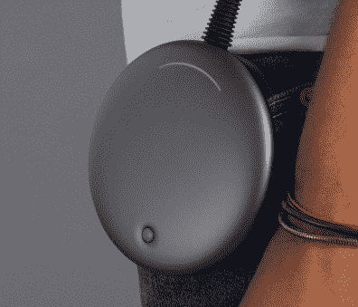
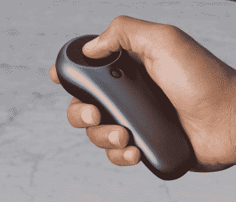
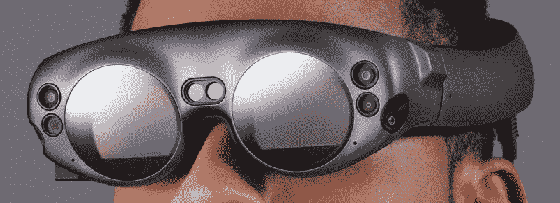

# 魔闰终于宣布；依然神秘

> 原文：<https://hackaday.com/2017/12/21/magic-leap-finally-announced-remains-mysterious/>

昨天 [Magic Leap](https://www.magicleap.com/) 宣布将于 2018 年发售开发者版硬件。这家公司以筹集大量资金而闻名。这只是一个笑话，因为被取笑的硬件仍然非常神秘，从未被披露，但他们已经通过四轮融资成功筹集了近 20 亿美元(其中三轮融资超过 5 亿美元)。

[公告](https://www.magicleap.com/stories/blog/a-small-reveal)发布了*Magic Leap One*——副标题为*创造者版*——邮件列表上有“设计师、开发人员和创意人员”的签名。要点是，第一轮硬件将出售给为 Magic Leap One 编写应用程序和创造用途的人。

我们已经收集了一些关于硬件的信息，但我们肯定会在下面的细节上开始猜谜游戏。已经解决的一个谜团是这项技术是如何实现的:作为一副连接到专用处理单元的护目镜。它与当前的产品相比如何？

### 什么是 Magic Leap？

将这项技术保密多年是一个非常好的举措。它让每个人都能想象比现在可能实现的更先进的东西。你可能还记得 2014 年打破最初公告的用户手中的大象营销形象。[连线文章](https://www.wired.com/2014/10/google-magic-leap/)将 Rony Abovitz 的吹嘘总结为一项新技术:

> Magic Leap 创始人兼首席执行官 Rony Abovitz 坚持认为，他所构建的不是移动计算、Oculus 风格的虚拟现实，甚至不是增强现实。

随着猫从袋子里出来，我们认为这些索赔越来越多。就更广泛的术语而言，这是增强现实，但超出了混合现实(MR)。MR 是一种 AR，包括对周围环境的感知。因此，Magic Leap 承诺在向周围环境添加虚拟物品时，可以了解桌子、椅子、窗户、门，希望还有猫和狗的位置。

### Magic Leap 诉 Hololens 诉 CastAR

这些可穿戴护目镜与微软的 Hololens 和 CastAR 有最大的共同点，因为这三款护目镜都具有透明镜片，不会像 HTC Vive 或 Oculus Rift(两者都是虚拟现实技术)那样遮挡你周围的世界。有趣的是这三者之间的关键区别。

不幸的是， [CastAR 在今年早些时候关闭了他们的大门](https://hackaday.com/2017/06/27/castar-shuts-doors/)，但是我们仍然热爱这项技术。它建立在一套可穿戴眼镜上，包括两个 720p 投影仪，每只眼睛上方一个。增强现实体验依赖于一种逆向反射材料作为投影表面。该表面以接收图像的完全相同的角度反射投影图像，因此几个人可以同时使用同一表面，而不会相互干扰。这里成功的关键之一是你所看到的实际上来自用户期望看到的物理位置。

微软的 Hololens 是一个弯曲的护目镜，你可以像戴面罩一样戴着它，从太阳穴到太阳穴，从鼻尖到眉毛。该面甲是投影表面，因此用户可以看到真实世界，但是投影到面甲上的效果会将图像叠加到用户所看到的内容上。这样做的好处是，你不需要有反光材料或任何其他设备与头戴式装置本身分开来实现这种体验。

Magic Leap 似乎使用镜头作为投影面，像 Hololens 一样，但使用两个独立的镜头，而不是一个大的遮阳板。我们热衷于尝试这个，因为它可能解决我们在测试 Hololens 时注意到的一个问题:视野(FOV)。

Hololens 可以投影的区域有限，小于护目镜本身的总可视部分。如果你的眼睛捕捉到虚拟物品可以投射的“边缘”,就会破坏体验。看看 Magic Leap 的小镜头，如果它能同步真实和虚拟世界的 FOV，不会中断感知体验，那就太棒了。唉，从收到当前原型演示的记者那里听到，Magic Leap 在圆形镜头内确实有一个矩形投影区域。我们希望生产硬件可以在这方面有所改进。

我很幸运地在 CastAR 还在开发的时候试用了它，它有一个很棒的 FOV。但这仅限于反光材料的尺寸，所以你可以说有一个类似的破坏体验的问题。

### 秘制酱…或者不是

所以，它可以跟踪头部运动，它在每只眼睛前面有一个可佩戴的透明屏幕，它有摄像头和传感器来采集周围的环境。如何让这款产品从现有产品中脱颖而出？

我们发现的最冗长的信息来源是[昨天](https://www.rollingstone.com/glixel/features/lightwear-introducing-magic-leaps-mixed-reality-goggles-w514479)刊登的《滚石》杂志的文章。关于[光场](https://en.wikipedia.org/wiki/Light_field)有一个很长的部分，以及在处理它上的突破是如何建立在革命性技术 Magic Leap 之上的。断言是，你的眼睛只需要光场的特定重要部分，而你的大脑构建其余部分。如果你输入那些神奇的部分，你的大脑会感觉到一些真实的东西在你的眼球前。

秘方是一个芯片——基本上是一个定制的传感器/DSP，它知道如何接收虚拟图像，将其与相机感测到的光场进行协调，并释放出一个足够复杂的人工光场，以欺骗你的大脑来填充间隙。这篇文章让它听起来像是他们在佛罗里达基地的地下室建了一个晶圆厂。这太不可思议了。你期待从托尼·斯塔克(或者某个邪恶恶棍的巢穴)那里得到的东西。更有可能的是，他们在内部组装原型的过程中，获得晶圆并裸运进行加工。

这些光场突破是一个强大的声明，我们希望这是真的，因为这样的进步确实是革命性的。看来我们只能等着瞧了。我们要看白皮书！

《滚石》杂志的文章展示的一个有趣的花絮是第一张概念原型证明的图片。如果你靠近看，你可以看到两片玻璃与下巴呈 45 度角，就像眼科医生那样。尽管有更多的暗示，该系统从一开始就基本上是基于眼镜的。

### 猜猜硬件

大家最喜欢的游戏时间到了！他们是怎么做到的？

    

在这个展示中几乎没有可用的硬件信息。不过反正猜谜更好玩。以下是我们从照片中收集到的信息。头戴式护目镜上有两根电线。它们合并成一个，蜿蜒到驱动它的 Discman 形状的、安装在腰带上的计算设备。手持控制器是无线的，没有明显的电源，因为盘形单元包含电池。

说实话，控制器和 CPU 都没那么有趣。就硬件而言，这些都是已经解决的问题。Magic Leap 的神奇之处在于耳机本身。

位置跟踪可能是整个系统中最重要的部分。当然，你可以争辩说，是光学成就了它，还是打破了它，我们一会儿就会谈到这一点。但是如果你完美的图形与用户的头部运动不同步，晕动病将确保头套不会被使用。

[看过去年五月在 Maker Faire 上演示的 Intel Euclid 后](https://hackaday.com/2017/05/26/intels-vision-for-single-board-computers-is-to-have-better-vision/)，很明显，用于感知运动和环境的摄像技术已经成熟。小欧几里得有一个完整的电脑和电池在里面，魔术般的飞跃移动到你的腰带。将其余部分装进这些护目镜并非不可思议。猜谜游戏变成了:上面显示的明显的镜头和传感器是用来做什么的？

Magic Leap 的两个“角”上都有一个外围视觉镜头，两个前置摄像头也在角上，鼻子上方的鼻梁上有两个窗口，看起来可能是红外的。左边显示的绿圈是个谜(电源键和指示灯？)和右边对应的相机镜头也是。运动跟踪很可能使用至少两个深度相机——爆破红外激光投影仪来绘制红外相机可以解释的网格。英特尔的 Realsense 是这样做的 holo lens 也采取了类似的方法。其他摄像机可能用于对象识别和照明条件处理。

镜头底部和侧面的小孔显示了用于感知声音的四个麦克风中的三个的位置。

### 你怎么看待 Magic Leap？

我们希望在下面的评论中听到你的意见。您是否从硬件展示中发现了任何线索？戴上你的逆向工程帽子，告诉我们你能从这非常有限的信息中收集到什么？这是革命性的还是仅仅是 VR/AR/MR 场景中的另一个增量发展？

当然，还有很多其他问题悬而未决。Magic Leap One 的硬件价格是多少？你如何与控制器交互，什么样的框架可以用来把你的代码放到机器上？我们期待听到您的想法。