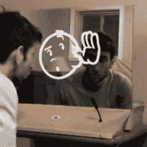

# 魔镜不知疲倦地满足孩子们的好奇心

> 原文：<https://hackaday.com/2018/05/27/magic-mirror-tirelessly-indulges-childrens-curiousity/>

[pepelepoisson]的 [Miroir Magique](http://www.chezpapietmamie.com/pcube/uncategorized/magic-mirror-hiding-technology-from-childrens-eyes-to-make-learning-magical/) (“魔镜”)是对智能镜子概念的有趣诠释；它旨在成为一种有趣的互动学习工具，适合那些对语言和互动非常感兴趣，但对拼写和写作示例无休止的需求同样令人疲惫的孩子。灵感来自他自己五岁的孩子，他既不会读也不会写，但却对单词、短语和数字的书写和拼写有着无尽的迷恋。

Magic Mirror is listening

神奇之处在于简单的界面。魔镜等待激活(手在传感器上简单的移动)，然后显示它正在监听。它听到的任何声音都会显示在屏幕上，然后读给用户听。从应用的角度来看，这相当简单，但有趣的是语音到文本和文本到语音功能的使用不是作为达到目的的手段，而是作为目的本身。在许多方面，它是一面镜子，它倾听并重复，同时写出所听到的内容。对于对语言的书面和口头方面着迷的好奇儿童的预期观众来说，它既是互动玩具，又是学习工具。

像大多数智能镜子项目一样，技术元素都是隐藏的；屏幕在单向镜后面，扬声器看不见，唯一的输入是一个手势传感器和一个嵌入框架的麦克风。如此装备，镜子可以不知疲倦地幽默，即使是最苛刻的好奇的孩子。

[pepelepoisson]在[项目页面](http://papasinventeurs.org/miroir-magique.html)(英文翻译链接[这里](http://translate.google.com/translate?js=n&sl=auto&tl=en&u=http://papasinventeurs.org/miroir-magique.html))上解释了一些技术方面的内容，所有代码和构建细节(法语)都可以在项目的 [GitHub 资源库](https://github.com/sebascabot/magic-mirror/blob/master/instructions.md)上找到。下面是魔镜的演示，首先是法语，然后切换到英语。

 [https://www.youtube.com/embed/lbKZVD8Y8uU?version=3&rel=1&showsearch=0&showinfo=1&iv_load_policy=1&fs=1&hl=en-US&autohide=2&wmode=transparent](https://www.youtube.com/embed/lbKZVD8Y8uU?version=3&rel=1&showsearch=0&showinfo=1&iv_load_policy=1&fs=1&hl=en-US&autohide=2&wmode=transparent)

以交互性和易用性为设计理念的项目非常值得一看，就像[pepelepoisson]之前的作品 [Stecchino](https://hackaday.com/2018/03/23/stecchino-game-is-all-about-balancing-a-big-toothpick/) ，一个关于平衡超大牙签的物理游戏。