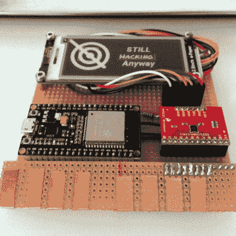

# 在还没有徽章的时候制作一个徽章

> 原文：<https://hackaday.com/2017/08/19/make-a-badge-when-there-is-no-badge-yet/>

当你热切期待的黑客阵营发布了即将到来的徽章的细节，而你真的想试着为它编码，但还没有徽章让你尝试的时候，你该怎么办？如果你是[Artdanion]，这不是问题，[你只需构建你自己的](https://devlol.org/wiki/artdanion#SHA2017_Badge_Clone)。

他发现他与真正硬件接口的要求超出了 SHACamp 2017 badge 团队精心提供的仿真器的能力，因此他伸手拿起 ESP32、MPR121 触摸传感器和 e-ink 显示器的分线板，并在一块条形板上组装了自己的克隆体。它不仅为他提供了足够的资源来开发自己的应用程序，当他把它带到活动中时，他发现官方固件的公开发行版只需进行一些配置调整即可运行。他有一个官方的活动徽章，那不是活动徽章。这是第一次这样做吗？我们认为有可能。

自制的徽章是一件令人印象深刻的作品，但它与我们在[结束时对 SHA2017 徽章官方版本](http://hackaday.com/2017/08/14/hands-on-with-the-shacamp-2017-badge/)的评论有关。使用带有精心设计的外围设备和可靠固件的 ESP32 意味着这种设计可能会成为未来一些徽章的基础。[Artdanion]已经证明了克隆是多么简单，我们想大胆地预测，我们将在未来的活动中看到这个平台的更多发展。与此同时，这个自制的徽章是一个整洁的成就，我们只能想象 SHA2017 徽章团队在收到他们工作的克隆版进行重新刷新时的惊喜。