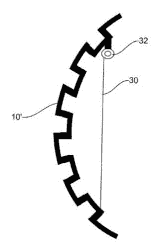

# 让汽车更柔软，让汽车更安全

> 原文：<https://hackaday.com/2017/09/03/make-cars-safer-by-making-them-softer/>

让自动驾驶汽车更柔软会让它们更安全吗？

Alphabet 的自动驾驶汽车分支 Waymo 认为情况可能是这样的，因为他们最近获得了一项关于撞击时变软的车辆的专利。传感器将识别即将发生的碰撞，并调整车辆外部的“张力构件”来缓冲撞击。这些“构件”将是波纹部分或移动面板，它们吸收车辆的碰撞效应，并根据车辆将要撞击的障碍类型进行调整。

自动驾驶汽车的新现实让人们有充分的理由担心安全问题，正如我们自己的  [埃利奥特·威廉姆斯](http://hackaday.com/2016/12/05/self-driving-cars-are-not-yet-safe/)指出的那样——但任何人与车的对峙都很少偏向人类一方。有鉴于此，很高兴看到这项技术走三点式安全带的路线，成为行业标准。

目前，在我们作为一个物种决定是否信任这项新生技术的时候，天网将不得不与更小、[更可爱、](http://hackaday.com/2017/06/22/self-driving-potato-hits-the-road/)和潜在破坏性更小的[自动驾驶汽车](http://hackaday.com/2016/05/16/self-driving-cars-get-tiny/)竞争。

[途径〔t0〕十二〔t1〕