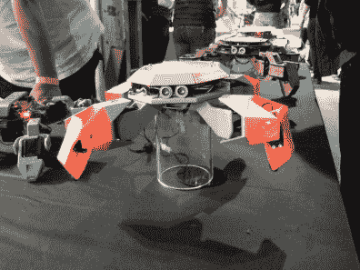
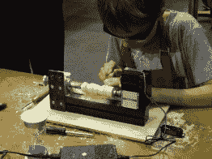

# 让慕尼黑变得很棒

> 原文：<https://hackaday.com/2017/05/08/make-munich-was-awesome/>

这是一个在巴伐利亚极客的好周末。除了我们自己的[Hack aday Prize Bring-a-Hack party](http://hackaday.com/2017/05/05/dont-forget-bring-a-hack-munich-is-tonight/)之外，我们最初安排它还有一个原因，那就是慕尼黑的独立 DIY 博览会 [Make Munich](http://make-munich.de/english/) 。

如果你是一个忠实的 Hackaday 读者，许多项目会看起来出奇的熟悉。我走进去，迎接我的是一些漂亮的德语和英语单词钟。尽管如此，看到[打开 Theremin](http://hackaday.com/2016/01/24/finally-a-modern-theremin/) 贴着“在 Hackaday 上看到的”标签出售，还是让我们笑了。然后我们就[Urs Gaudenz]的另一个项目进行了一次很好的交谈: [DIY 生物仪器](http://hackaday.com/2017/01/16/microfluidics-frogger-is-a-game-changer-for-diy-biology/)，也在 Hackaday 上看到。

有大量的机器人。有人(来自 günd？)开着涂鸦机器人在地板上喷水，而不是用油漆或粉笔，效果非常好。展示了[动物机器人家族](http://zoobotics.de/)的全部进化。甚至 Calliope ( [德国版的 micro:bit](http://hackaday.com/2016/10/18/germans-react-to-uks-microbit/) )展台也有这个可爱的蓝牙振动机器人。休息之后，请加入我的行列，让我尽情欣赏周末展出的所有精彩作品。

  Twenty to Five: Zehn Nach Halb Funf  As seen on Hackaday  Calliope Vibrobot  Water Graffiti  Zoobotics: 3D print, cardboard, and paper

## 黑客空间

似乎没有什么是黑客空间不能用激光切割机制造的，现在包括滑板轮子。慕尼黑创客实验室将他们的想法发给了布莱叶滑板(YouTube)，他们滑了很长时间，直到它最终屈服。

慕尼黑 CCC hackerspace 有我亲自见过的最大的 flip-dot 显示器，它正在运行一个 pong 游戏，但细节是它变酷的地方。它由来自第 28 届混沌通信大会的 r0ket 徽章控制，以 2.4 GHz 的频率向来自 2015 年 CCCamp 的 SDR[radio 徽章](https://rad1o.badge.events.ccc.de/)发送 RF，这些徽章在 [GNURadio](http://hackaday.com/2015/11/11/getting-started-with-gnu-radio/) 中完成所有解码。那有多 DIY？

在翻转点方面不甘示弱，来自附近奥格斯堡的黑客空间得到了一些面板，并通过一些软件技巧实现了流畅的动画。事实证明，由于重力的原因，不同的脉冲最适合设置和重置一个位。Augsburgers 也只在像素发生变化时更新像素，从而降低了功耗。非常聪明。

在亚琛科技大学附属的黑客空间的其他项目中，有一个令人印象深刻的振动马达背心，旨在帮助盲人更好地导航。空间被直观地绘制在 2D 矩阵上，距离被编码为振动强度。这将是 Hackaday 奖的一个好项目。

  Flip All the Dots — muCCC  Munich Maker Lab: Next, laser-cut trucks!  3D Cubes on Flipdots — Augsburg  Vibrational Vest for the Blind

## 现实、工作室和新发明

 如果参加 DIY 展会是一个晴雨表，我们可能已经走过了 3D 打印机的巅峰，正在进入一个对增强和虚拟现实进行实验的时代——有一整排基于护目镜的项目在照片中表现不佳。尽管如此，一些 AR 项目有更大的屏幕，像这个依赖于检测彩色烤箱手套的 pong 游戏，是一个伟大的交互设计。

但我对虚拟有点厌倦，更喜欢疯狂的机械装置。在两个相邻的摊位上，我看到了一个令人惊叹的小提琴演奏机器人([这是在 YouTube 上的](https://www.youtube.com/watch?v=iRdXqo57ZDs)在运行)和一些来自 [Skulls N Gears](http://www.skulls-n-gears.com/) 的功能性蒸汽朋克艺术/设备，就我而言，它们使这种风格合法化。这台电脑附带的打印机是一台改装过的打字机，当我们走过时，它正咔嗒咔嗒地用德语打印查克·诺里斯的资料。太棒了。

拐角处有一些车间，包括有车床的孩子(由 Unimat 提供)和一个免费的热熔胶和垃圾电子零件，标签为“后世界末日珠宝”。有印刷机和焊接站，通常有太多的事情要做。

然后就是[纸飞机机枪](http://hackaday.com/2017/01/10/paper-airplane-machine-gun-v2-0/)。实际上，展出了三个版本。是的，有卡纸，而且[迪特]不得不克制自己不要把传单铺得太深(嘻嘻！)，但是看着机器工作感觉棒极了。查看我们文章中的链接视频。

我还在挠头，那个装着发光二极管的纸板管和末端的椰子发出了非常有趣的声音。摊位的主人出去吃饭了，所以我没机会问“另类椰子研究中心”到底在做什么。

  Violinautomat  Steampunk done right!  Kids with Lathes  Post-Apocalyptic Jewelery  Paper Airplane Machine (Gun)  Center for Alternative Coconut Research

## 河伯孔

这就把我们带到了希伯仑。在之前[Brian Benchoff]已经对赫伯肯斯充满诗意，所以我不需要。重点是它以最好的方式搞笑、包容、怪异。两个活泼的播音员和数不清的“机器人”让观众有兴趣观看蹩脚的机器人战斗，超过了一些观众的就寝时间。

这里显示的是“Schratte”，德语中“垃圾”和“老鼠”的组合词，与“拿着刀的猴子”相对。Schratte 是我最喜欢的，因为它是晚上唯一的沃克。我不记得鳄鱼机器人的名字了(Croco-什么？)，但它继续用它精心制作的前铲:一块木头，推开了所有的竞争对手。

  Monkey with Knife vs Schratte  Crowd Cheers Croco-something

## 当众黑！

所以，走出去，支持你的本地创客现场！如果你没有，那就做一个。因为，即使你已经在 Hackaday 上读到过，也没有什么比亲眼看到一个项目并和它的建造者聊天更好的了。