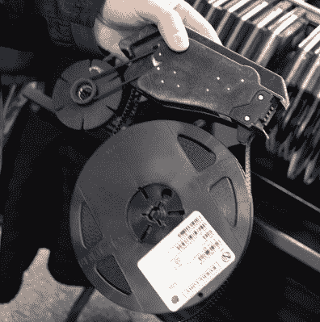

# 制造商大会纽约:芯片设置，挑选和放置你的产品

> 原文：<https://hackaday.com/2016/10/01/maker-faire-ny-chipsetter-the-pick-and-place-for-your-production/>

本周末在 Maker Faire 上，[芯片制造商](http://www.chipsetter.com/)展示了他们的取放机。在我看来，这是第一台为黑客空间、设计实验室、工程部门和原型设计者设计的拾取和放置机器。它不是为做所有事情而设计的，但它是为这些地方需要的所有东西而设计的，并且比标准的低端中国取放机便宜得多。

廉价的 DIY 取放机是我们熟悉的领域。几年前，我们看到了 [Carbide Labs 拾取和放置机器](http://hackaday.com/2014/09/24/pick-and-place-machines-at-maker-faire/)，这种机器允许你将电路板放在任何地方，从胶带中取出芯片，并将它们放在粘贴的衬垫上。[复古填充器](http://hackaday.com/2014/08/30/thp-semifinalist-retro-populator-a-pick-and-place-retrofit-for-a-3d-printer/)是一种拾取和放置机器，它改装到 3d 打印机上。[另一个 Hackaday 奖项目 Firepick Delta](https://hackaday.io/project/963-firepick-delta-the-open-source-microfactory) ，将一个微型工厂引向了它的逻辑结论，它能够 3D 打印、填充电路板、分配浆料，并创建自己的电路板。所有这些机器都有一个特点:它们完全不同于普通的、标准的工业取放机器。

The Chipmaker feeder. Production versions of this feeder will be injection-molded plastic. This one is SLA nylon.

任何创业公司的想法都是建立一个最小的产品，Chipsetter 背后的想法是建立一个最小可行的工具。对于他们的市场来说，这意味着能够放置 0402 元件(虽然它可以做 0201，但该团队表示，非常小的封装的可靠性达不到他们的标准)，这意味着每小时能够拍摄 1250 个元件，并且它必须有廉价的进料器来接受标准胶带。

这与曼恩公司的机器规格表完全不同。对于“专业”机器来说，一个进料器可能要花费数百美元。据 Chipsetter 创始人 Alan Sawula 称，这种机器的进料器有望最终售价约为 50 美元。这几乎便宜到足以让你的零件留在馈线上。一台 pro 机器可以处理 01005 组件，但 0402 对于大多数项目和产品来说已经足够好了。

这是我见过的最接近拾取和放置机器的机器，旨在弥合合同制造商和黑客空间之间的差距。至少就我们所知，Hackaday 的大多数受众没有资金将所有生产外包给合同制造商。然而，Hackaday 或任何黑客空间的大多数观众都可以购买一台芯片设置机。Chipsetter 的设计并不是最好的，但当它涉及到将零件放置在浆糊上时，最好的是大幅度过度的。

芯片设定者现在已经有了一个 Kickstarter。他们大约有一半的资金，还有三周多一点的时间。现在，如果你正在寻找挑选和放置机器，我强烈建议检查芯片设置。它工作正常，有 40 个进料器，比价格最低的“专业”机器更便宜，性能更好。