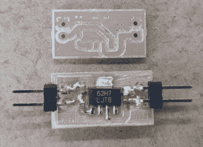

# Makerbot 打印机重生为 PCB 雕刻师

> 原文：<https://hackaday.com/2018/06/25/makerbot-printer-reborn-as-pcb-engraver/>

Makerbot 3D 打印机是第一批上市的打印机，所以旧的和坏的打印机现在充斥着黑客空间和家庭作坊的货架是有道理的。比起扔掉他的，Foaly 看到了一个将它转换成某种数控机床的机会。鉴于它缺乏固有的刚性和相对较弱的马达，他选择[制造一台低冲击电路板雕刻机](https://silica.io/makerbotcnc/)，他恰当地称之为 MakerbotCNC。我们喜欢他投入到这个项目中的想法，并且它显然是由大量的经验支持的。

幸运的是，他的 Makerbot Replicator 2 来自于 MakerBot 更加开放的时代，这意味着他可以使用一个简单、开放的库来控制机器。稍微开放一点的软件处理他的 Gerber 文件到 g 代码的转换。用钢笔画画的第一次试验成功了，所以他继续研究雕刻头。他选择了一个无刷电机来减少灰尘进入电机，但由于这些电机有发热的趋势，他不得不增加风扇来冷却它。这仍然没有阻止热量熔化和弯曲他的 3D 打印 PLA 车厢的尝试，所以他将其切换到激光切割的 MDF 板进行固定。找到正确的夹头被证明是棘手的，但最终，他发现最合适的是一个夹头离合器，通常用于将挠性轴连接到遥控船马达。

如你所见，结果是值得的。使用浅通道，他甚至可以切割碳纤维部件。

虽然[Foaly]没有选择更换更多的部件，而是选择更强大的数控系统，但看看这个 3D 打印机到数控系统的转换，它可以切割木材，丙烯酸，甚至铝。