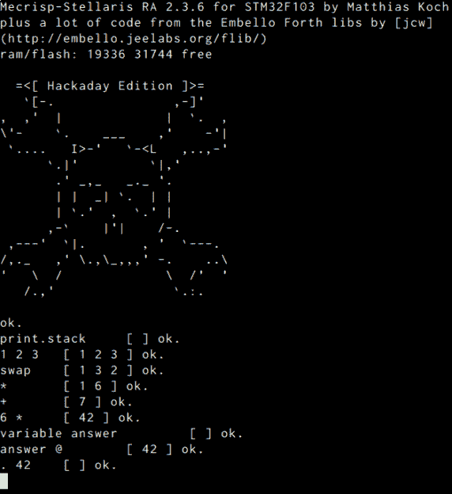
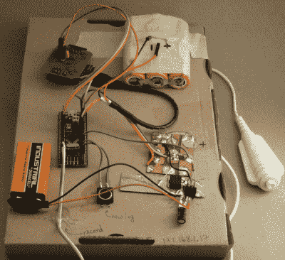

# 用 Mecrisp-Stellaris Forth 制作太阳能电池测试仪

> 原文：<https://hackaday.com/2017/04/26/making-a-solar-cell-tester-with-mecrisp-stellaris-forth/>

在关于 Forth 的前两篇文章中，我已经[大言不惭地讲述了它是如何美丽而奇怪](http://hackaday.com/2017/01/27/forth-the-hackers-language)，然后让你在一个基本系统上进行设置，并且[让一些 led 灯闪烁](http://hackaday.com/2017/04/19/moving-forth-with-mecrisp-stellaris-and-embello/)。虽然我已经向你指出了多重任务，但我们还没有真正利用它。像这样开始使用第四代系统大约是成功的一半。在内部工作*微控制器不同于为微控制器编译，弄清楚工作流程、如何处理问题以及有用的资源在哪里不一定是显而易见的。此外，Mecrisp-Stellaris Forth 还有一些很棒的特性，您可能不会注意到，除非您已经侵入该系统一段时间。*

理想情况下，你可以从某人的肩膀上偷窥他们的工作，你可以看到他们是如何工作的。这就是这篇文章的目的。如果你已经闪现了我们的 mec risp-stellar is-plus-Embello 版本，你已经准备好跟随了。如果没有，回去做你的功课真的很快。你做完后我们还会在这里。本文的很多内容都是针对 Forth 的 Mecrisp-Stellaris 风格的，但是考虑到它运行在大量的 ARM 芯片上，这是一个不错的地方。

## 适应环境

在 Forth 中，您首先需要习惯的是堆栈。你知道人们只能保持五个(七个？)的事情在他们的脑海里一次？福斯将这一点付诸实践。

[](https://hackaday.com/wp-content/uploads/2017/04/session.png) 上次我简单提到了`.s`(“打印堆栈”)命令。在 Hackaday 版本中，我重新定义了标准的 Mecrisp `.s`,使其不那么冗长，并且在我看来可读性更好。如果你发现自己经常打`.s`，你会的，我也写了一个函数(暂时)覆盖“ok”每次按回车键时，通过追加堆栈打印输出来提示。键入`print.stack`并再次按 enter 键，看看它是如何工作的。点击重置按钮，或者输入`reset`将会清除 RAM 中的所有内容，包括堆栈打印提示，所以你将会回到一个干净的状态。

现在可能是使用堆栈操作符的好时机。你读过 [Mecrisp 词汇表](http://mecrisp.sourceforge.net/glossary.htm)吗？查看那里的栈杂耍操作列表。打开`print.stack`并四处播放，直到它们都有意义。

你跑了吗？它给出了 Forth 知道的每个单词的*链表，以及它们所在的内存位置，以及一些额外的细节——太多的细节，除非你正在调试系统本身。Mecrisp 中有一个额外的、不标准的单词，它只是打印出函数名:`list`。现在试试吧。如果你还没有定义几个词，那就定义吧。*

```
: hw ." hello, world!" cr ;
```

是手头上的一个好东西。

## 内存中的层

Mecrisp-Stellaris 的内存分为两个总位置:RAM 和 flash。在“— Mecrisp-Stellaris 内核—”标记之前列出的所有字都在 RAM 中，在复位或掉电时会丢失。新的 RAM 功能将被添加到列表的前面。

在“— Mecrisp-Stellaris 内核—”之后，mark come 在闪存中运行。在 flash 的早期，在“— Flash Dictionary —”之前是标准的 Mecrisp Forth 内核。从那里直到“<>”是从 Mecrisp 发行版中提取的通常有用的单词，包括一些调试功能和多任务处理。在“<>”之前是来自 Embello 库的贡献，包括许多 GPIO 定义，而那些在“<>”之前的只是为了这个系列文章而添加的。

不明显的是，所有这些用括号括起来的标记都是`cornerstone` s，这允许你清除 flash 直到那个内存位置。因此，如果您已经在 flash 中添加了一些额外的功能，并且想要清除回 Hackaday Edition 的默认状态，您可以键入`<<Hackaday-extras>>`。额外的功能将被删除，芯片复位。(注意，这将丢失 RAM 中的所有内容！)命令`eraseflash`会让你回到“— Flash 字典—”标记。

### 覆盖历史

如果你用同一个名字给一个单词下了两次定义，你将会在字典里有这个单词的两个版本。当一个字被调用或编译时，解释器会从 RAM 的顶部向下遍历内存，然后从 flash 的末尾返回到开头。因此，在 RAM 中具有相同名称的字在 flash 中的字之前被调用。Forth 特别奇怪的地方在于，因为它是实时编译的，所以在任何调用字中引用的字都是在调用字被定义时位于顶部*的那个字。制造混乱的历史肯定会让人发疯。*

```
: foo ." foo!" ;
: bar foo ."  bar!" ;
bar foo! bar! ok.
: foo ." bizzle!" ; Redefine foo.  ok.
foo bizzle! ok.
bar foo! bar! ok.

```

另一方面，这里有一种很好的工作方式，可以利用这些不同的内存特性。RAM 在每次重置时都会被擦除，给你一个干净的石板，但是通过使用基石，flash 也不是不可变的。当然，你在 flash 中删除的越深，你以后需要重新定义的单词就越多，假设其中一些是有用的。这表明了一种分层的开发方法，最“核心”的单词在 flash 的最里面。这也很自然，因为单词需要被定义才能被调用，所以无论如何首先定义基础是有意义的。

您可以通过调用`compiletoram`将新单词编译到 RAM(默认设置)中，或者通过调用`compiletoflash`编译到 flash 中。在 RAM 中建立你的话的原型。您可以随意多次覆盖它们，但是请记住，在您更改了上游的一些内容之后，您必须重新定义任何相关的单词，以保持调用历史的完整性。一旦你完成了一大块开发，输入`reset`并清空内存。现在把这些词重新定义成 flash。如果您自下而上开发您的应用程序，您会发现这一切都很好地结合在一起。当你发现已经写入闪存的程序中有 bug 时，`cornerstone`就会来拯救你。

最后，Forth 定义的这种分层性质非常方便。例如，flash 中定义的函数`init`会在每次复位时运行。它包括诸如设置处理器速度和系统时钟之类的事情，您可能不想弄乱它们。因为您可以覆盖`init`，并且任何编译都使用编译时可用的单词，所以您可以简单地将您的功能放在`init` : `: init init ." howdy!" cr ;`上。第一个“init”是新单词的名称，第二个是调用预先存在的`init`，并完成所有的设置。定义的其余部分是你自己的。重启时，所有东西都将按照定义的顺序执行。

## 物质享受

我在编辑器( [Vim](http://hackaday.com/2016/08/08/editor-wars-the-revenge-of-vim/) )中编写大部分代码，然后将代码发送到芯片上进行处理。具体来说，我写了一个名为`forth_upload.sh`的脚本，包含以下内容:

```
[[ $1 ]] && TERM=$1 || TERM=/dev/ttyUSB0
DELAY=0.2
while read -r f; do echo "$f" ; echo "$f" > $TERM ; sleep ${DELAY}s ; done

```

要将文件发送到串口，并进而发送到 Forth，`forth_upload.sh < myfunctions.fs`将起作用。它遍历文件中的每一行，允许系统有 0.2 秒的延迟来编译任何东西。根据我的经验，这种延迟太长了，但是短时间的延迟带来的错误很难发现。`Folie`采取寻找“好”的方法提示加快速度，但这有它自己的问题。如果您使用的是 Vim，您可以发送单个单词或包含以下内容的完整文件:

```
nnoremap <Leader>u vip:<Home>silent <End>w !forth_upload.sh<cr>
inoremap <Leader>u <Esc>:silent .w !forth_upload.sh<Cr>
nnoremap <Leader>U :silent w !forth_upload.sh<Cr>

```

这种设置让我可以在我喜欢的编辑器中开发和调整功能，然后几乎立即将它们发送到 Forth 系统中进行测试。我保持一个终端窗口打开，它总是登录到 Forth 系统，这样我就可以看到新单词被定义，然后开始交互地使用它们。挺甜蜜的。

## 太阳能电池测试仪

现在来看一个快速真实的例子，它将利用上述所有内容。最近，我决定对我放在垃圾抽屉里的一堆小型太阳能电池板进行描述。这意味着调整面板上的负载，并记下面板产生的电压和通过负载的电流。我连接了两个万用表，写下了一些数字，但这显然是微控制器的工作。

[](https://hackaday.com/wp-content/uploads/2017/04/dscf9435_thumbnail.png) 从图像中可以清楚的看出，这是一次快速的拉速。较大的覆铜层有一个电流测量电阻和一对电阻，配置为分压器，将面板电压降至 3.3 V ADC 可以处理的水平。

悬空的是(镀银的)可变负载电路，这完全是次优的:MOSFET 通过由 100 uF 电容滤波的 PWM 电压半导通来散热。9 V 电池和光隔离器是草草拼凑而成的，以确保有足够高的电压来完全打开 MOSFET，它需要 3.3 V 以上的电压。这个可怕但实用的负载电路是后来添加的，第一个版本只有一个电位计，直到它因流过太多电流而变得模糊不清。

按钮用于在阳台上开始和停止设备的录制，而不必跑回室内。程序是用鳄鱼夹夹住一个新面板，按住白色按钮进行录音。按一次黑色小按钮来划分新单元格的数据。数据通过 UART 串行，通过运行 [esp-link](https://github.com/jeelabs/esp-link) 的 ESP8266 返回到我的笔记本电脑，作为一个透明的 WiFi 串行桥，见左上角，就在回收的笔记本电脑电池旁边。热熔胶和硬纸板完善了这个高科技建筑。

### 到数据表！

这种快速且实用的工具构建正是 Forth 的亮点。Jeelabs Forth 库已经有一些简化 ADC 设置的函数，但它们实际上并不适合我，所以我求助于数据手册。要让 ADC 工作，最起码需要打开 ADC 外设时钟，使能 ADC 单元，然后选择 ADC 采样时间。我们可能还需要运行 ADC 校准程序，以确保读数正确。这是任何微控制器都必须完成的所有低级细节，或者依靠一个库来完成。

阅读数据手册时，为了开启 ADC 系统时钟，我们需要设置`RCC-APB2ENR`存储器寄存器中的`ADC1EN`位。随便啦。Mecrisp-Stellaris 有一些支持代码，可以从制造商提供的文件中读取这些值。我已经把它们列入了`core/registers/`目录。内存映射文件对所有寄存器都有很好的助记符，但我对处理单个位名称的方式不太满意。那是一头[牦牛刮胡子](http://hackaday.com/2016/08/09/yak-shaving-hacker-mode-vs-maker-mode/)改天吧，我正试着把事情做完。

以下是我得出的一组位级 ADC 字:

```
\ Hookup
\ PB0 - AIN8 is connected to panel voltage
\ PB1 - AIN9 is connected to current sense resistor

: adc.rcc-enable  9 bit RCC-APB2ENR bis! ; \ set ADC1EN
: adc.set-adon    0 bit ADC1-CR2    bis! ; \ set ADON to enable ADC
: adc.set-cal-bit 2 bit ADC1-CR2    bis! ;

: adc.cal-done?    2 bit ADC1-CR2    bit@ 0= ;
: adc.isdone?      1 bit ADC1-SR     bit@ ;

```

`9 bit`创建一个第九位置位的数字，所有其他位为零，`RCC-APB2ENR bis!`在相关 ADC 控制寄存器中设置所需的位。总而言之，相当不透明，但也与数据手册的说明一一对应。对这些底层单词的良好命名使事情更上一层楼。例如，负责运行校准(设置一个位，等待另一个位清零)的单词相对来说是可读的:`: adc.cal adc.set-cal-bit begin adc.cal-done? until ;`。

这里我们看到了我们的第一个流控制,`begin...until`结构。顺序很奇怪吧？`Begin`开始循环，测试函数`adc-cal-done?`执行，在堆栈上留下一个真或假的值，然后`until`读取这个值并循环回`begin`，直到值为真。这与 C `while (!adc-cal-done()){;}`忙等待循环相同。这是对另一个第四习语的介绍:使用`?`返回布尔值。

## 测试、修复并再次测试

所以让我们来测试一下这些单词。初始化 ADC 并读取它很容易:现在让我们运行一下，确保值是我们期望的。在 Forth 中创建一个快速测试夹具是它的主要优势之一。`: test-adc begin adc@ . cr 10 ms key? until ;`定义一个字，用于读取 ADC、打印数值，并每十毫秒重复一次，直到按下 enter 键。举例来说，如果你在荧光灯下使用太阳能电池板，当电源频率纹波击中你的电池板时，你会拾取到这些纹波，这是你可能没有想到的。一旦定义了新词，就可以随意摆弄，这种能力使得这种调查性的编码流程变得很自然。

真实故事时间。当我写这段代码时，我对 ADC 输入设置了太短的采样时间。这会导致一个读数影响下一个读数，因为 ADC 的内部电容没有时间完全充电或放电。电压高时，我得到的电流读数太高，电压低时，我得到的电流读数太低。我编写了一个例程，连续几次读取每个通道并将值打印出来，并把这些字留给后人，从而很快地调试了这个程序。

```
( Take 8 samples of each, for debugging )
: read-both 8 0 do read-V . loop 8 0 do read-I . loop ;
: readloop begin read-both cr 100 ms key? until ;

```

这次测试的反馈让我将 ADC 的采样时间调至最大值，因为这里没有什么时间要求，我使用的是一个相当高阻抗的源。(缺省值是尽可能快地采样。)更改之后，我再次测试，一切都很准确。当调试一个新的硬件设备时，这种快速的交互式测试和修复是很常见的，来回修复它们变得相当容易。

## 把它包起来

在我离开办公桌使用了几次这个系统之后，很明显我需要添加这两个按钮来实现远程操作。还增加了一些额外的闪烁程序。尽管这些是后来才想到的，但是很容易将它们包装成任务，并让它们同时运行。

一个任务寻找数据采集按钮，而另一个任务寻找“下一个样本”按钮，超时足够长，我不会意外地激活它两次。我真的很喜欢[按钮超时](https://github.com/hexagon5un/hackaday-forth/blob/master/demos/solar/tasks.fs)任务与支持多任务的`ms`命令一起工作的方式。你可以在这个项目的 GitHub 中看到这一切。

[](https://hackaday.com/wp-content/uploads/2017/02/solarcell_morning.png) 在计算机端，由于所有数据都是通过 WiFi 托管的串行端口传入的， [ncat](https://nmap.org/ncat/) 用于将数据转储到一个文件中，在该文件中，数据根据分隔符被分成块，转化为有效的 CSV 数据集，并进行绘制。本质上，这些都是一行程序，但是我也把它们放到了存储库中。

我不是第四大师——我在微控制器上使用 Mecrisp 才一年——所以我很乐意接受对代码的建设性批评。这是一个快速的破解，但它正是我所需要的，并且是编程的乐趣(除了调试 ADC 配置)。对于任何黑客项目来说，十块这样的廉价 ARM 板加上一个不错的 Forth 设置是一个很好的选择。如果你也在做同样的事情，请告诉我们！