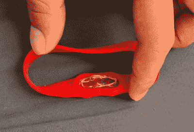

# 制作可穿戴 NFC 公交通行证

> 原文：<https://hackaday.com/2017/06/20/making-a-wearable-nfc-bus-pass/>

[Stephen Cognetta]正试图将他拥有的物品总数控制在 115 件以下，他一直在寻找简化生活的方法。

 为了这个目标，他将自己的 SF Transit Clipper 卡溶解在丙酮中，以[获取嵌入其中的 NFC 标签](http://www.instructables.com/id/Transform-the-SF-Clipper-Card-Into-a-Wearable/)。这种标签由一个贴在天线上的微型芯片组成，天线的大小和卡片本身一样。大约花了三天的时间(视频下方的休息)层分离和[斯蒂芬]能够摆脱标签。

他最终尝试了几种不同的方法来存放这个精致的芯片和天线，包括一块 Sugru 和一个防水阿司匹林带，如右图所示。

有人认为公交通行证的想法可能会节省你一点时间，但真正简化你生活的是拥有一个可以解锁一堆东西的可穿戴标签。还应该注意的是，不冷静，损坏卡违反顺丰运输的服务条款…

HaD 之前已经涵盖了 NFC 可穿戴设备，包括[手机解锁 NFC 戒指](http://hackaday.com/2014/03/17/nfc-ring-unlocks-your-phone/)以及 [NFC 戒指盒](http://hackaday.com/2014/08/10/nfc-ring-lock-box/)。这个 [NFC 控制的无限远镜](http://hackaday.com/2015/12/09/impressive-nfc-controlled-infinity-mirror-table-cuts-no-corners/)很好地利用了这项技术。

 [https://www.youtube.com/embed/c4D13Mbfw28?version=3&rel=1&showsearch=0&showinfo=1&iv_load_policy=1&fs=1&hl=en-US&autohide=2&wmode=transparent](https://www.youtube.com/embed/c4D13Mbfw28?version=3&rel=1&showsearch=0&showinfo=1&iv_load_policy=1&fs=1&hl=en-US&autohide=2&wmode=transparent)

