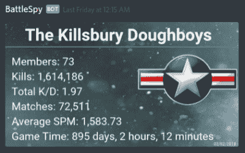
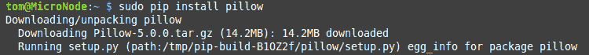
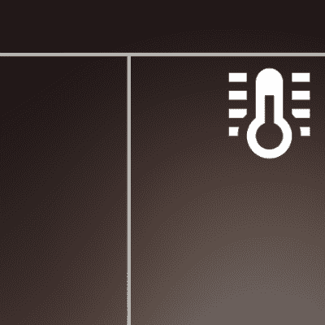
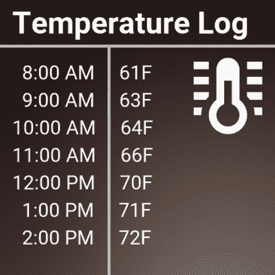

# 用 Python 制作价值 1000 字的图片

> 原文：<https://hackaday.com/2018/03/21/making-pictures-worth-1000-words-in-python/>

在之前的一篇文章中，我展示了如何从 Python 上传图片到 Discord 服务器；利用流行的聊天平台来简化远程监控和在移动设备上推送通知等工作。作为一个例子，我展示了一个自动生成的图像，其中包含我的*战地 1* 排的统计数据，每周都会被推送到成员的设备上。

[](https://hackaday.com/wp-content/uploads/2018/02/discordbot_battlespy1.png)

Automatically generated stats posted to Discord

该图像的生成超出了原始帖子的范围，但我认为这是一项值得单独讨论的技术。毕竟都说一图抵一千字。所以这意味着一张实际上包含了单词的图片肯定更有价值。像，至少 2000，容易。

能够从文本数据中创建图像可以为您的项目增添一些特色，而无需创建完整的图形用户界面。通过在预先渲染的图像上叠加文本，您可以用最少的系统资源获得非常流畅的视觉效果。只要您有显示图像文件的方法，就可以了。

在这篇文章中，我将快速演示如何加载图像，用文本覆盖它，然后将生成的图像保存到一个新文件中。这种技术在显示器不需要实时更新的情况下是理想的；视觉效果可以定期生成，并简单地显示为静态图像。可能的用途包括天气显示、[、【神奇】镜子](https://hackaday.com/2015/12/30/magic-mirror-on-the-wall-is-pi-or-esp-fairest-of-all/)、公共标志等。

## Python 图像库

要在 Python 中操作图像，您需要名副其实的 Python 图像库(PIL)。不幸的是，PIL 的开发似乎在 2009 年的某个时候停止了，虽然它在技术上仍然有效，但它不支持 Python 3 . x。PIL 的一个分支存在，[称为 Pillow](http://pillow.readthedocs.io/en/latest/) ，它得到了积极的维护，并修复了 PIL 的一些问题。不为别的，您应该使用 Pillow 来保护您的代码。

和大多数 Python 库一样，它可以用`pip`安装:

[](https://hackaday.com/wp-content/uploads/2018/03/pil_install.png)

## 外部资源

[](https://hackaday.com/wp-content/uploads/2018/03/pil_blankbg1.png)

The background image for our demonstration.

对于这项技术，我们将加载两个外部资源:文本的 TrueType 字体和要覆盖的背景图像。在这两个元素之间，你有机会用最少的努力和代码来组装一个视觉上非常吸引人的最终产品。如果你提前计划，你可以在背景图片中添加表格或其他视觉分隔符，当然还有一大堆令人敬畏的字体。

作为一个友好的提醒，请确保您的项目中包含的任何字体或背景图像的许可证都得到正确遵守。如果你只是为自己做一个项目，你可以做任何你想做的事情，但是一旦你把它放在 GitHub 上或者开始分发它，事情就变得棘手了。我发现网上发布的大多数字体倾向于非商业用途的许可，但是你应该经常仔细检查。即使非商业使用是允许的，许可证的条款通常会要求在你的软件文档中有适当的信用。图形的许可可能会更严格一些，所以我建议查看公共领域图像的存储库，以使生活更轻松。

## 示例代码

假设您有一个记录每小时数据的温度传感器，并且您想要一种比 CSV 文件更有特色的显示方式。我们在这里做了一点手脚，说列表“temps”已经填充了一些时间和温度的组合，但是代码的其余部分是完全有效的。

```

#!/usr/bin/env python

from PIL import Image, ImageDraw, ImageFont

# Text positioning
text_y = 100
text_pad = 45

# Define fonts for regular text and heading
data_font = ImageFont.truetype('Roboto-Regular.ttf', 32)
header_font = ImageFont.truetype('Roboto-Bold.ttf', 50)

# Load background image
bg_img = Image.open('bg_img.png')
surface = ImageDraw.Draw(bg_img)

# Write heading
surface.text((20, 8), 'Temperature Log', font=header_font)

# Write temperatures
for x in range(len(temps)):
    surface.text((20, (text_y + (text_pad * x))), temps[x], font=data_font)

# Save file
bg_img.save(open('temp_log.png', 'wb'), 'PNG')

```

保存到`temp_log.png`的结果图像可以在右边看到。

[](https://hackaday.com/wp-content/uploads/2018/03/pil_thumb.png) 简单运行一下代码:它定义了两种不同大小的字体，加载背景图像，创建一个我们可以操作的表面，然后在指定的 X 和 Y 坐标打印文本。该循环遍历温度列表，将每一个温度都打印在图像的下方。最后一行将我们的工作保存到一个新文件中。值得注意的是，原始图像没有以任何方式进行修改，因此您可以使用新数据反复运行该脚本，并且您将获得适用于您的项目的任何频率的更新图像。

当然，这是一个非常简单的例子，但它很好地展示了如何将静态背景图像与动态数据相结合来创建一个具有视觉吸引力的最终图像。

顺带一提，这里使用的字体来自 Google 的 [Roboto 家族](https://fonts.google.com/specimen/Roboto)，图标来自“[材质设计图标”项目](https://materialdesignicons.com)。如果你在自由和开源许可下寻找有吸引力的字体和图标，这两者都是很好的资源。

## 最后的想法

这篇文章应该让您知道使用几行 Python 可以做些什么，但这绝不是对这个主题的详尽介绍。下一步是利用颜色、不透明度和图形元素来创建更加健壮的图像，比如本文顶部的系统监视器显示。有了这样的代码和一个支持网络的相框([可能是由 Raspberry Pi](https://hackaday.com/2018/03/05/shoot-and-forget-digital-photo-frame/) 驱动的 DIY 类型)，您就可以为您想要监视的任何东西创建一个流畅的监控系统了。