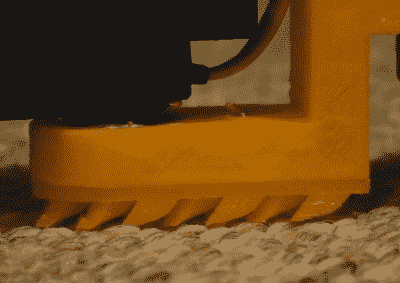

# 制造能滑行、侧风和攻击的机器蛇

> 原文：<https://hackaday.com/2018/06/14/making-robot-snakes-that-slither-sidewind-and-strike/>

威尔·唐纳森一直在制造各种各样的机器蛇。他的一条蛇抱住地面，以正弦波运动滑过地面。把它翻过来，调用不同的代码，这条蛇也会像尺蠖一样移动。他的另一条蛇将身体的一部分向上提起，在地面上横向移动，同样使用正弦波。

3D printed scales

起初，他的滑行蛇只会在地板上原地摆动。更仔细地观察生物蛇，他发现它们向前移动的部分原因是由于它们的鳞片。天平在地面上沿一个方向平稳移动，但当向后或侧向推动时会夹紧。他还发现了哈佛大学所做的工作，他们将泵入的空气和纸工艺结合在一起，制造出可以改变形状的鳞片。所以[威尔]为他的蛇设计并 3D 打印了一些鳞片。然而，正如你在下面的视频中看到的，它们在地毯上不起作用。

他的成功来自于他给每一部分都增加了轮子。它们不像汽车一样工作，没有引擎转动轮子。相反，它们的行为更像是天平，可以向一个方向自由旋转，当被推向一边时会被抓住。这一成功也让他可以在代码中添加一个左转或右转的参数。

正如我们上面所说的，他可以翻转地面拥抱者，像尺蠖一样奔跑，他还有一个响尾蛇变体。响尾蛇甚至可以抬起它的头，像眼镜蛇一样攻击。如果你想做自己的，可以看看他的 hackaday.io 页面。他提供了 STL 文件、代码和构造细节。

[威尔]对他的蛇有很多未来的计划。目前，它们被拴在一个改良的 ATX 电源上，但是他想把脂肪电池植入蛇体内。他最初的目标是让[成为一条爬树蛇](https://hackaday.com/2010/09/06/snake-bot-climbs-trees/)，就像卡耐基梅隆大学生物机器人实验室的那条一样(本文更新链接),但是他的第一条蛇不够长。他仍然计划追求那个以及一条水下电子鳗。他能尝试的事情似乎没有限制。现在，看看下面的视频，看看他迄今为止的成功和失败。也许你甚至对那些棘手的秤有一些建议。他的蛇的下半部分看起来是模块化的，适合实验。

 [https://www.youtube.com/embed/e6Amh1GUPkA?version=3&rel=1&showsearch=0&showinfo=1&iv_load_policy=1&fs=1&hl=en-US&autohide=2&wmode=transparent](https://www.youtube.com/embed/e6Amh1GUPkA?version=3&rel=1&showsearch=0&showinfo=1&iv_load_policy=1&fs=1&hl=en-US&autohide=2&wmode=transparent)

