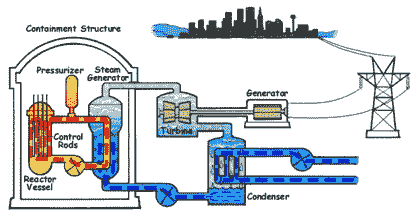
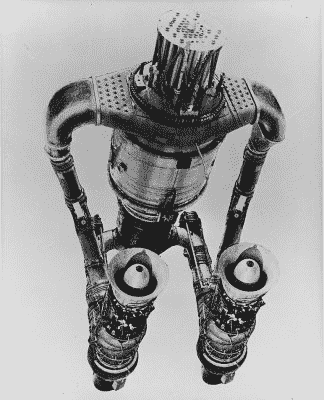
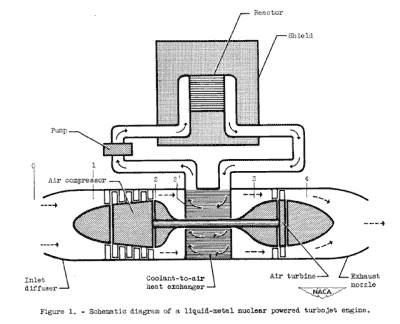
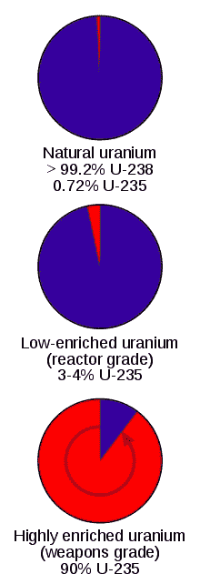

# 为核飞机辩护

> 原文：<https://hackaday.com/2015/11/02/making-the-case-for-nuclear-aircraft/>

在任何特定时刻，美国海军的几艘尼米兹级航空母舰都在世界海洋上航行。重达 9 万吨，这些巨大的船只需要很大的动力才能移动。有人会认为这种动力需要大量的燃料，这会限制它们的航程，但事实并非如此。它们的航程实际上是无限的，每 25 年才需要加油。哪种技术允许这样做？答案是小型化的核电站。尼米兹级航空母舰有两艘，它们与更大的发电厂非常相似。如果我们能把它们做得足够小来装船，我们能把它们做得足够小来装其他东西吗，比如飞机？

## 核能 101

核反应堆利用铀原子的受控分裂来产生能量。这种能量以热能的形式转化为水。水被保持在高压下，这阻止它变成蒸汽，并允许它  变得超热。过热的水被转移到热交换器，在那里它加热另一个水源以产生蒸汽。该第二热交换器不仅允许能量转移，而且将放射性与系统的其余部分隔离。来自第二个热交换器的非放射性蒸汽被用来驱动涡轮机发电。蒸汽最终流向冷凝器，在那里它变回液态水，并被转移到第二个热交换器。

所以现在我们知道了核能是如何工作的，我们开始研究有趣的东西！我们的工作是讨论如何把它做得非常非常小，然后塞进飞机。然后研究这种技术的后果。

## 传热反应器

HTRE-3

喷气发动机使用旋转的叶片来压缩燃烧室内的空气。然后，压缩空气被喷上化石燃料，并用火花点燃。由此释放的能量从发动机中排出，产生推力。核动力喷气发动机除了燃烧室之外几乎是一样的。空气被压缩并被送到压力通风系统。核反应堆将空气加热到很高的温度。过热的空气然后被送到涡轮，在那里产生推力。

美国政府在 20 世纪 50 年代建造了核动力喷气发动机。它被称为传热反应堆实验-3，简称 HTRE-3。它使用液体盐而不是水作为热交换器。盐会变得更热，更有效地将能量传递到空气中。

核动力喷气式飞机背后的想法类似于核动力船——不需要停下来加油。核动力喷气式飞机的航程是无限的。然而，洲际弹道导弹的出现使得这种飞机不再用于军事目的。

## 商用喷气式飞机呢？

Nuclear Jet Engine

虽然制造一架核动力喷气式飞机向人们投掷炸弹可能不切实际，但运输人们呢？以今天的技术，有没有可能建造一个小型、安全的核喷气发动机，用于商业客机上？很难想象它不会。今天的材料科学比 20 世纪 50 年代先进得多。我们有能力完善一个更小的核发动机。问题是——为什么我们没有？

### 安全

首先想到的是，如果发生灾难性事故，导致飞机在飞行途中解体，会发生什么。在这样的灾难中，你如何控制放射性物质？让我们回到 1997 年秋天，那时卡西尼号宇宙飞船正准备发射。它的核心是 37.2 公斤的钚 238。你可以想象在一个巨大的受控  爆炸顶上捆扎放射性物质的争议。美国宇航局保证，如果火箭爆炸，放射性物质将得到控制。卡西尼号当然是一个非常成功的任务，解开了土星的许多秘密。我们能够减轻卡西尼号带来的风险和危险。我们应该可以用一种更稳定的飞行器——喷气式飞机来做同样的事情。

### 这不是武器级别的

我想到的第二件事是有人偷了一个然后做了一个炸弹。这就是我们需要指出武器级和反应堆级铀的区别。你可能在最近的新闻中听说过这些术语，因为它们是伊朗核协议的关键点。天然铀大约 99%是铀 238，1%是铀 235。U238 同位素不适用于核能或核弹。你需要更高浓度的 U235 同位素。炸弹需要高得多的 U235 浓度，而反应堆需要低得多的浓度。浓缩铀 235 同位素的过程被称为浓缩。

浓缩铀很难做到，因为铀 235 和铀 238 同位素的性质非常相似。最常见的技术是使用高科技离心机按重量分离两者。这是伊朗协议的症结所在。没人关心他们是否有反应堆级铀。该协议是为了防止他们制造能够从中分离出足够制造核弹的铀 235 的离心机。

简而言之，你不必担心有人会用核动力喷气发动机中的铀制造炸弹。

### 核动力商用喷气式飞机的影响

让我们以思考一架安全的核动力喷气式飞机对社会的影响作为结束。远离化石燃料是一项受欢迎的运动。如果我们能让每个人都相信它是安全的，它会得到许多国家领导人的大力支持。此外，燃料成本是航空业最大的开支之一。一架不需要燃料的飞机将会是一个巨大的成本节约，为我们所有人提供更便宜的机票。

现在轮到你了。核动力商用喷气式飞机——是还是不是？