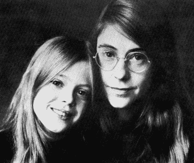
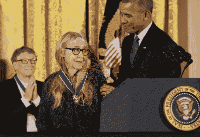
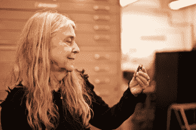

# 玛格丽特·哈米尔顿将软件工程带到月球和更远的地方

> 原文：<https://hackaday.com/2018/04/10/margaret-hamilton-takes-software-engineering-to-the-moon-and-beyond/>

如果你要列出一份影响软件工程的女性名单，第一个选择就是玛格丽特·哈米尔顿。[阿波罗 11 号源代码](https://github.com/chrislgarry/Apollo-11)将她的头衔列为“编程领袖”。今天，这个头衔可能会类似于“首席软件工程师”

玛格丽特·哈米尔顿于 1936 年出生在印第安纳州的乡下。她的父亲是一位哲学家和诗人，他和祖父一起鼓励她热爱数学和科学。她主修数学，辅修哲学，1956 年在厄尔汉姆学院获得学士学位。在厄尔汉姆的时候，她继续读研的计划被推迟了，因为她支持她的丈夫在哈佛攻读自己的学位。玛格丽特在麻省理工学院找到了一份工作，在爱德华·诺顿·罗伦兹教授的指导下开发一个预测天气的计算机程序。玛格丽特是在诺顿办公室的桌子大小的 LGP-30 计算机上开始工作的。

汉密尔顿很快转向 SAGE 计划，编写软件来监视来袭的俄罗斯轰炸机的雷达数据。她在 SAGE 上的工作使 Margaret 处于加入新的阿波罗导航软件团队的最佳位置。

阿波罗制导计算机软件团队由麻省理工学院设计，雷声公司制造。说这在当时是一个巨大的软件项目是一种保守的说法。到 1968 年，超过 350 名工程师从事软件工作。在阿波罗 11 号着陆月球表面之前，软件工程记录了 1400 人工年，该项目由玛格丽特·哈米尔顿领导。

## 忘记它

当玛格丽特开始从事阿波罗计划的工作时，她仍然被认为是一名初级程序员。如你所料，她被分配了一个非常低优先级的任务:编写在异常中止时运行的软件。这是将用于早期测试之一的软件，所以没有人期望中止代码会运行。玛格丽特甚至把这个项目命名为“忘记它”。玛格丽特立刻成了专家，她被叫到国家航空航天局解释她的软件是如何工作的，并回答问题。

最终，玛格丽特成为了导航计算机的首席程序员。不过，她不是一个袖手旁观的经理——她在战壕里工作，努力让人们去月球并返回。这个时候，她也是一个工作的父母。在许多深夜和周末的工作会议上，她会把女儿劳伦带进来。玛格丽特会进行测试，“扮演宇航员”，劳伦会和她一起玩。

## P01 程序注释

在一次测试中，劳伦在控制器上输入了一些东西。导航计算机立即崩溃，导致整个系统瘫痪。玛格丽特进行了调查，发现劳伦在指令舱飞行时无意中加载了 P01 预启动程序。如果宇航员在任务中这样做，那将是灾难性的，因为 P01 程序将会删除所有的计算机导航数据。飞船会盲目飞行。

Margaret with her daughter Lauren

玛格丽特建议添加软件来防止这种情况发生，但美国宇航局拒绝了她的请求。更多的软件意味着更多可能的错误。一个真正的宇航员绝不会在任务进行中加载发射前程序。为了安抚玛格丽特，美国宇航局给软件添加了一条用户注释:“飞行期间不要选择 P01”

在阿波罗 8 号期间，宇航员吉姆·洛威尔通过在任务的第五天意外加载 P01 证明了美国宇航局是错误的。系统崩溃，导航数据丢失。玛格丽特和她的团队被召来拯救世界。他们花了八个小时研究软件并验证恢复方法。它必须成功，而且第一次就成功了。按照玛格丽特的指示，美国宇航局上传了新的导航系数，任务得以继续。

尽管软件驱动了阿波罗计划，但它仍然不被认为是一门科学——至少硬件或机械工程师不这么认为。程序员不受重视。为了解决这个问题，玛格丽特创造了“软件工程”这个术语。她的许多同事起初认为这是一个笑话。当然，时间已经证明她是完全正确的。

## 1201 程序报警

Margaret 和整个软件团队知道他们正在做一件前所未有的事情——创建一个第一次使用就必须完美的人工软件。任何重大错误都意味着宇航员的死亡，他们把生命托付给了这个软件。玛格丽特特别担心计算机问题会被宇航员忽视，直到为时已晚。她会见了美国宇航局的官员，他们一起想出了一个通知宇航员电脑有问题的方法。

这些警告没过多久就出现了。在阿波罗 11 号的着陆过程中，1201 和 1202 程序警报几次点亮了驾驶舱。这些是玛格丽特的警告。他们表示，计算机已经耗尽了资源，正在重新启动，放弃了低优先级的任务，专注于对任务的着陆阶段重要的任务。这些警报本不应该响起来——它们出现的事实意味着事情非常不对劲。然而，任务控制中心的团队知道玛格丽特的减载系统有多强大，所以宇航员被告知忽略并清除警报。

后来的调查表明，1201 和 1202 警报是由清单错误引起的。清单指示宇航员在任务的着陆阶段打开他们的会合雷达。着陆时并不需要会合雷达，但由于它是开着的，它每秒钟仍会多次干扰制导计算机。这些中断会导致计算机资源耗尽，并显示玛格丽特的一个警报。如果软件没有被编写和测试得这么好，来自额外雷达数据的负载可能会导致登月舱中止任务，或者更糟，撞上月球——搁浅或杀死船上的宇航员。

## 阿波罗之后

阿波罗任务结束后，玛格丽特继续在麻省理工学院从事美国宇航局项目的工作。她参与了天空实验室以及航天飞机软件的第一次修订。但最终，她离开了公司，创办了自己的公司。

Accepting the Presidential Medal of Freedom from President Obama in 2016.

在阿波罗上工作时，玛格丽特发现了许多虫子，并把它们压扁了。她仔细记录并分类了每一个。这项工作让她认识到许多错误发生在软件模块之间的边界。从那里，玛格丽特能够推导出软件设计的六个数学公理。在高阶软件公司，玛格丽特创造了通用系统语言来将这些公理付诸实践。

今天，玛格丽特是汉密尔顿技术公司的首席执行官(也是创始人)，她仍在那里创造工具和系统，使软件更安全、更无 bug。

Margaret Hamilton holds a LEGO minifig of herself

多年来，玛格丽特在美国国家航空航天局和麻省理工学院的工程师和科学家们的核心圈子里很出名。然而，她并不为公众所知。一张她站在一堆比她高的打印件旁边的照片——阿波罗导航计算机的全部资源改变了这一切。Margaret 现在理所当然地被认为是软件工程领域的第一批女性之一，并被授予总统自由勋章，同时还被列入了美国国家航空航天局描绘她著名形象的女性乐高玩具中。