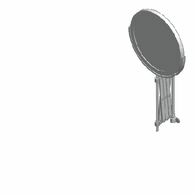
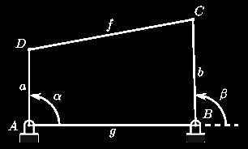
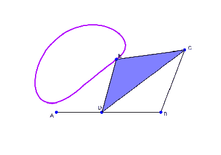
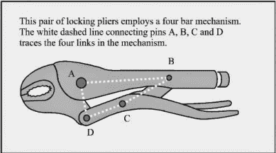
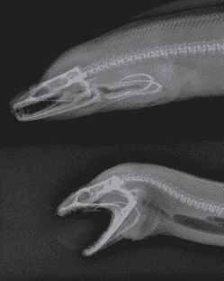

# 神奇的机构:无处不在的四连杆机构

> 原文：<https://hackaday.com/2017/03/29/marvelous-mechanisms-the-ubiquitous-four-bar-linkage/>

四连杆机构是一种用于许多不同装置的机械连杆机构。几个例子是:锁钳、自行车、油井泵、装载机、内燃机、压缩机和受电弓。在生物学中，我们也可以找到这种联系的例子，如在人类膝关节中，这种机制允许旋转并保持两条腿的骨头相互连接。它也存在于一些[鱼颚](http://dynref.engr.illinois.edu/aml.html#aml-sj)中，进化成利用四杆机构可以提供的力倍增。

## 它是如何工作的

带剪式连杆机构的可展开镜子。由[Catsquisher]via[Wikimedia Commons](https://commons.wikimedia.org/w/index.php?curid=12725142)

对连杆机构的研究始于阿基米德，他将几何学应用于杠杆的研究，但完整的数学描述必须等到 19 世纪晚期，然而，由于由此产生的方程的复杂性，复杂连杆机构的研究和设计随着数字计算机的出现而大大简化。

一般来说，机械连杆是一组相互连接以控制力和运动的物体。形成连杆机构的主体或连杆在称为关节的点处相互连接。也许最简单的例子是杠杆，它由一个可以绕支点转动的刚性杆组成，用来获得机械优势:你可以用比物体重量更小的力举起物体。

两个杠杆可以相互连接形成四连杆机构。在图中，杠杆由连杆 *a* (A-D)和 *b* (B-C)表示。A 点和 B 点是支点。第三个连杆 *f* (C-D)连接杠杆，第四个连杆是安装该机构的地面或框架 *g* (A-B)。在下面的动画中，输入连杆 *a* (曲柄)执行旋转运动，驱动摇杆 *b* 并导致连杆 *b* (摇杆)往复运动。

    

这种曲柄滑块机构是内燃机的心脏，气缸中气体对滑动活塞的膨胀驱动曲柄旋转。在压缩机中，情况正好相反，曲柄的旋转推动活塞压缩气缸中的气体。根据该机制的排列方式，它可以执行以下任务:

*   将旋转运动转化为往复运动，就像我们上面讨论的那样。
*   把往复运动转换成旋转运动，比如在自行车上。
*   约束运动，例如膝关节和汽车悬架。
*   放大力量，例如在鹦嘴鱼的下颚。

Locking pliers mechanism. Image from [[Engineering made easy](http://www.hkdivedi.com/2015/01/four-bar-linkage-mechanism.html)]

## 一些应用

四连杆机构的一个有趣的应用是在锁紧钳中。B-C 和 C-D 连杆设置在接近 180 度的角度。当力施加到手柄上时，连杆之间的角度小于 180 °(从连杆内部测量),钳口中的合力试图保持手柄打开。当钳子卡入锁定位置时，该角度变得小于 180 °,钳夹中的力将手柄保持在锁定位置。

在自行车中，骑车人腿部的往复运动通过由两个腿部、车架和曲柄形成的四杆机构转化为旋转运动。

一个来自大自然的例子，海鳗。图片来自[ [马修·韦斯特](http://dynref.engr.illinois.edu/aml.html) ]

正如人类的许多其他发明一样，我们经常发现大自然已经通过进化提出了同样的想法。鹦嘴鱼生活在珊瑚礁上，以珊瑚礁为食，并且必须磨碎珊瑚才能吃到里面的珊瑚虫。为了这项工作，他们需要非常强大的咬合力。鹦嘴鱼通过使用下颚的四连杆机构获得了肌肉力量的机械优势！其他物种也使用相同的机制，其中一种是海鳗，如图所示，它有一种非常特殊的能力，可以将嘴张开来捕捉猎物，很像电影系列中的外星人。

连杆机构中连接链节的接头有两种类型。铰接关节称为转动关节，滑动关节称为棱柱形关节。根据转动关节和棱柱关节的数量，四连杆机构可以有三种类型:

*   由四个连杆和四个转动点构成的平面四边形连杆机构。上面的动画显示了这一点。
*   由三个转动关节和一个移动关节组成的曲柄滑块机构。
*   由两个转动关节和两个移动关节组成的双滑块。苏格兰轭和阿基米德的 T2 栓就是例子。

四连杆机构有很多种变化形式，正如你所猜测的，获得我们需要的力和运动的设计过程并不容易。对感兴趣的读者来说，康奈尔大学的 [KMODDL](http://kmoddl.library.cornell.edu/) (设计数字图书馆的运动学模型)是一个极好的资源。其他有趣的网站有 [507 机械运动](http://507movements.com/)，在那里你可以找到好看的动画，还有[ [thang010146](https://www.youtube.com/user/thang010146 "thang010146") ]的 YouTube 频道。

我们希望激起你对机械的好奇心。在这个电子技术飞速发展的时代，观察几个世纪前开发的机械装置的工作情况，是一种有益的体验，但这些机械装置仍然存在，并且在我们的日常生活中仍然需要。我们计划写更多关于有趣机制的文章，所以请在下面的评论中告诉我们你最喜欢的。