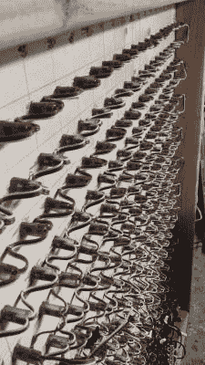

# 海量像素显示节日装饰

> 原文：<https://hackaday.com/2016/12/20/massive-pixel-display-holiday-decoration/>

为节日装饰是一件严肃的事情！发现自己周围都是做大的邻居，redditor [wolfdoom]决定今年要大展拳脚，并决定建造一个超大像素 LED 显示屏。

 在他们的工艺中显示出足智多谋，[wolfdoom]发现了一种古老的荧光网格图案，以防止从一个像素到下一个像素的出血。重复使用这种网格节省了许多精密切割中密度纤维板的时间——取而代之的是许多切割塑料的时间，这无疑有更大的误差空间。将生成的网格贴在一张胶合板上。)钻孔之后，led 被安装并费力地连接在一起。

销售 pizel 效应的塑料散光板和他们当地的 [maker space](http://www.hive76.org/) 对电源电路的一点帮助足以让这个项目滚动到完成——在地下室住宅建造的必要时期之后。

尽管由于一个笨拙的女儿而有一些小小的降级，但巨大的 4×4 显示器仍然是一个合适的节日装饰。目前，控制系统仍在[wolfdoom]的地下室，但有计划将其整合到显示器的框架中。

我们今年看到的更有趣的 LED 矩阵构建之一是使用 1575 个啤酒瓶的[。为了更具互动性的节日装饰，万圣节通常会带上蛋糕——就像](http://hackaday.com/2016/06/03/1575-bottle-of-beer-on-the-led-wall/)[这个动画门环](http://hackaday.com/2013/10/08/halloween-doorknocker-decoration-hack/)。

[通过 [/r/DIY](https://www.reddit.com/r/DIY/comments/5ijdpf/christmas_led_pixel_project_videodetails_in/)