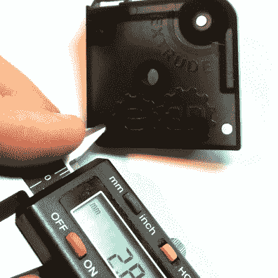

# 为精确逆向工程测量零件质量差

> 原文：<https://hackaday.com/2016/04/15/measuring-parts-badly-for-accurate-reverse-engineering/>

Previous headquarters of Useful Thing Inc. They made the best widget you could buy in the 80s.

像大多数黑客一样，我遇到了一个看起来可能会做我想要的事情的部分，但唯一的文档来自一家公司，这家公司彻底停业了，他们的公司办公室现在是一家美甲店和一个地铁站。

因此，就像任何一个带着 20 英镑闲钱逛折扣店的黑客一样，我一度买了一个中国卡尺。当然，当电池电量低，温度变化，如果我把它拿在手里太久，月亮出来了，等等，它都会测错。但是它只有二十美元。无论哪种方式，我如何从中获得精确的测量？嗯，半巫术和告诉自己受过教育的谎言。

通过说谎获得精确测量有两条黄金法则。对一些人来说，这可能是显而易见的，但我经历了相当多的痛苦才得出这些结论。

1.  工程师很懒。好懒。大多数事情将是偶数，共同的分数，如果可能的话，标准大小。如果板材和螺钉是 2 毫米和 3 毫米的，那么你肯定会看到很多 2 毫米和 3 毫米的特征。此外，即使公制世界应该是纯粹的，你仍然会看到更多的 0.25 (1/4)毫米的测量比你。333333 (1/3)毫米的测量。因为有些小分数比小数更容易思考。
2.  你的眼睛在说谎。如果有关系，测量一下以确定。

## 愚蠢的测径技巧

使用卡尺应该很简单。毕竟，它只是两个相对滑动的部分，也是测量它移动了多远的一种方式。尽管如此，在三种测量表面和使用每种表面的一些技巧之间，它是值得研究的。

### 平钻头和楔形钻头

卡尺的钳口上有两种类型的表面——读数附近的平坦部分，以及朝向尖端变薄的楔形区域。当您想要平均测量时，请使用平钻头；当您想要点测量时，请使用楔形钻头。

例如，如果你想知道一个螺丝要钻多大的孔，就用平头钻头。(但是如果你想测量螺丝的小直径——螺纹内部的直径——就用楔形物。)通常，你会用扁钻头来测量直径。即使在测量之后，你也会想用你的头脑。螺丝通常比上面写的尺寸小一点，所以 M3 螺丝在卡尺上的读数是 2.95 毫米。额外的间隙将使它很容易通过一个 3 毫米的孔。

  Accidentally measuring the minor diameter of the screw. This is not a M7 bolt.  Using the larger surface confirms this is a M8 bolt.

如果你想测量一个精致或易碎的材料，你也可以使用扁平钻头。卡钳应该由相当硬的钢制成。(你每花 10 美元，它的硬度就会增加一分。)因此，如果你试图测量一些微妙的东西，它会损坏或缩进表面。对于塑料零件来说尤其如此。对于塑料零件，楔块施加点载荷，使表面变形，从而影响测量。

测量完成后，不要在表面上拖动卡尺。这是我最讨厌的事。我有一个同事，他会用他 250 美元的卡尺来测量电路板的宽度，然后把它从边缘拉下来。楔形是一个薄而精密的硬化表面。你要么损坏了卡尺，要么损坏了你正在测量的东西。打开你的卡钳，然后移除它们。

### 卡尺有内置的数学函数

使用零按钮，你可以做简单的加法和减法。假设您想要测量两个孔中心之间的距离。您可以测量孔外侧之间的距离，然后减去每个孔的半径，以获得中心距离。或者，当两个孔的大小相同时，可以使用 zero 函数。测量孔的直径，然后单击零。现在测量孔的外点到外点。这将是您的中心到中心的距离-直径(两个半径)自动减去。整洁！

  First measure the hole. Don’t copy my technique. Two hands, are needed to do this properly. I needed one for the camera.  Press “Zero” and then measure edge to edge. Expected 31.00+-.1 via. the NEMA17 standard. Nice!

当试图决定一个东西是否适合另一个东西时，零函数也很有用。如果你想知道一个轴是否适合一个洞呢？你可以先测量一个，然后再测量另一个，减去两者之差得到间隙。用卡尺？测量轴，单击零，然后测量孔。屏幕上的值是间隙。

同样的技巧用于检查不同零件上两个相似测量值之间的差异。测量一个，按零，然后测量另一个。我也用这个功能来测量用我做的工具[挤出了多少打印机灯丝。](http://hackaday.com/2016/01/27/3d-printer-tool-set-your-extruder-steps-with-ease/)

## 示例应用程序

Honestly, it’s amazing my old cold-end lasted so long. This unlikely event brought to you by Cyanoacrylate Glue.

有了这些基础知识和一些技巧，我们就可以准确地对一个东西进行逆向工程。我们的受害者是来自 E3D 的新冷端。我打印机上的冷端坏了，我需要一个新的。因为我彻底陷入了先有蛋还是先有鸡的困境，我希望有人能在 MRRF 给我印一份新的。我告诉他们我在 MRRF 的[困境，他们同意给我一个他们的原型，如果我为 Prusa i2 设计雪橇的话。](http://hackaday.com/2016/03/19/mrrf-3d-printing-spectacular/)

我首先弄清楚我需要进行哪些测量:外壳和喷嘴相对于步进电机的位置。这定位了喷嘴，给了我冷端的大致轮廓，所以没有东西会撞到任何东西。冷端的其余特征及其位置是不需要的。您不需要对整个零件建模，只需对影响您正在构建的零件的部分建模即可。

Thanks RepRap Wiki! You’re my favorite hot mess of a resource.

它看起来像我们有一个安装在后面的步进电机。由于所有步进机都是按照标准制造的，我们可以马上应用规则 1。快速搜索向我们展示了一个 [NEMA 17](http://reprap.org/wiki/NEMA_17_Stepper_motor) 发动机的模式是一个间距为 3 毫米、31 毫米的方孔，中间有一个 27 毫米的孔。我们还没有把卡钳拿出来。

好的，我们来看看冷端的外部尺寸。我得到了 43.97 和 46.44。我将通过规则 1 把它转换成 44 毫米和 46.5 毫米。同样，我得到的深度是 24.67，所以是 25 毫米。

现在，你们中一些更有经验的人会说，但是 Gerrit，那么拔模角度呢？零件底部比顶部小了整整 0.75mm。好吧，再说一遍，规则 1，但这次是我自己。真的没关系。我只对这个测量感兴趣，想知道零件什么时候会碰到什么东西，所以用 do 的最大维度。

I’m on to your dastardly illusions, off-center hole!

接下来是规则 2 的一个应用。看起来轴就在盒子的正中间，这意味着步进模式应该在盒子的正中间。然而，再看一眼，很明显，中心性是由右下角的偏移螺钉引起的视错觉。这是一个重要的尺寸，所以我要测量它，以确保它是居中的。

首先，我选择了最容易测量的角落。我可以通过规则 1 假设没有任何东西被旋转，步进模式将与所有东西完全成直角。即使旋转步进孔图案有一些未知的优势，CAD 软件真的讨厌这种事情。如果我找到一个洞的偏移量，其余的就可以确定了。所以我简单的测量了从边缘到洞内的距离，然后加上洞径的二分之一。如果数学更难，我可以使用零偏移技巧来完成。

最后，我们必须得到从步进轴到滑入冷端的喷嘴组件中心的偏移量。没有好的方法来得到这个度量，但是通过结合到目前为止的所有技巧，很容易得到一个好的猜测。虽然如果被迫诚实，我会抛出一个+/-1 毫米的误差。

所以，我来测量槽的最宽点。我会把尺寸减半，然后用卡尺测量。然后我会把它放在离轴最近的一边。现在我将在脑海中(或用蜡笔)标出卡尺另一边的位置。那是槽的中心。然后我会用一张纸从轴的中间画一条线到我测量的边缘。现在我有一个测量！11 毫米。

  Measure the slot and divide by two. Then scribe a mark on the lid at the center point.  Use a piece of paper to draw a line from the center of the stepper shaft to the calipers. Now measure from the scribed mark. That’s the offset.

为了得到冷端背面到喷嘴中心的偏移量，我可以应用规则 2。我从适合这个的喷嘴的文件中知道，它的[http://wiki.e3d-online.com/wiki/E3D-v6_Documentation](http://wiki.e3d-online.com/wiki/E3D-v6_Documentation)将是一个 16 毫米或更大的孔，它才能工作。因此，凭直觉，我看了看弧线是否有 8 毫米高，使它成为一个 16 毫米的圆。如果是这样的话，我可以从弧的最低点测量到背面，然后加上 8 毫米就可以得到偏移量。最后距离背部 13 毫米。也就是说，就在组件中心的稍前方。感谢规则 2！

  Measure the widest point of the arc.  Measure the base of the arc to the back.

当我们在这的时候，让我们得到喷嘴适合的洞的深度。我没有提到卡钳后面的棍子，因为它通常不起作用，但这就是它的作用。快速测量一下配合面，我们得到 12.1 毫米，也就是 12 毫米。

经过一点计算机辅助设计，我们有了一个模型，它可以让我们将这个零件设计成一个组件。这里可以看到/下载[。经过更多的工作，我用它来设计承诺的雪橇。我在设计的第一次迭代](http://a360.co/1qhcOTN)中[遇到了一些其他问题，但是就冷端确定的间隙和位置而言，我没有任何问题。几个迭代之后，我](https://www.youtube.com/watch?v=hX1cXfQk6n0)[有了一个最终的设计](http://www.thingiverse.com/thing:1479327)，它工作得相当好！

  The end result of all the measurements.  The final assembly the model was used to design.

当我开始做这类事情时，我总是为得到完全正确的模型而苦恼。我会画很多图纸，并保存测量表。当我继续下去的时候，我意识到一点小聪明和对工具的熟悉对于实用目的来说就像 3D 扫描仪一样好，而且肯定要快得多。我不建议你在工作中使用这些技巧来做质量检查，但是为了得到一个好的模型，最少的痛苦，它做得很好。你们都有测量小技巧可以分享吗？