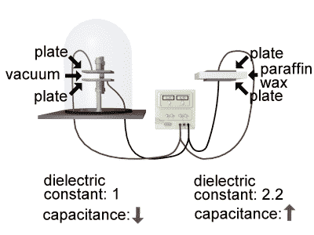
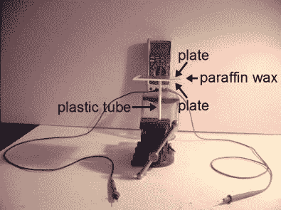
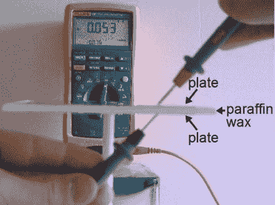
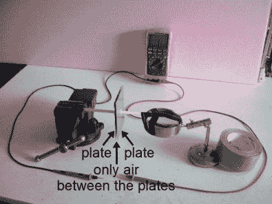
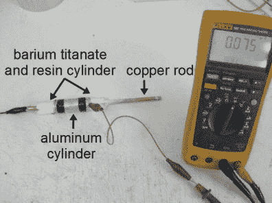
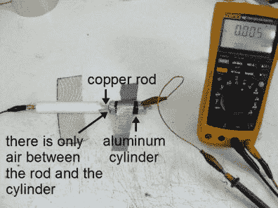
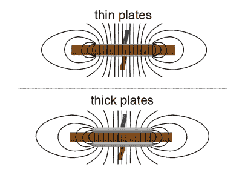
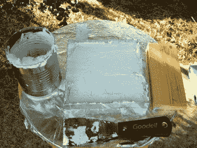

# 如何测量 DIY 电容器的介电常数

> 原文：<https://hackaday.com/2016/10/12/measuring-the-dielectric-constant-for-diy-capacitors/>

时不时地，你需要制作自己的电容器。这包括为它选择电介质，即板之间的绝缘材料。我经常使用的一种绝缘材料是石蜡，它可以在艺术品商店找到，通常用于制作蜡烛。另一种是树脂，最容易找到的是用于汽车车身修理的汽车树脂。

问题是，你有时需要提前计算电容尺寸，而不是随便拼凑。这意味着你需要知道电介质材料的介电常数。这是为艺术品商店生产石蜡的制造商不会知道的，汽车车身修复树脂的制造商也不会知道。目标客户根本不在乎。

因此，这是留给你自己来测量介电常数，在这里，我将谈论我使用的方法。

## 什么是介电常数？

Capacitors in vacuum and not

如果你想知道什么是介电常数，不要担心，因为你不是唯一一个。先简单解释一下。

假设你有一个平板电容器，极板之间没有任何东西，实际上是一个真空。该电容器将具有特定的电容，该电容是其在极板上存储电荷的能力的量度。如果你在极板之间插入一种绝缘材料，例如蜡，那么电容器将具有更高的电容，在极板上存储电荷的能力更强。在极板之间放置绝缘材料可以增加电容。

介电常数是当你插入材料时电容增加多少的量度。它是电容器的电容与材料的电容之比，与它在真空中的电容之比。例如，如果你在网上搜索，你会发现石蜡的介电常数在 2.1 到 2.5 之间。下面你会读到我是如何测量我的分数为 2.2 的。

物理学家很久以前就定义真空的介电常数为 1。这意味着电容器中的石蜡赋予电容器 2.2 倍的存储电荷的能力，就好像那里只是真空一样(2.2 倍于 1，是 2.2)。

## 术语

在我们进一步讨论之前，让我指出介电常数这个术语实际上已经被废弃了，物理学家和工程师们使用相对介电常数来代替。但是它的使用仍然很广泛，你可以在网上找到的大多数表格都使用介电常数这个标题。

你还会经常看到介电常数在公式中表示为κ(希腊字母 kappa)或*ε*r(希腊字母 epsilon 和一个 r 代表相对)。

## 测量介电常数

我们应该首先提出一个警告。介电常数随温度而变化。它随着温度的升高而降低。对于大多数材料来说，差异很小。每当我测量介电常数时，它总是在室温和 0Hz 下使用。

知道介电常数是电容器在材料中的电容与其在真空中的电容之比，就有了一种测量方法。我说过，真空的介电常数是 1，但是空气的介电常数是 1.0005，差不多。因此，如果 **Cm** 是电容器与你的材料的电容，而 **Ca** 是与空气的电容，那么介电常数是 **Cm/Ca** 即两者之比。

这意味着，要获得介电常数，只需在材料就位的情况下测量电容器的电容( **Cm** )，然后在没有材料的情况下再次测量其电容，即使用空气代替( **Ca** )。用第一个值( **Cm** )除以第二个值( **Ca** )，你就得到了材料的介电常数。

在下面的照片中，我正在测定我在当地艺术商店买的石蜡的介电常数。

  Setup for measuring capacitance with wax dielectric  Measuring capacitance with wax dielectric

我首先测量蜡电容器的电容，如前两张照片所示。我做了一块 4 毫米厚的正方形蜡。对于盘子，我切了一些方形的铝片，当放在蜡上时，不会完全覆盖蜡的表面。

我把一个盘子热粘在一个塑料管的顶部，让它悬浮在空中。然后，我将蜡放在第一个地方，然后将另一个盘子放在蜡的上面，制作一个电容器三明治。正如您通常在测量电容时所做的那样，在进行测量之前，我使用仪表的 REL 功能来存储探针本身的电容。那会使仪表归零。然后我测量极板和蜡电容器的电容。我得到 0.053nF，这是我的 **Cm** 。

  Setup for measuring capacitance with air dielectric  Measuring capacitance with air dielectric

接下来是测量空气电容器的电容，如上面两张照片所示。我将另一个盘子热粘在另一个塑料管上，将盘子间隔 4 毫米，中间只留有空气，确保间隔与蜡在盘子之间时相同。这产生了相同的电容器，唯一的区别是使用空气作为电介质。我得到一个 0.024nF 的电容，这是我的 **Ca** 。

做计算，蜡的电容( **Cm** )，0.053nF，除以空气的电容( **Ca** )，0.024nF，我得到介电常数 2.2。请注意，它是无量纲的，因为它是具有相同维数的两个值的比值。在网上搜索，大多数表格给出的石蜡范围是 2.1 到 2.5，所以我对我的结果很有信心。

  Measuring capacitance with barium titanate/epoxy dielectric  Measuring capacitance with air dielectric

在这组照片中，我使用相同的程序来测量钛酸钡和环氧树脂的混合物的介电常数，这种混合物是为我在[我的文章*疯狂科学家*的自制电容器](http://hackaday.com/2016/10/03/homemade-capacitors-of-a-mad-scientist/)中描述的圆柱形电容器制作的。内板是一根直径为 1/4”的铜棒，用于测定介电常数的外板是一个铝圆柱体，你可以看到它包裹在钛酸钡和树脂介电圆柱体周围。铜棒比它需要的要长得多，所以为了测量空气中的电容，我简单地将铝圆筒移动到没有电介质的棒的长度。

钛酸钡和环氧树脂混合物的电容为 0.075 纳法(Cm)，空气中的电容为 0.005 纳法。0.075 纳法除以 0.005 纳法得出介电常数为 15。在上面链接的文章中，我提到了值 27，但是我没有那个版本的测量照片。

## 其他考虑

另外两个需要考虑的因素是电阻率和边缘效应。

Thin vs thick capacitor plates

如果你有一个平板电容器，那么你可以想象如图中的线所示的电场。请注意，边缘处的电场不同于极板之间的电场。还要注意的是，这取决于板块的几何形状。例如，薄板的边缘更尖锐，边缘的电场线更密集。但是我们只对板块之间的材料发生了什么变化感兴趣，而不是在边缘。最小化边缘对我们的测量的影响的一个方法是简单地使用与边缘数量相比大的板面积，使边缘不那么重要。

Barium titanate and wax in a mold

另一个需要考虑的是电介质材料的电阻率。自然，你会希望你的电容器有一个良好的绝缘体作为电介质。但是既然我们在这里做自制的东西，有可能你已经做了一种有一定导电性的电介质材料。因此，在制作好电介质材料后，在两侧放上一些极板，用电表的电阻刻度测量极板间的电阻。它应该显示您的仪表通常显示的电阻过高而无法测量的东西。

我曾经遇到过这个电阻率问题。我和一个朋友制作了一个钛酸钡和蜡电容器，由于某种原因，组装成电容器时的电阻为 2.31 毫欧姆。我们猜测，当钛酸钡和热蜡混合物冷却时，外面的空气可能是潮湿的，一些水分进入了混合物。所以我们把它放在 110 摄氏度(230 华氏度)的烤箱里 65 分钟以去除水分。冷却后，我们再次测量电阻。它大于 20 毫欧姆，高于仪表所能测量的值。

## 结论

这就是我测量电介质材料的介电常数或相对介电常数的方法。如果你已经测量了一种材料的介电常数，我很想知道你是怎么做的，以及任何特殊的考虑。请在下面的评论中告诉我们。