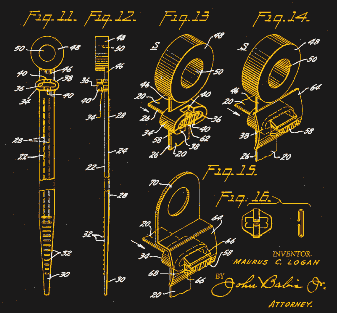

# 机制:电缆扎带

> 原文：<https://hackaday.com/2018/03/22/mechanisms-cable-ties/>

拉链带、系带、扎带；随你怎么称呼它们，但很难想象没有这些无处不在的有用设备会怎样。与管道胶带和热熔胶一样，它们是用来快速廉价地解决棘手问题的三种紧固件的一部分。它们是我们发现的令人着迷的机制列表中的下一个，事实证明，这些设备比我们看到的要多。

### 穿戴整齐的线束

像我们今天认为理所当然的许多产品一样，电缆扎带是为了解决航空航天工业中的问题而发明的。在战前，飞机是相对简单的事情，只有适度的电气系统，线束也相当简单。束线可以通过绑扎来固定，这是一个高强度的手工过程，需要熟练的从业者用灵活的手指在电线周围编织蜡绳，从而产生整齐的线束，这些线束通常是艺术品。

Maurus Logan. Source: [Thomas & Betts Co](http://www.tnb.com/pub/index.php)

甚至在第二次世界大战期间，随着越来越复杂的飞机携带无线电和雷达设备，系带是驯服现在需要运行飞机的数英里电线的规则。但在蓬勃发展的战后时代，随着飞机制造商加快生产以满足迅速扩张的民用和军用市场，系紧每一根线束的耗时和专业技能正成为一种负担。

对于有准备的人来说，每一项负债都是一个市场机会，而 Maurus C. Logan 发现了这个机会并抓住了它。20 世纪 50 年代中期，洛根在电气设备制造商 Thomas & Betts 工作，他在参观波音工厂时亲眼目睹了手工系紧航空线束的繁琐过程。洛根知道必须有一个更好的方法，在接下来的几年里，他把注意力转向了这个问题。

[US Patent 3,022,557](https://patents.google.com/patent/US3022557)

他使用许多不同的材料进行了几次设计迭代，最终利用聚合物科学的发展，确定了一种模制塑料带。1958 年的原始专利图纸看起来非常像现代的电缆扎带，有一个长的带齿的棘轮带，它被折回并插入带末端一个小盒子的插槽中。

就像目前的电缆扎带一样，棘轮啮合棘爪，以保持环紧紧围绕成束的电线，但洛根的原始设计不同于今天的大多数电缆扎带，因为它需要一个单独的金属弹簧作为棘爪。很容易理解他为什么会走那条路，事实上 Ty-Raps 直到今天都在使用金属棘爪，而不是大多数其他制造商喜欢的带有塑料活动铰链的集成棘爪。

### 每起犯罪都有一个电缆扎带

自从第一批 Ty-rap 上市以来，电缆扎带的领域已经得到了极大的扩展，各种用途的电缆扎带都有了。大多数电缆扎带是用尼龙模制的；那些用于室内的通常是天然的乳白色，而那些用于室外的有紫外线稳定剂，使它们呈黑色。当然，并非所有的扎带都是生来平等的，有些扎带比其他扎带更能经受住恶劣天气的考验——有扎带折断经历的人请举手，即使天气稍冷时也要扎紧扎带。电缆扎带张紧器可以帮助解决这种情况；基本上，它是一种通过棘轮将电缆扎带尾部拉到预设张力的工具，既能保护电缆扎带，又能防止线束过度压缩。

PlastiCuffs ready for action. Source: [Baltimore City Police Department](https://baltimorecitypolicehistory.com/handcuffs-restraints)

当然，电缆扎带已经远远超出了最初驯服不守规矩的线束的市场，甚至超出了上述权宜修理的应用。我们都见过执法部门在抗议和社会动荡期间使用被称为塑料套子的双环绳进行大规模逮捕。

高度改良的电缆扎带甚至被用作外科手术结扎线来控制出血，而不会像外科手术钳那样压碎组织。一些领带甚至由聚乙醇酸模制而成，这是制造可吸收缝线的相同材料，并且可以留在体内。

在过去的 60 年里，由 Maurus Logan 设计的简单机制已经做得很好了。洛根本人也是如此——这些年来，他在 Thomas & Betts 一路晋升，最终成为研发副总裁。他于 2007 年去世，就在他说唱 50 周年纪念日前夕。