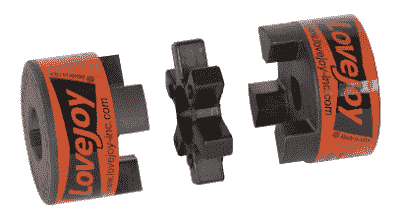

# 机制:耦合

> 原文：<https://hackaday.com/2018/04/05/mechanisms-couplings/>

几年前的一天，我正在劈木头，用我的液压劈木机准备来年冬天的柴火。它通常很容易处理我的白蜡树和橡木，但我有一个特别粗糙的桦树排在队伍中，分裂是挣扎。当楔子卡在扭曲的谷粒中时，20 吨重的汽缸慢了下来，引擎开始陷入困境，然后砰！我向后一跳，因为有什么东西坏了，发动机转速失控了；我想是液压软管坏了。不管是什么，我今天已经做完了。

我后来发现，发动机轴和液压泵之间的一个耦合器发生了戏剧性的故障。一旦我订购了正确的零件，这就很容易解决，而且我已经学会了在库存中保留多余的零件。联轴器是有用的东西，它们是我们机械系列的下一个主题。

### 匹配不匹配的

像我身上失败的那种联轴器有一些一般用途。首先也是最重要的，它们确实如其名称所暗示的那样:它们将两根轴连接在一起以传递旋转力。大多数联轴器在或多或少在同一轴线上的轴之间传递旋转，有些例外，我们将在下面讨论。

根据设计的需要，联轴器可以是刚性的，也可以是柔性的。刚性联轴器用于约束良好的系统，在这种系统中，两轴不可能完全轴向对齐。刚性联轴器包括套筒或套筒联轴器，通常用平头螺钉夹紧到轴上，并且可能在孔中加工有键槽，以便更好地传递扭矩。

Lovejoy jaw coupling, the one that got me. Source: [Lovejoy Inc](http://www.lovejoy-inc.com/)

但是，如果轴之间有任何错位的可能，就需要一个弹性联轴器。虽然不是为大角度传递扭矩而设计的，但挠性联轴器确实允许轴偏离对齐几度而不会造成损坏。这在结构的振动或弹性可能让轴相对于彼此轻微移动的设备中很重要，就像我的劈木机。在那种情况下，轴是通过爪式联轴器连接的，通常被称为商标名 Lovejoy。Lovejoy 联轴器有两个金属半体，带有相互嵌套的城堡形结构。坚韧的弹性三脚架防止金属直接接触，既缓冲扭矩的快速变化，又允许轴稍微弯曲。

硬件项目中常见的另一种柔性耦合是梁耦合。常见于大型数控机床的步进电机和丝杠之间，梁式联轴器看起来有点像由单个圆柱体材料加工而成的粗壮弹簧。弹性允许有一点角度灵活性，甚至允许一些轴向间隙，这可以使轴变得更近或更远。光束耦合通常由铝加工而成，但也使用其他金属甚至聚合物。

 [https://www.youtube.com/embed/NfdTES0ZWNU?version=3&rel=1&showsearch=0&showinfo=1&iv_load_policy=1&fs=1&hl=en-US&autohide=2&wmode=transparent](https://www.youtube.com/embed/NfdTES0ZWNU?version=3&rel=1&showsearch=0&showinfo=1&iv_load_policy=1&fs=1&hl=en-US&autohide=2&wmode=transparent)

### 关节:通用和恒定

当轴之间的不对中超过几度时，或者当需要通过大范围的角度传递大量扭矩时，就需要不同种类的联轴器。这种类型的标准联轴器可能是通用接头，通常用于汽车传动轴。由十字架或蜘蛛连接的嵌套轭的熟悉设计可以追溯到很久以前，早期的例子出现在希腊的攻城机械上。伟大的英国科学家罗伯特·胡克后来研究了这些装置，并用数学方法描述了它们的特征。他意识到输出旋转不一定在每个角度都是恒定的，并找到了解决方法:在轴的两端各有一对接头，轴向旋转 90 度。这种布置仍然可以在后轮驱动车辆的传统驱动轴上看到，一个万向节位于变速器的输出端，另一个万向节位于差速器的输入端。

 [https://www.youtube.com/embed/LCMZz6YhbOQ?version=3&rel=1&showsearch=0&showinfo=1&iv_load_policy=1&fs=1&hl=en-US&autohide=2&wmode=transparent](https://www.youtube.com/embed/LCMZz6YhbOQ?version=3&rel=1&showsearch=0&showinfo=1&iv_load_policy=1&fs=1&hl=en-US&autohide=2&wmode=transparent)

对于较短的轴，如前轮驱动车辆的驱动轴，可能没有安装一对万向节的空间。为了适应这种情况，使用了另一种柔性联轴器:[等速(CV)接头](https://en.wikipedia.org/wiki/Constant-velocity_joint)。等速万向节看起来有点像结实的滚珠轴承，带有又深又宽的同心滚道。大型钢球骑在每个凹槽和传递扭矩之间的内和外圈。等速万向节可以在很大的角度范围内工作，通常在每个轴上成对使用。

这里我们还没有涉及到许多其他联轴器，从使用金属波纹管甚至织物或聚合物隔膜的柔性联轴器，到允许旋转滑动的变矩器和磁力联轴器等联轴器。对于几乎所有需要在轴之间传递扭矩的应用，总有一款联轴器适合这项工作。

【特色图片: [SMW3D](https://www.smw3d.com/) ，[学术](http://enacademic.com/dic.nsf/enwiki/25887)