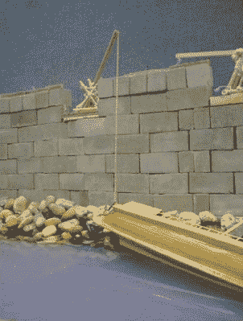
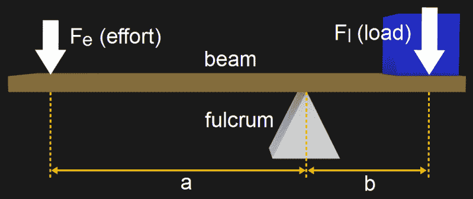
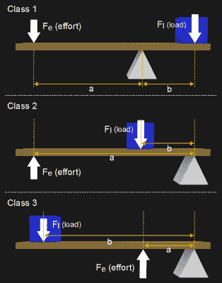
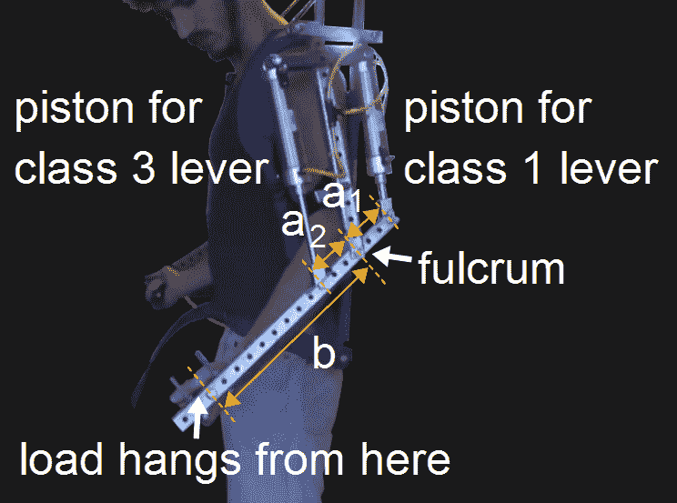
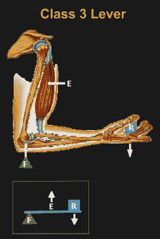

# 机制:杠杆，无处不在

> 原文：<https://hackaday.com/2018/04/26/mechanisms-the-lever/>

杠杆几乎无处不在。你的身体用它们来移动，拿起一支笔来签你的名字，你将利用机械优势使圆珠笔滚动，如果没有一个巧妙设计的杠杆，那罐汽水就打不开。

我很偶然地想到了这个话题。我正在制作一架扑翼飞机，它在抬起翅膀时遇到了麻烦。对于外行人来说，[扑翼飞机](https://hackaday.com/2013/08/21/amazing-flight-of-a-3d-printed-rubber-band-powered-ornithopter/)是通过拍打翅膀来飞行的机器。问题是杠杆臂太短了。老实说，在我工作的时候，我甚至没有想到杠杆，只是在我通过反复试验微调了它的长度之后，才意识到有一个杠杆。在那之后，杠杆的存在是令人尴尬的明显。

我可能会原谅我没有马上看到杠杆，因为它不是我们最常经历的类型。杠杆有不同的类别，可以肯定地说，大多数人甚至没有意识到这一点。让我们仔细看看这些超级有用的，有时是隐藏的被称为杠杆的机制。

## 杠杆是最古老的机制之一

[](https://hackaday.com/wp-content/uploads/2018/04/archimedes_claw_drexel_university.jpg)

Archimedes Claw lifting ship. Image source [Drexel University](https://www.math.nyu.edu/~crorres/Archimedes/Claw/models.html)

从技术上讲，杠杆早于人类。你可以在生物学中找到它们——你的前臂是一个很好的例子，我将在文章的后面进行深入研究。

说到人造机械，人们怀疑早在古埃及就已经使用杠杆来提升大石块和方尖碑，但关于其工作原理的最早著作来自亚里士多德和阿基米德的追随者，这两人都生活在公元前 300 年左右。阿基米德给了它一个静态的描述:

> 在与重量成反比的距离上，星等处于平衡状态。

他还有一句名言:“给我一个支点，我可以撬动地球。”将此付诸实践，他设计了一种被称为“利爪”的防御性武器，用于击退攻击城墙的船只。历史记载似乎描述了一个坐在墙上的起重机，它将一个抓钩下降到攻击船只上，并将它们吊出水面，使它们倾覆或沉没。

## 杠杆原理



如图所示，杠杆由一根绕支点转动的横梁组成。在离支点`a`的某个距离处施加一个力，称为作用力`F[e]`。并且负载`F[l]`存在于离支点一定距离`b`处。

杠杆定律指出:

> 负载上的力与作用力之比等于这些力离支点的距离之比。

数学上，它可以表述为:

```
MA = Fl/Fe = a/b

```

MA 代表机械优势，是力被放大多少的量度。该公式表明，如果从支点到作用力的长度`a`大于从支点到载荷的长度`b`，那么机械效益将大于 1。

注意，我们这里不是在讨论自由能。功率输入等于功率输出，忽略杠杆梁的摩擦、磨损和弯曲造成的损失。功率是力乘以速度，它们彼此成比例地不同。如果`a > b`，那么负载的移动速度将比施力点慢(在相同的时间内，施力点必须移动更大的距离)。

## 杠杆的种类

杠杆可以以不同的方式排列，并被描述为三类，所有这些都遵循杠杆定律。

#### [](https://hackaday.com/wp-content/uploads/2018/04/lever_classes1.png) 第 1 类杠杆

班级 1 可能是最熟悉的。这方面的例子有跷跷板、撬棍，以及任何时候你拿起一根棍子，把它放在一个方便的支点上，以举起棍子另一端的重物。钳子是 1 级杠杆，我们经常使用，但很少认识到这一点。

#### 2 级杠杆

对于 2 级杠杆，支点移动到杠杆的一端，负荷在中间，力在另一端。每次你拿起手推车时，你都使用 2 级杠杆，轮轴是支点。

#### 3 级杠杆

3 级杠杆的排列可能是最难想象的。支点仍然在杠杆的一端，但力现在在中间，负荷在另一端。很难想出日常的 3 类例子，但我们将在下面看到其中的三个。当我们看到外骨骼手臂、人类手臂和橡皮筋驱动的扑翼机翅膀时，我们看到的是 3 级杠杆。

## 詹姆斯的外骨骼杠杆



我在一个黑客制作的项目中寻找一个杠杆的很好的例子，并提出了一个我们自己的很好的例子(詹姆斯·霍布森)。他制造了一个带[手臂的外骨骼，用来举起重物](https://hackaday.com/2014/08/30/homemade-superhero-james-diy-exoskeleton/)。有趣的是，每个臂都包含一个 1 级和一个 3 级杠杆。

该臂由活塞驱动。1 级杠杆和 3 级杠杆的主要区别在于负荷和支点被调换了。在这里，您可以看到后活塞的位置创建了一个 1 级杠杆，前活塞的位置创建了一个 3 级杠杆。你可以看到他用这个装置举起 170 磅的杠铃。

[](https://hackaday.com/wp-content/uploads/2018/04/lever_in_human_arm2.png)

Human arm as a class 3 lever. Image source: [Robotpark](http://www.robotpark.com/academy/robotic-mechanisms-levers/)

## 人体中的杠杆

由于有肌肉、骨骼和关节，人体充分利用杠杆就不足为奇了。

然而，它们并不总是用于机械优势。在通过抬起下臂并使用肘部作为支点来提升负载的情况下，作用力由上臂中的肌肉提供。这块肌肉附着在离支点非常近的杠杆(骨头)上，意味着`a`比`b`短，后者从支点延伸到手中的负荷(图中，R 代表阻力)。因此机械利益`a / b`小于 1。

相反，这里的好处是骨骼在肌肉处的小运动产生了手部的大运动。这使得手臂紧凑而灵活，在狭小的空间里非常有用。相反，从肩膀延伸到手腕附近的举重肌肉在很多时候会碍事。请注意，詹姆斯已经用他的外骨骼手臂做了类似的事情，尽管他添加了第二个活塞来推动，而另一个活塞则拉/举。

## 扑翼机的操纵杆


典型的橡皮筋动力扑翼机有一个从中间向下延伸的机身，作为所有部件连接的主体。扑翼机机身底部有一个曲柄，由一根扭曲的橡皮筋转动。连杆将机翼连接到曲柄上。转动曲柄通过连杆升起和降下机翼。在动画 GIF 中可以清楚地看到这种上升和下降。

看图表，支点在扑翼飞机的中间，在机身的顶部。当它们上下拍动时，每只翅膀都在那里转动。

负载实际上是当机翼被向上推或向下拉时压在机翼薄膜上的空气，尽管我的问题在向上推时最明显。

力从下面施加，连杆连接到每个机翼。

我的扑翼机中不明显的杠杆原来是两种不同级别杠杆的组合，一种 2 级和 3 级杠杆，这两种杠杆都存在于每个机翼中。

#### 2 级杠杆

2 级杠杆是从支点到连接机翼的连杆施加作用力的部分。使它成为 2 级杠杆的载荷是在这两点之间向后延伸的机翼部分上的空气压力。这符合 2 级杠杆的定义，因为负荷在中间，在支点和作用力之间。

#### 3 级杠杆

3 级杠杆也是由支点和连杆上的作用力形成的，但载荷是远离支点反方向作用力一侧机翼上的空气压力。这符合 3 级杠杆的定义，因为力在中间，在负载和支点之间。

## 看到杠杆无处不在

因此，虽然杠杆并不总是引人注目，但它们在很多地方都能找到。这无疑是因为它们非常有用。我们希望在下面的评论中听到你在哪些地方使用了杠杆，或者你在哪些令人惊讶的地方发现了杠杆。