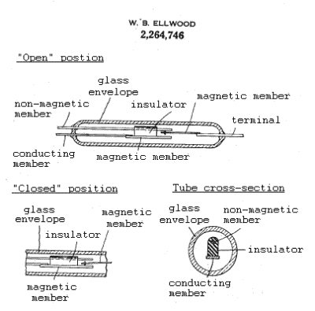
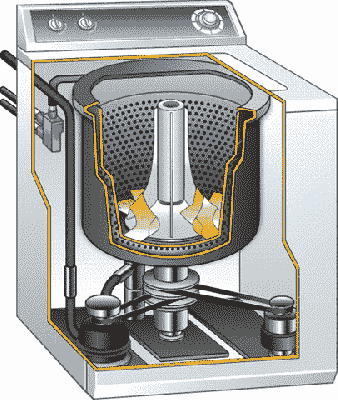
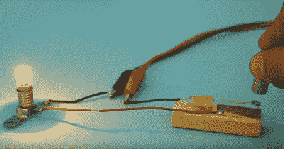

# 机制:簧片开关

> 原文：<https://hackaday.com/2018/03/01/mechanisms-the-reed-switch/>

无论你走到哪里，附近都有一个簧片开关在静静地工作。簧片开关无处不在，在任何时候，你可能都不会离它超过几英尺远，尤其是在家里或车里。你可以把它们作为防盗报警系统的一部分安装在门窗上。当盖子打开时，它们会阻止洗衣机运行，当您合上盖子时，它们会让您的笔记本电脑进入睡眠状态。他们知道汽车是否有足够的制动液，以及你的安全带是否系好。

簧片开关是一种有趣的装置，在家庭和工业中有着广泛的应用。我们称它们为开关，但它们也是传感器。事实上，当它们可以感应磁场时，它们只做开关的工作。它们能够在低电压和高电压下切换交流或 DC，但它们不需要电力来工作。因为它们是密封在玻璃中的，所以它们不受污垢、灰尘、腐蚀、温度波动和爆炸环境的影响。它们便宜，耐用，在低电流应用中，它们可以持续大约 10 亿次驱动。

The simplest type of reed switch. Via [Wikipedia](https://en.wikipedia.org/wiki/Reed_switch#/media/File:Reed_switch_(aka).jpg)

### 什么是簧片开关？

最简单的簧片开关由两个薄的铁磁触点组成，轴向悬挂在玻璃管内。该管充满惰性气体，通常是氮气，并在末端密封。簧片的商业端涂有非磁性材料，如铱或钨，以增加强度和耐用性。

簧片的两端稍微重叠，其间有一个小间隙。每当永久磁铁或有源电磁线圈靠近玻璃体时，磁场就会使簧片相互吸引和接触，从而闭合电路。当磁铁被移除时，柔性簧片弹开并重新打开电路。

Ellwood’s patent drawings. Public domain via [Wikipedia](https://en.wikipedia.org/wiki/Reed_switch#/media/File:Reedswitch.PNG)

### 它来自贝尔实验室

1941 年，贝尔实验室的工程师沃尔特·b·埃尔伍德为簧片开关申请了专利。埃尔伍德希望设计一种廉价且易于更换的中继单元来切换电信流量，这是一种能够承受大量使用的简单开关。

埃尔伍德的专利图纸中的设备与现在市场上的簧片开关只有细微的不同。在他的设计中，一端的致动簧片在另一端的磁性簧片和非磁性簧片之间波动，两者由物理绝缘体分开。

在接下来的 40 年左右的时间里，贝尔系统和 TXE 电话交换机将使用数百万个簧片继电器，首先作为存储模块，然后在快速的交叉配置中使用，使旧交换机望尘莫及。数字电话交换机已经使数百万个簧片继电器失去工作，但是埃尔伍德的多用途发明很快传播到许多其他行业，比如家庭用品。

Ye olde top loader. Via [Giphy](https://giphy.com/gifs/loading-washing-gfycatdepot-y3tsG5UYbn7gc)

### 芦苇房子

簧片开关的大部分工作是传感或脉冲计数，在普通的家用电器中这两种工作都有。任何需要感应液位或知道零件位置的系统都可能使用簧片开关来实现。想想洗衣机，它做了所有这些工作。当您开始洗衣时，洗衣桶会装满水以供洗涤。每次需要的水量都不一样，这取决于你要洗的东西和数量。不是泵入一定量的水(可能会溢出浴缸)，而是在顶部附近有一个簧片开关和一个浮动磁铁，它可以乘着涨潮来应对涨潮并关闭水。

你已经开始装东西了，但是楼梯上有一只袜子肯定是从篮子里掉出来的。你揭开盖子，机器立即停止注水。为什么？因为另一个簧片开关。这个通过检测盖子里嵌入的磁铁来工作。提起盖子会带走磁场，所以机器会暂停，直到你放进袜子，关上盖子。另一个簧片开关用于测量滚筒的速度，从固定在桶上的磁铁获取脉冲。

A DIY reed switch. Via [Hackaday](https://hackaday.com/2017/07/26/make-your-own-reed-switches/)

### 簧片开关永远

簧片开关具有相当可靠的耐用性和可靠性。即便如此，在要求更高精度的情况下，它们已经被霍尔效应传感器所取代。霍尔效应传感器比簧片开关更快，因为它们是固态设备，不需要等待几毫秒，磁场就可以克服惯性。

霍尔效应传感器的缺点是它们需要恒定的功率来工作。这是因为它们必须时刻准备感知磁场的存在。他们对磁铁的位置也很挑剔，如果磁铁的方向不正确，他们不会记录霍尔效应。

只要需要简单的非接触式开关，簧片开关就会出现。身边没有可以一起玩的吗？你可以在几分钟内用一点点铜、一些电磁线，当然还有一块磁铁来建造一个。