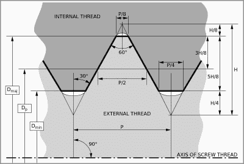
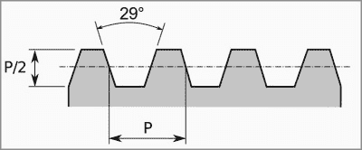
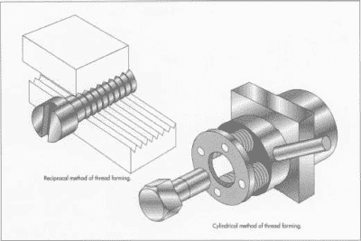

# 机制:螺纹

> 原文：<https://hackaday.com/2018/02/01/mechanisms-the-screw-thread/>

从最精致的手表到最大的桥梁，它们将所有东西连接在一起。这个世界实际上是由螺丝和螺栓来防止分裂的，然而我们并不经常考虑这些机制。部分原因可能是因为我们已经非常擅长制造它们，以至于它们被视为廉价商品，但螺纹背后的物理学和工程学是有趣的东西。

我们可能都记得早期的一堂科学课，在课上，所有机制的基本构件都被展示出来了。*简单机械*是利用作用力做功的机构，如斜面、杠杆、滑轮等。例如，一个斜面，以劈木楔的形式，将打击其平面的力量导向一大块木头，迫使木头分开。

螺纹是另一种简单的机器，可以被认为是一个长而平缓的斜面包裹着一个圆柱体。用纸剪出一个长的直角三角形，从大的一端开始绕在铅笔上，斜边形成一个螺旋状的斜坡，看起来就像一根线。当然，对于做任何工作的螺纹来说，它必须伸出超过一张纸的厚度，而伸出的形状决定了螺钉的机械性能。

### 螺纹轮廓

V-screw Thread Profile

最常见的螺纹轮廓是简单的 V 形螺纹，螺纹的相对面形成 60°角。这个螺纹角度是平衡效率、磨损率、强度以及最重要的螺纹摩擦的折衷。除了螺距或每单位长度的螺纹数，螺纹摩擦也是大多数螺纹的自锁或“不大修”特性的一个因素。自锁螺纹很容易将旋转力转换成轴向力，但反之则不然。很容易看到这种特性的作用——用手指按压螺母，螺母很容易在螺钉上旋转，但沿着螺钉的长轴尽可能用力推动螺母，螺钉将不会开始旋转。自锁可防止螺旋千斤顶等工具在负载下松开。

[Acme Screw Thread Profile](https://commons.wikimedia.org/wiki/File:Acme_thread.svg) by Wizard191 CC-BY-SA 3.0

螺纹轮廓可以从标准的 V 形轮廓进行修改，以在不同的负载下获得更好的性能。Acme 型材是一种梯形，其表面形成 29°的夹角，具有大的平顶和平根，特别适用于高负载应用，如老虎钳和夹钳。它也存在于丝杠中，例如从 DVD 播放机到数控机床的线性致动器中使用的丝杠。在大多数金属车床的丝杠中也可以找到 Acme 轮廓，因为它与对开螺母配合良好。对开螺母顾名思义是一种纵向裂开的内螺纹元件，可以围绕丝杠打开和关闭。这有利于螺纹切削操作，其中对开螺母在螺纹切削开始时围绕导螺杆闭合，在切削结束时打开，在可重复的位置开始和停止切削工具相对于工件的运动。

 [https://www.youtube.com/embed/IA851C9ixjQ?version=3&rel=1&showsearch=0&showinfo=1&iv_load_policy=1&fs=1&hl=en-US&autohide=2&wmode=transparent](https://www.youtube.com/embed/IA851C9ixjQ?version=3&rel=1&showsearch=0&showinfo=1&iv_load_policy=1&fs=1&hl=en-US&autohide=2&wmode=transparent)

### 切割和轧制

对于精密螺纹和小批量生产，切削螺纹是常见的。切削螺纹是在车床或 CNC 机器中通过去除材料形成螺纹轮廓而产生的，或者用螺纹切削工具相对于旋转工件纵向平移，或者用丝锥(内螺纹)或板牙(外螺纹)。

 [https://www.youtube.com/embed/DAOg4_FwOCg?version=3&rel=1&showsearch=0&showinfo=1&iv_load_policy=1&fs=1&hl=en-US&autohide=2&wmode=transparent](https://www.youtube.com/embed/DAOg4_FwOCg?version=3&rel=1&showsearch=0&showinfo=1&iv_load_policy=1&fs=1&hl=en-US&autohide=2&wmode=transparent)

Rolling threads. Source: [How Products Are Made](http://www.madehow.com/Volume-3/Screw.html)

尽管切削螺纹很耗时，但对于大规模生产来说，外螺纹通常是通过滚压加工形成的。锻造毛坯被紧紧地夹在一对带槽模具之间，其中一个模具是固定的。相对的模具垂直于坯料上的长轴移动，将螺纹轮廓压入其中。因为没有材料从毛坯上去除，而且材料是加工硬化的，滚压螺纹比切削螺纹更坚固。轧制过程也是自动化友好的，轧制机器每分钟可以生产数千个零件。

螺母的内螺纹不适合滚压，所以大多数大规模生产的螺母都是通过热锻工艺形成的。热金属块被形成头部轮廓的模具撞击，并冲出中心孔。随后，冷却后的坯料被送至攻丝机，该攻丝机使用丝锥切削内螺纹。

当然，除了这个快速的游览之外，还有更多关于螺纹的内容。螺纹的简单性和螺纹紧固件的普遍存在掩盖了这些机制背后的物理学，但是理解基础知识是一个很好的起点。