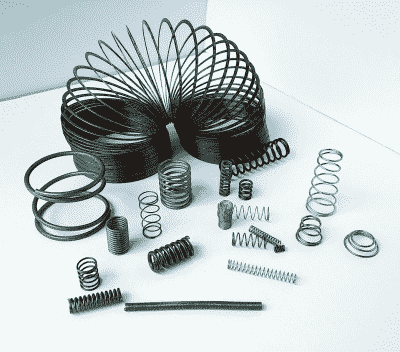
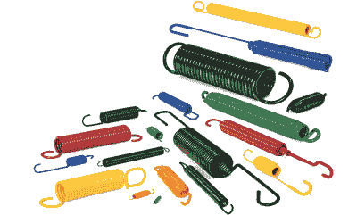
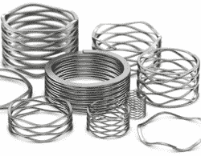
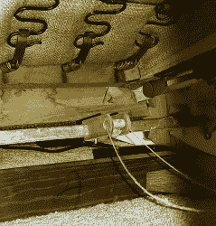
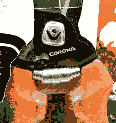

# 机制:弹簧

> 原文：<https://hackaday.com/2018/04/13/mechanisms-the-spring/>

大多数人可能不会想到弹簧，直到一个扭结或折断，但世界上大多数的弹簧是非常重要的。那些不叫斯林克的。

我们每天都在不知不觉中使用和遇到几十种不同类型的弹簧。看看弹簧的世界，你会发现以弹跳为主题的数百种变化。弹簧的原理非常简单，可以扩展到几乎任何可以想象和加工的形状和尺寸。因为它可以有很多种形式，弹簧作为一种机械装置有成千上万种应用。看看你的车底，拆开一支伸缩笔，打开一个订书机，一个烤箱门，或者一个安全别针，你会发现一两个弹簧。

Buckling spring mechanism via [r/mechanicalkeyboards](https://www.reddit.com/r/MechanicalKeyboards/comments/1f2lsh/improved_buckling_spring_animation/)

### 什么是春天？

从技术上讲，弹簧是一种弹性物体，它储存机械能，并在压缩、拉伸或扭曲时释放出来。人类已知的最古老的弹簧形式可能是射箭弓，其次是青铜时代镊子的扁弹簧。古罗马马车使用板簧悬架，以便在那些多石的道路上行驶更平稳。

螺旋弹簧，现在是最常见和可识别的，在 15 世纪首次用于锁和钟表。在 19 世纪，它们开始出现在床上和家具中。到了 20 世纪 80 年代，它们经常被扣在 IBM 的键盘上。

弹簧可以根据它们的形状、结构和用途来分类。大多数弹簧要么是螺旋的，要么是扁平的，但也有大量不同形状的定制弹簧。弹簧的主要用途包括将某物返回到其起始位置，如纱门；测量力，像一个标尺；并储存能量以备后用，就像机械表或发条玩具一样。

弹簧通常由金属或塑料制成；选择取决于预期的应用和环境。大多数由弹簧钢制成，弹簧钢是一种冷拉碳钢合金。由铜合金如磷青铜和铍铜制成的弹簧具有高导电性和导热性。塑料弹簧可能看起来不切实际，但它们在敏感应用中非常有用，如食品加工和 x 射线设备，这些应用需要由惰性材料制成的非金属机构。

不管是什么成分，一个好的弹簧都可以反复恢复平衡，而不会有任何持久的尺寸损伤。一个设计良好的弹簧应该可以使用很长时间，这可能就是为什么很多弹簧在断裂之前不被注意和考虑的原因。

My own personal collection of helical and conical compression springs. Yeah, that’s a 40th anniversary Slinky.

### 哪个春天是哪个？

请人画一个弹簧，他们很可能会草草画出一个*压缩弹簧*。当挤压或压缩时，它们会变短。这些是最常见的，从伸缩笔到皂液器到弹球活塞到汽车悬架，无处不在。

Slinky 是一种预压缩的螺旋弹簧，它的特性被玩弄于股掌之间，以使它尽可能地滑下楼梯。把电池从什么东西里拿出来，你可能会发现锥形压缩弹簧端子压缩得更平，以节省空间。

Some whimsa-coil extension springs from [Winamac Coil Spring](http://www.winamaccoilspring.com/extension-springs/)

*拉伸弹簧*是第二常见的。当拉伸或拉动时，它们会变长。这些弹簧可以让你的纱门关上，让你的蹦床弹跳起来。它们的制造方法与压缩弹簧非常相似。主要区别在于拉伸弹簧的末端有挂钩或耳状物，用于连接将拉伸弹簧的一个或多个负载。这些耳状物通过弯曲一个或多个末端线圈制成，通常垂直于剩余线圈的方向。

另一个区别是线圈之间的空间。压缩弹簧是用来压缩的，所以线圈的间距足够大，可以提供压缩的空间。拉伸弹簧被拉伸，因此线圈在其未拉伸的位置接触。

A bunch of torsion springs I’d like to have. Via [Springman Corp.](http://www.springmancorp.com/torsion-springs.html)

*扭力弹簧*类似于压缩弹簧，但启动方式不同。压缩弦受到扭转应力，或者通过扭转弹性材料，扭转弹簧受到弯曲应力。它们存在于晒衣夹、弹出式电子产品和许多其他有颌的东西中。

负载沿线圈绕组的方向施加到弹簧腿上。扭簧就像小的上了发条的悬臂，要么提供扭矩，就像在晒衣夹中一样，要么承受扭矩，就像在除钉器中一样。

另一种常见的扭力配置是*扭力杆*，用于一些汽车悬架和 DeLorean DMC-12 的鸥翼车门。扭簧也可以是扁平的，像机械钟中的*游丝*、[音乐盒](https://www.youtube.com/watch?v=COty6_oDEkk)和其他发条玩具。

*板簧*是一种无扭转板簧。卡车和其他大型车辆通常采用钢板弹簧悬架，将负载均匀地传递到底盘上。

越复杂的东西，它可能有越多的弹簧。这同样适用于所涉及的弹簧类型。这完全取决于需要。订书机有两个:推进钉仓的拉伸弹簧和将订书机返回准备位置的片簧。汽车和磁带放音机各有许多不同的弹簧，尽管普通汽车的弹簧数量要多出几百个。

### 这些是我最喜欢的一些泉水

Wave springs via [ASME](https://www.asme.org/engineering-topics/articles/manufacturing-design/wave-springs-have-sprung)

Three types of springs in my rocker-recliner’s suspension: serpentine, flat, and helical extension.

A double volute spring on a pair of pruners.

Belleville washers via [HK Metalcraft](https://www.hkmetalcraft.com/washers/histakspringpakwashers/)

许多东西需要专门的弹簧动作，为此有许多种特殊的弹簧、一次性弹簧和特制的钢丝，如开口销或活页夹的手柄。弹簧也可以由单件原料加工而成。

*波形弹簧*用于替代压缩弹簧，在小空间内需要紧密的负载偏转。一些电动马达用一种降低噪音的波形弹簧预加载轴承。

*蛇形弹簧*是制作椅子和沙发悬挂的之字形弹簧。我怀疑常见的马铃薯捣碎器设计是基于这样的弹簧。

*蜗形弹簧*像一个可折叠的杯子，*双蜗形弹簧*看起来像羊角面包。许多类型的储罐在垂直和水平配置中都使用螺旋弹簧悬架。你车库里的那把手动修枝剪可能有双蜗壳；它们似乎没有太多其他用途。

最奇怪的可能是贝氏垫圈。这些是圆锥形的圆盘，以各种不同的配置堆叠起来，以提供不同类型的弹跳，最常见于地雷。

Illustration of Hooke’s Law via [Phys.org](https://phys.org/news/2015-02-law.html)

### 工作原理:弹簧

那么是什么赋予了弹簧弹性和反弹力呢？就弹簧钢而言，弹性是分子相互作用方式的函数。静止时，内部的吸引力和排斥力是平衡的。

当压缩弹簧被挤压时，排斥力增加，释放弹簧将分子推开。在拉伸弹簧中，拉伸线圈会产生吸引力，释放弹簧会将分子拉在一起。

每当一个力作用在任何类型的弹簧上时，弹簧的位移量就称为它的挠度。大多数在其弹性极限内动作的弹簧将遵守胡克定律，该定律指出，压缩或拉伸弹簧所需的力(F)等于弹簧常数(k)乘以行程距离(x)(也称为其挠度)的乘积。换句话说，任何弹簧的压缩或拉伸都与其力成正比。

并非所有的弹簧圈在负荷下都会变形。任何封闭端的弹簧都有不活动的线圈，不承受任何应力。也许最重要的是，弹簧设计必须考虑到工作所需的有效线圈数量。

An ES50-8A MAX CNC spring forming machine spits out double extension springs. Via [YouTube](https://www.youtube.com/watch?v=OzTxzI_Hjrs)

### 制作方法:弹簧

对于产品制造商来说，需要弹簧的设计没有现成的解决方案。它们的弹簧必须根据所需的尺寸和变形来定制。

金属弹簧从一圈拉制的钢丝开始，钢丝的外形可以是圆形、方形或矩形。绳索被送入成形机，该成形机被设置成制造特定类型的弹簧。这台机器可能需要一个小时或更长时间来安装，但一旦它被拨入，它每小时可以制造数万个弹簧。

压缩弹簧简单地卷绕成所需的端部结构并切割。制造拉伸弹簧时，机器会将第一圈或第二圈以 90°角向外弯曲，形成一个钩子。然后，它将弹簧的其余部分卷起来，形成另一个钩子，并切断它。有些挂钩是手工制作的，取决于材料和客户规格。

然后，成品弹簧被加热以松弛金属，这减轻了卷绕时的应力，并有助于它们在弯曲后保持形状。一些弹簧在一种叫做喷丸强化的过程中被喷上高速的颗粒流以增加强度。

大多数消费级弹簧都是冷卷的。对于直径超过 16 毫米的电线，它们是热缠绕的，如下图所示。汽车、农业和建筑设备以及机车悬架中都有热卷弹簧。

 [https://www.youtube.com/embed/nauLVPsaXM8?version=3&rel=1&showsearch=0&showinfo=1&iv_load_policy=1&fs=1&hl=en-US&autohide=2&wmode=transparent](https://www.youtube.com/embed/nauLVPsaXM8?version=3&rel=1&showsearch=0&showinfo=1&iv_load_policy=1&fs=1&hl=en-US&autohide=2&wmode=transparent)

### 卷你自己的线圈

假设你有一些设计可以受益于弹性。如果你在 Microcenter 的弹簧分类中找不到你需要的，如果你有车床和心轴，你可以用音乐钢丝自己制作。[【this old Tony】可以帮忙做细节](https://www.youtube.com/watch?v=jAawhg6JtyY)。你自己做了弹簧吗？请在评论中告诉我们。

虽然我们刚刚开始触及弹簧这个主题的表面，但我们希望您已经对这些辛勤工作的机械装置有所了解。