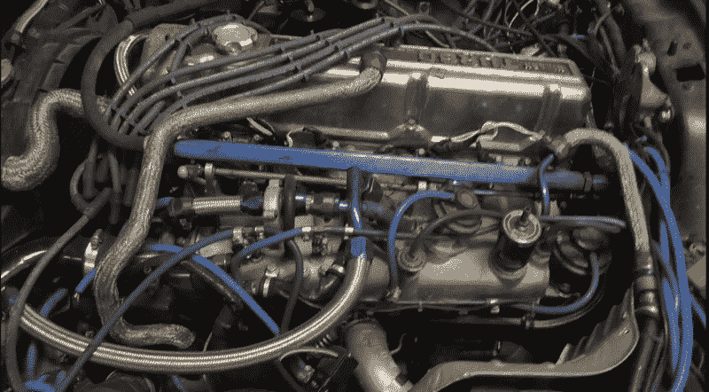
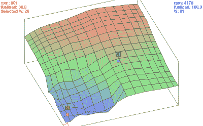
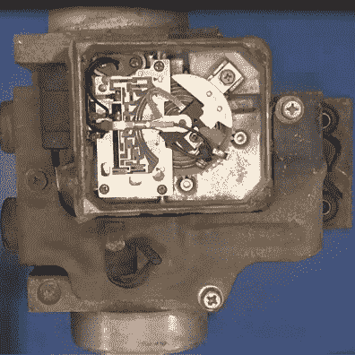
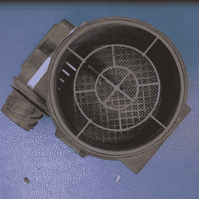
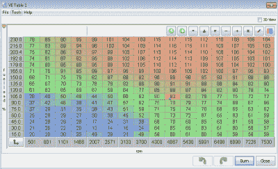
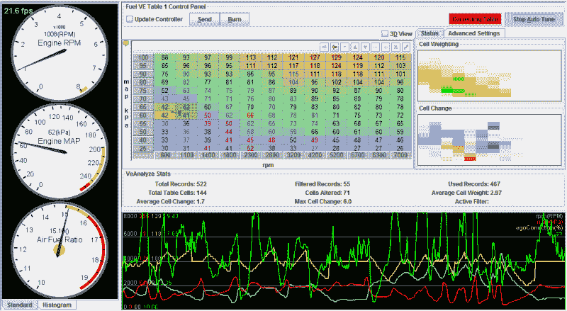
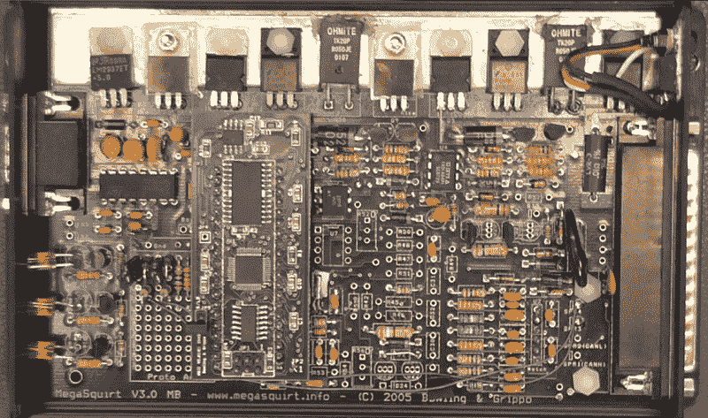

# 大喷我的 1983 年达特桑 Z

> 原文：<https://hackaday.com/2016/09/08/megasquirting-my-1983-datsun-z/>

## 当恐龙开车去上班的时候

早在 20 世纪 80 年代中期，我在一家名为 Commodore Business Machines 的公司工作，这是一家生产家用电脑的公司，每年一月的第一周，我们的年度超级碗就是在拉斯维加斯举行的消费电子展。

在 11 月的某个时候，一辆达特桑 Z 会停在停车场的前面，然后不动，直到早春的某个时候它上面的积雪融化。最终，我会把它拖走，留下一堆令人伤心的铁锈、螺母和螺栓。手里拿着按时完成最新电脑的奖金支票，我会去买另一台二手 Z，重复这个循环。

 [https://www.youtube.com/embed/t4MKdhYq9l0?version=3&rel=1&showsearch=0&showinfo=1&iv_load_policy=1&fs=1&hl=en-US&autohide=2&wmode=transparent](https://www.youtube.com/embed/t4MKdhYq9l0?version=3&rel=1&showsearch=0&showinfo=1&iv_load_policy=1&fs=1&hl=en-US&autohide=2&wmode=transparent)

## 气候变化和铁锈

这些日子老达特桑 Z 的；240Z，260Z，280Z，280ZX，有些罕见，可能是因为他们是真正的锈桶，即使是新的。为了寻找下一台家用电脑，我牺牲了几台之后，看在旧时光的份上，我开始抢救一台。我真的很喜欢这辆车，所以我把修复它作为我的项目。现在我总共有三个 Z 型车身，一个引擎，一个变速器都在后面，还有一个几乎完成的 Z 型在车库里。

由于我已经把发动机拆成了最基本的部件，我抓住机会做了一些改变:增加了涡轮增压器的尺寸，增加了气缸/活塞的缸径和冲程，改善了燃料分配，并通过支撑气缸盖和中间冷却器等改善了空气流动。

## 对新 ECU 的需求

所有这些意味着我需要改变发动机混合燃料和空气的方式来支持燃烧，更多的空气意味着在同样的时间内需要更多的燃料。第一步是更大的燃料喷射器(和更大的燃料泵，调节器，过滤器，油底壳，管道等。)这就是为什么我需要一个可编程发动机控制单元(ECU)。

从各种各样的选择中，我选择了一款 [Megasquirt](http://megasquirt.info) ，这是一款 DIY 风格的设计。在我的情况下，我组装 ECU 自己一段时间了(这个特定的套件是从 2005 年)。除了选择我想听的音乐之外，它现在控制着我车内的大部分重要功能。

## 空气通过发动机

这里看到的是控制发动机功能的主要组件的框图，正如我在视频中所说，这都是关于空气通过发动机的旅程。踩油门并不像你想的那样直接增加燃油，它真的打开了一扇大门，让更多的空气进入燃烧室，然后 ECU 通过添加适量的燃油来补偿。

添加多少燃料的决定不仅基于多少空气，还基于温度和排气中的传感器，该传感器感测燃料燃烧的完全程度。其他功能，如打开燃油泵和控制怠速，是 ECU 可以执行的其他功能的例子。在我的例子中，我没有使用新的 ECU 来控制点燃燃料的火花；我把控制权留给了股票 ECU。

## 如何测量气流

我原来的 Z 发动机测量空气流量的内嵌体积空气流量(VAF)传感器，实际上(不幸的是)阻碍了过程中的空气流动。这是通过测量空气在装有弹簧的叶片上运动的阻力来实现的。我们称这个神秘的东西为“挡板”,因为它是在操作时叶片打开和关闭的方式。当这种方法测量体积时，空气的温度是确定空气质量所需要的。

  Stock airflow sesonr uses “flapper”  More refined sensor uses heated wire

测量空气流量的另一种方法是质量空气流量(MAF)，有时也称为热线传感器。最简单的描述是，它通过测量电阻的变化或保持其在设定温度所需的电流的变化来测量一根加热的金属丝的冷却。空气流过电线会带走热量(想想热力学),这往往会排除温度的影响，因为它更直接地测量质量而不是体积。

## 巨型水枪如何测量空气

[巨型水枪](http://www.megamanual.com/begintuning.htm)做的事情与我上面描述的不同。它使用一个气压传感器，测量歧管中的空气压力，歧管是燃料和空气在被吸入气缸之前混合的空间。

结合其他输入，如发动机转速和氧气传感器，Megasquirt [计算应该喷射多少燃料。](http://www.megamanual.com/v22manual/mfuel.htm)但还有更好的。除了这种监测燃烧的改进方法之外，我还控制着 ECU 根据这些测量值进行的计算。这给了我相当多的控制引擎正在做的几乎所有事情的能力。

## Tuner Studio 软件

用于配置 Megasquirt 的软件是 EFI Analytics 的 Tuner Studio MS。我使用付费版本，它具有额外的功能，如基于实际驾驶日志和性能的高级调整。

需要加载大量的基本配置参数，基本上是关于发动机的细节，包括气缸数、喷油器流量，甚至使用的燃料类型。最终我们得到了一个容积效率(VE)图，它与标准的燃油/空气图非常相似，因为我们对在不同的速度和负荷下应该喷射多少燃油进行了编程。

此幻灯片需要 JavaScript。

额外的变量，例如在各种条件下何时加浓或修改燃料量，例如发动机起动、节气门全开(也称为“加大油门”)和预热期间。当发动机完全冷却时，我的发动机喷射几乎两倍的燃料。

## 设定 ECU

插入并运行 Tuner Studio 软件后，它可以从发动机在真实条件下的运行方式中积累实时结果，并创建一个对 ve 图的建议修改表，然后可以应用该表。这意味着最终性能的优化超越了简单的计算值，本质上它应该每次都能更好地驱动，直到所有参数通过调整过程达到平衡。

## 仪表板灯

最后，该软件可以在笔记本电脑或内置的汽车电脑上运行，使用其中的一些设计仪表板，或者用户可以设计自己的仪表板，使用各种仪表，包括燃油经济性等计算值。

此幻灯片需要 JavaScript。

我注意到，现在也可以使用 Android 设备进行远程 dash 集群，我必须承认，在 HUD 模式下在 dash 上使用我的旧迷你平板电脑的想法听起来很酷。

## 该工具包

我从一个套件中构建了我的 ECU，除了处理器升级插件是预装配的(全部是 SMT)。它基于 MC9S12C64，一个运行在 24 MHz 的 16 位处理器，具有 4kB 或 RAM 和 128 kB 的闪存，并有一些有用的插件，如 PWM 控制器和 [CAN](https://en.wikipedia.org/wiki/CAN_bus) 接口。【T2

## 测试

无论何时你在一个系统上工作，通过适当的测试，你都可以节省很多时间。在这种情况下，去除最大的变量——汽车——是至关重要的。我有两个不同的测试单元，插入 ECU 的“大屁股连接器”。

这里显示的是我的 Megasquirt，带有一个可用于配置和故障排除的刺激器(绿色 PCB)。这比我想象的要有用得多。

## 放弃

我在这里说的所有东西都是为了越野使用；修改任何与联邦强制排放控制有关的东西都是非法的。

## 资源

*   [DIY 自动调优](https://www.diyautotune.com/)
*   [电喷分析](http://www.tunerstudio.com/index.php/tuner-studio)