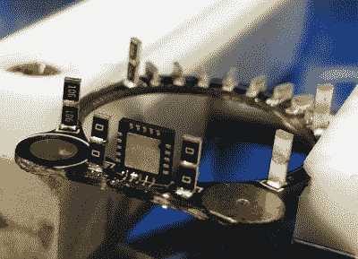

# 电子光明会成员环

> 原文：<https://hackaday.com/2018/02/10/membership-ring-of-the-electronic-illuminati/>

当拉着硬件世界无形琴弦的电子设计大师们的阴谋集团聚集在一起时，我们想象他们必须展示这枚戒指来证明他们的身份。这是[扎克·弗雷丁]的作品，你会被他称之为“电子人环”的建造和执行震惊。

电子人戒指最明显的特征是一系列可寻址的发光二极管，占据了戒指上宝石所在的区域。可能不太明显的是，它完全由电子元件构成，没有使用任何传统的机械部件，如支架。毫不夸张地说，表面贴装器件在这个环中是结构性的。

 他们也是电气。在这里，你可以看到[扎克]如何实现这一点的细节。我们正在看戒指的下面，也就是你指关节下面的部分。两个 PCB 中的一个大小适合你的手指，已经被放置在一个[棒钳](https://hackaday.io/project/3287-stickvise-low-profile-soldering-vise)中，同时 QFN 处理器被焊接在末端，并且 SMD 电阻器对被放置到位。

每个器件的精确测量使得选择能够完美跨越两块电路板之间间隙的元件成为可能。在图像的背景中，您可以看到长端的 SMD 电阻，这是他用来让 led 本身跨接在两个 pdb 上的一个电阻之间以完成电路的技术。不可思议吧。

但事情会变得更好。[Zach]最终有了一个工作原型，但继续以新的设计迭代向前迈进。这些更新读起来很愉快！确保你跟踪他的项目，并定期检查；如果你已经看过了，现在是时候回去看看新作品了。为戒指供电的微型硬币电池的金垫被重新选择，因为电池不适合原来的电池。一些布局问题正在调整。新的主板应该会在一周左右从 fab 回来。

不要错过下面的演示视频。我们真的很喜欢看到在可佩戴戒指外形内构建的项目。这是一个令人印象深刻的限制，扎克似乎已经掌握了。我们的另一个最爱是[【凯文的】阿杜博伊戒指](https://hackaday.com/2014/12/24/an-oled-ring-for-bluetooth-notifications/)。

 [https://www.youtube.com/embed/zC01jVVOusc?version=3&rel=1&showsearch=0&showinfo=1&iv_load_policy=1&fs=1&hl=en-US&autohide=2&wmode=transparent](https://www.youtube.com/embed/zC01jVVOusc?version=3&rel=1&showsearch=0&showinfo=1&iv_load_policy=1&fs=1&hl=en-US&autohide=2&wmode=transparent)

