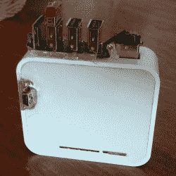

# 测量所有相位:带 OpenWrt 的三相电能表

> 原文：<https://hackaday.com/2016/05/25/meter-all-the-phases-three-phase-energy-meter-with-openwrt/>

跟踪你的总用电量是一件好事，如果你知道所有的千瓦时都去了哪里，那就更好了。[Anurag Chugh 的]房子有三个整齐有序的配电箱:一个用于照明和风扇，一个用于家用电器，一个用于热水供应。为了监测和分析他家的电气指纹，[Anurag] [安装了一个三相电表，并将其连接到互联网上](http://www.electronicsfaq.com/2016/05/internet-connected-energy-meter.html)。

【anu rag】购买了一台 Selec MFM383C 三相电表，配有 Modbus 接口和三个电流互感器，每相一个。在所有东西都连接好[和](http://www.electronicsfaq.com/2015/12/installing-3-phase-energy-meter-in-your.html)并安装到配电板后，他用 USB 转 RS485 桥将一个安卓平板电脑连接到电表上。他开始使用[监控应用](https://play.google.com/store/apps/details?id=com.Bhavan.Galex)从仪表中读出 Modbus 寄存器。在验证应用程序正在读取合理的值后，他继续配置 OpenWrt 路由器，将其连接到互联网。

[最新版本的 OpenWrt 填满了路由器的大部分内部闪存，为项目所需的额外模块留下的空间太少。【阿努拉格】](https://hackaday.com/wp-content/uploads/2016/05/energymeter_router.jpg)[解决方法](http://www.electronicsfaq.com/2015/12/openwrt-1505-chaos-calmer-on-tl-mr3020.html)这是编译一个精简版的 OpenWrt，允许通过路由器的串行端口将文件系统转移到外部 USB 拇指驱动器，这当然需要打开路由器并焊接一个 USB 转串行桥。

随着路由器的启动和运行，他编写了一个紧凑的 OpenWrt 包，通过一个 T2 命令行界面从电表中读取数据。一个 cron 作业定期执行一个小脚本，该脚本轮询电表并将数据点上传到一个[初始状态](https://initialstate.com/)帐户。在那里，收集的数据可以进一步处理，并通过一个有吸引力的网络界面绘制成图表。

构建当然做得很好，但是这个项目真正突出的是[文档](http://www.electronicsfaq.com/2016/05/internet-connected-energy-meter.html)的细节和结构。它由一系列四个广泛的帖子组成，其中所有步骤都被完整地记录到最低级别，准备好被复制并被其他制作者和黑客学习。我们相信你会喜欢这本书的！

感谢[杰米]的提示！