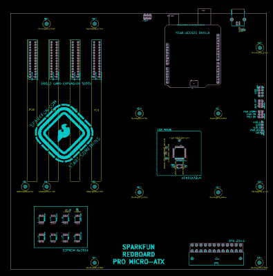

# 微型 ATX Arduino 是终极突破板

> 原文：<https://hackaday.com/2017/12/23/micro-atx-arduino-is-the-ultimate-breakout-board/>

如果你曾经接触过微控制器和电子产品，你肯定对分线板的概念很熟悉。分线板不是费力地将电线和元件连接到不断缩小的 IC 和 MCU，而是通过本质上使其更大来使其更容易与设备接口。Arduino 本身可以说是一个突破性的平台。它采用了 ATmega 芯片，增加了通过 USB 与计算机对话所需的硬件，并使用易于管理的头引脚引出了所有的 GPIO 引脚。

但是如果你想要一个更大的 ATmega 分线板呢？一些真正有伸腿空间的东西。好了，不要再说了，因为[【尼克·普尔】已经用他那疯狂的 RedBoard Pro 微型 ATX](https://www.sparkfun.com/news/2561) 覆盖了你。将 ATmega32u4 微控制器与标准桌面 PC 硬件相结合就像你希望的那样荒谬，但令人惊讶的是确实提供了一些切实的好处。

RedBoard PCB layout

RedBoard 是一款完全兼容的微型 ATX 板，几乎可以放入你在垃圾堆里找到的任何电脑机箱。从支架位置到扩展卡插槽的对齐，一切都经过精心设计，因此可以直接放入您选择的机箱中。

没错，扩展槽。它不使用 PCI，但它确实有一个使用 28 针边缘连接器的标准 Arduino“屏蔽”概念的变体。有一个带 USB 端口和 ISP 接头的后部 I/O 面板，如果你真的想的话，你甚至可以添加水冷却(该板支持标准的 LGA 1151 插座冷却附件)。

虽然将 Arduino 放大到 ATX 大小并不实际，但 RedBoard 并非没有合法的优势。具体来说，PCB 上的大量空闲空间允许[Nick]增加 2mb 的存储空间。甚至有人考虑用 EEPROM 芯片制作可移动的“RAM”存储库，但你必须在某个地方划清界限。RedBoard 还支持标准 ATX 电源，这将为可能填充扩展槽的附加硬件提供充足的电力。

由于 miniITX 和 microATX 的价格低廉且数量充足，人们似乎有意将硬件塞进它们也就不足为奇了。我们已经报道了[多次尝试将其他硬件拖进那个无处不在的米色盒子外形中。](https://hackaday.com/2013/07/02/raspberry-pi-now-in-a-mini-itx-form-factor/)