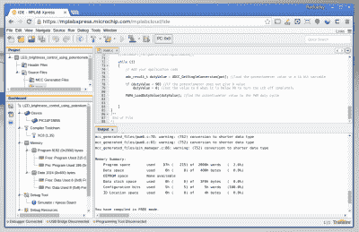
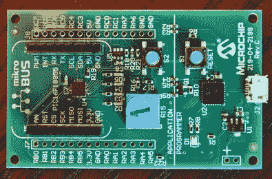
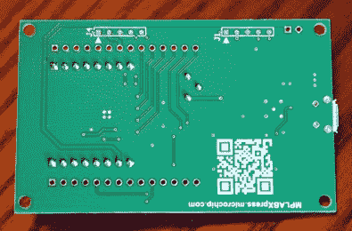

# 微芯片推出在线 MPLAB IDE 和 10 美元板

> 原文：<https://hackaday.com/2016/02/15/microchip-unveils-online-mplab-ide-and-10-board/>

今天，Microchip 发布了一些有趣的嵌入式开发工具。第一个是名为 [MPLAB Xpress](http://mplabxpress.microchip.com) 的免费在线 IDE，第二个是 10 美元的内置程序员开发板。这两人的目标是让人们快速启动和运行 PIC 开发。他们在发布前给了我们一个解释，并送来了一个样板。我们来看看吧！

### 在线 IDE、编译、存储和社区

MPLAB Xpress looks just like MPLAB X

新软件名为 [MPLAB Xpress](http://mplabxpress.microchip.com) 。它是一个浏览器内置的 IDE，可以在线存储你的代码并在服务器端编译。它吐出一个. hex 文件，由您的浏览器下载并刷新到目标设备，它能够与传统的调试硬件接口。

对我来说，这感觉很像 Microchip 在竞购业余爱好市场。PIC 老手不太可能会放弃这个浏览器内版本的 MPLAB X(离线 IDE)。但是这对于第一次教授嵌入式系统是非常理想的，并且非常适合快速入门。让我们面对现实吧，嵌入式开发最糟糕的部分是建立工具链。它往往充满了难以找到的下载、依赖性问题，并且可能需要很长时间才能知道您的问题是出在工具、您自己的测试代码还是硬件本身。

这实际上是我可以看到专业人士转向 MPLAB Xpress 的地方。在线 IDE 链接到一个微芯片社区平台，该平台包括论坛等常见的社交元素。但是它也可以作为一个代码库，您只需单击一下就可以将项目文件放入 IDE 中。第一次使用新芯片？将 *hello world* 代码(由微芯片工程师编写)加载到 MPLAB Xpress 中，并确保它能够工作，然后再转到 MPLAB X(传统的离线工具)开始实际工作。

更好的消息是，这绝不会取代离线工具。两者将并行开发，任何熟悉使用 MPLAB X 的人都会马上注意到两者的感觉是一样的。我很高兴地发现，编译和闪存 1.3k。十六进制文件感觉就像在本地一样快。但公平地说，我没有做任何基准测试，服务器可能还不支持大量的用户负载。

### 开发板

    

我喜欢周围有开发板，这一个应该把一些头。在 10 美元时，它会说“啊，为什么不呢？”在你的大脑里串起来。目标器件是一个 [PIC16F18855](http://www.microchip.com/wwwproducts/Devices.aspx?product=PIC16F18855) ，它带有 14 KB 程序存储器、1kb RAM、一系列外设和一个可配置为 1-32 MHz 的内部振荡器。

在板上，您会发现四个用户 led、一个 trimpot 和一个按钮。设计师们在拆分引脚方面做得很好，这些引脚与 3.3V、5V 和四个 GND 连接一起，标在电路板的顶部。有趣的是，有一个 mikroBUS 足迹，其中包括女性引脚头，所以那些投资于该生态系统的人应该非常高兴。

### 程序员

我认为 Microchip 在业余爱好市场上落后了，因为非专业人士不愿意购买真正的程序员。随着去年引入他们的好奇心板，他们开始将这个减速带降低到非专业开发上，该板以 PKOB 程序员为特色。该板继续这项工作，再次将编程硬件放在 PCB 上。这种板被称为 *MPLAB Express 开发板*，在 Linux、OSX 和 Windows 上作为 USB 大容量存储设备列举，不需要额外的驱动程序。这与 mBed 模型类似，您只需拖放您的。十六进制文件，它是自动编程。正如我之前提到的，这真的很快。事实上，在试用 Microchip 的演示项目时，我可以感觉到鼠标放下和编程完成之间没有任何延迟。

从黑客的角度来看，这块板是二对一的。有一个明显的目标微观。但是这个板可以在编程器和应用电路之间的线上分开，作为一个有点粗糙的编程器使用。有几个电阻桥接编程线。没有 V 形槽，所以我们讨论的是严格的切割，将这些电阻焊接到适当的编程接头可能有点复杂，但这是可能的。

独立程序员的想法是二合一的。可能的三合一是把程序员本身作为编程目标。芯片是一个 [PIC18F25K50](http://www.microchip.com/wwwproducts/Devices.aspx?product=PIC18F25K50) 。该芯片可以用 USB 引导程序刷新，并作为独立的 uC 进行编程。然而，很少的引脚被打破，所以你的里程可能会有所不同。这是一个支持 USB 连接的芯片。电路板背面有脚印，我认为是使用传统编程器(如 PICKIT3)的编程头。将一个接头焊接到这些芯片上(足迹间距为 0.1 英寸，便于熨斗使用)，并编写自己的 USB 设计程序。

### 总体思路

这太棒了。主板的价值、基于浏览器的套件的特性以及在线社区是 PIC 硬件开发的福音。

目前 XC8 编译器是唯一受支持的，但我被告知 XC16 和 XC32 将在今年年底前实现并投入使用。使用免费版的编译器，但是那些已经购买了升级的人也可以在线解锁。

每个用户都被分配了 10 GB 的私有存储空间来存储他们的代码。在线开发的项目可以在传统的 MPLAB X 软件中下载和打开，反之亦然。微芯片代码示例是一个很大的优势，它们也为社区贡献的代码开放了机制。为此，时间会证明是否有足够数量的提交和足够的审查过程来过滤掉不可靠的代码。但是从代码示例页面到工作 IDE 的单击操作真的很巧妙。

作为发布会的一部分，Microchip 将赠送 2000 块免费电路板。寻找 MPLAB Xpress 登录页面上的按钮申领一个。