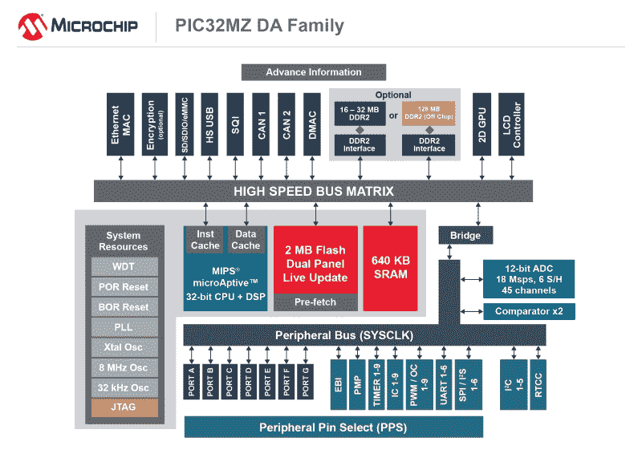
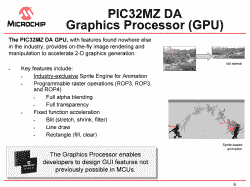
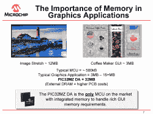
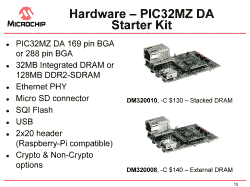
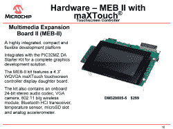

# Microchip 的 pic 32 mz DA——带 GPU 的微控制器

> 原文：<https://hackaday.com/2017/05/30/microchips-pic32mz-da-the-microcontroller-with-a-gpu/>

说到显示器，传统微控制器和 Linux 片上系统(SoC)之间存在差距。智能手机中的 SoC 总是有足够的 RAM 用于帧缓冲，并且通常有几个引脚专用于 LCD 接口。今天，微芯片宣布了一种微控制器，它模糊了 SoC 和微控制器之间的界限。[pic 32 mz‘DA’系列微控制器](http://ww1.microchip.com/downloads/en/DeviceDoc/60001361D.pdf)专为图形应用而设计，配有大量 RAM 和专用 GPU。

这款芯片的主要特点是为帧缓冲区和 2D 图形处理器提供大量内存。PIC32MZ DA 系列包括具有 32 MB 集成 DRAM 的封装，设计用作帧缓冲器。包括对 SXGA (1280 x 1024)面板上 24 位颜色的支持。还有一个 2D 图形处理器，支持精灵，位图传送，阿尔法混合，线条画和填充矩形。不，它不能玩《孤岛危机》——只是为了摆脱这个迷因——但它是一个优秀的图形用户界面平台。

PIC32MZ DA 芯片提供三种封装，包括 169 引脚 BGA、288 引脚 BGA 和 176 引脚 LQFP。这些芯片的程序大小为 1024 KB 或 2048 KB，数据存储器为 256 KB 或 640 KB。这些图片带有一个可选的 DDR2 控制器和一个可选的“片上”32mb DDR 2 SDRAM。这个“片上”SDRAM 具体来说*不是*；取而代之的是，我们看到的是类似于包对包组件的东西。无论哪种方式，其中一些部件带有 32 MB 的 DDR2，封装在一滴环氧树脂中。

PIC32MZ DA 的两个入门套件将很快推出，一个采用堆叠 DRAM，另一个采用外部 DRAM。此外，还将提供 WQVGA 触摸屏子板。不过，这个子板并不是必须的，Microchip 已经花了很大力气来创造新的工具，让 LCD 面板快速启动和运行。一个新版本的 MPLAB IDE 具有一个显示管理器，允许开发者在几分钟内为任何显示器生成驱动程序。

PIC32MZ DA 千片订量报价为 7.73 美元/片。

GPU 现在是中的*，在 Nvidia 的最新产品[和可以将像素推送到 4k 显示器的小型廉价 ARM 板之间，你可能会认为向产品添加大型高分辨率显示器的唯一方法是包含基于 Linux 的 SoC。PIC32MZ DA 是这些 SOC 和传统微控制器之间的桥梁，允许更简单的电路板和更容易的布线，仍然能够将像素输出到显示器。](http://hackaday.com/2017/03/14/hands-on-nvidia-jetson-tx2-fast-processing-for-embedded-devices/)*

这是一个小小的个人观察，但自从 Raspberry Pi 的发布和带 HDMI 的廉价 ARM 板的泛滥以来，Hackaday 已经没有看到多少用于视频应用的微控制器了。总有人在玩 VGA，但是请记住，T2 的 Uzebox 曾经是一款非常受欢迎的产品。这一部分是由于基于 Linux 的主板越来越多，但另一部分也是由于微控制器仍然附带少量的 RAM。这是一个非常酷的芯片，我们迫不及待地想看看它最终会成为什么。